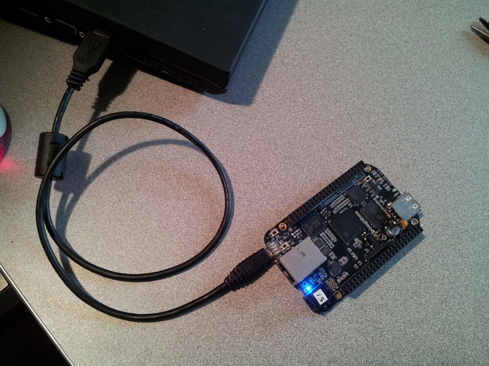
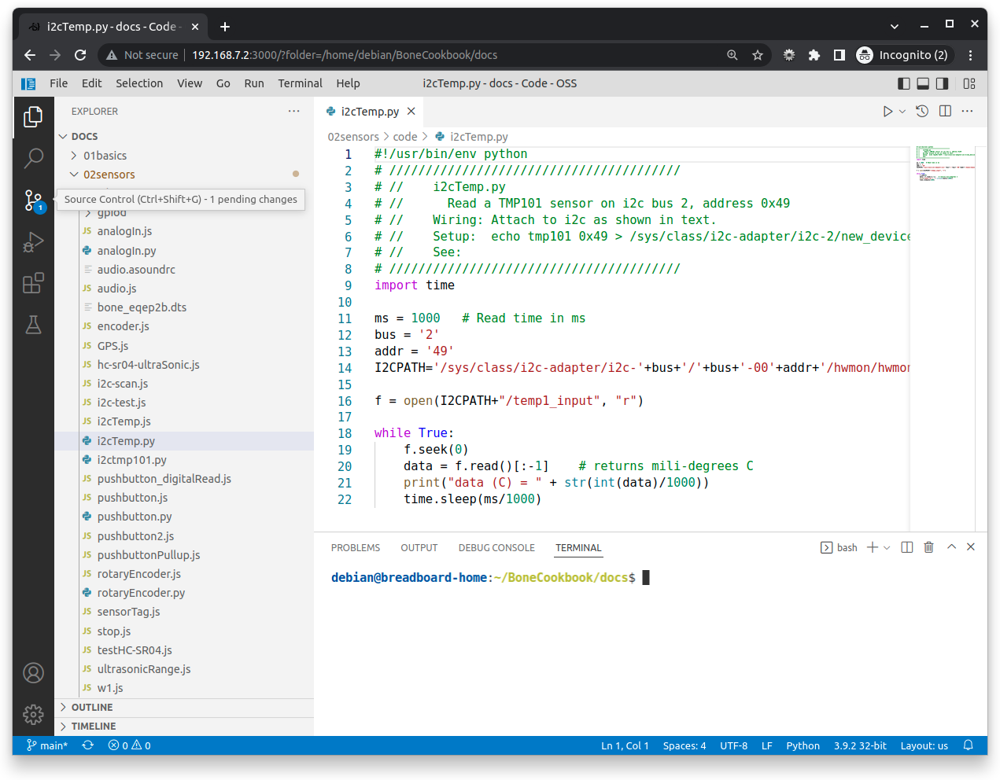

[[basics]]
[role="pagenumrestart"]
== Basics

=== Introduction

When you buy BeagleBone Black, pretty much everything you need to get going comes with it. You can just plug it into the USB of a host computer, and it works. The goal of this chapter is to show what you can do with your Bone, right out of the box. It has enough information to carry through the next three chapters on sensors (<<sensors>>), displays (<<displays>>), and motors (<<motors>>).

=== Picking Your Beagle

==== Problem
((("BeagleBoards", "selecting")))((("BeagleBones", "selecting")))((("basic operations", "BeagleBone/BeagleBoard selection")))There are many different BeagleBoards. How do you pick which one to use?

==== Solution
// TODO

Current list of boards: https://git.beagleboard.org/explore/projects/topics/boards

==== Discussion

[[basics_out_of_the_box]]
=== Getting Started, Out of the Box

==== Problem
((("basic operations", "getting started")))You just got your Bone, and you want to know what to do with it.

==== Solution
Fortunately, you have all you need to get running: your Bone and a USB cable. 
Plug the USB cable into your host computer (Mac, Windows, or Linux) and plug the mini-USB connector side into the USB connector near the Ethernet connector on the Bone, as shown in <<basics_pluggingIn_fig>>.

[[basics_pluggingIn_fig]]
.Plugging BeagleBone Black into a USB port

((("USER LEDs")))((("LEDs", "USER LEDs", seealso="input/output (I/O)")))The four blue +USER+ LEDs will begin to blink, and in 10 or 15 seconds, you'll see a new USB drive appear on your host computer. <<basics_01gettingStarted_fig>> shows how it will appear on a Windows host, and Linux and Mac hosts will look similar. The Bone acting like a USB drive and the files you see are located on the Bone.

// TODO Update
[[basics_01gettingStarted_fig]]
.The Bone appears as a USB drive
image::figures/01GettingStarted.png[A new USB drive]

[[basics_open_vsc]]
((("integrated development environment (IDE)")))Browse to http://192.168.7.2:3000 from your host computer (<<basics_05gettingStarted_fig>>).

[[basics_05gettingStarted_fig]]
.Visual Studio Code
image::figures/05GettingStartedVScode.png[Visual Studio Code]

Here, you'll find _Visual Studio Code_, a web-based integrated development environment (IDE) that lets you edit and run code on your Bone!  See <<basics_vsc>> for more details.

[WARNING]
====
((("basic operations", "shut-down")))((("halt command")))((("shut down")))Make sure you turn off your Bone properly. It's best to run the +halt+ command:

++++
<pre data-type="programlisting">
bone$ <strong>sudo halt</strong>
The system is going down for system halt NOW! (pts/0)
</pre>
++++

This will ensure that the Bone shuts down correctly. If you just pull the power, it's possible that open files won't close properly and might become corrupt.

====

==== Discussion
The rest of this book goes into the details behind this quick out-of-the-box demo.  Explore your Bone and then start exploring the book.

[[basics_latest_os]]
=== Verifying You Have the Latest Version of the OS on Your Bone

==== Problem

((("operating system (OS)", "updating")))((("Debian", "determining version")))((("Linux", "Debian")))((("ID.txt")))((("software", "OS updates")))((("basic operations", "OS updates")))You just got BeagleBone Black, and you want to know which version of the operating system it's running.

==== Solution
// TODO  update version
This book uses https://www.debian.org[Debian], the Linux distribution that currently ships on the Bone. However this book is based on a newer version (BeagleBoard.org Debian Bullseye IoT Image 2022-07-01) than what is shipping at the time of this writing. You can see which version your Bone is running by following the instructions in <<basics_out_of_the_box>> to log into the Bone.  Then run:

++++
<pre data-type="programlisting">
bone$ <strong>cat /ID.txt</strong>
BeagleBoard.org Debian Bullseye IoT Image 2022-07-01
</pre>
++++

I'm running the 2022-07-01 version.

==== Discussion

=== Running the Python and JavaScript Examples

==== Problem

((("basic operations", "BoneScript API tutorials")))((("BoneScript", "tutorials for")))((("JavaScript", "tutorials for")))You'd like to learn Python and JavaScript interact with the Bone to perform physical computing tasks without first learning Linux.

==== Solution

Plug your board into the USB of your host computer and browse to http://192.168.7.2:3000 using Google Chrome or Firefox (as shown in <<basics_out_of_the_box>>). In the left column, click on _EXAMPLES_, then _BeagleBone_ and then _Black_. Several sample scripts will appear.  Go and explore them.

[TIP]
====
((("BoneScript", "API examples page")))Explore the various demonstrations of Python and JavaScript. These are what come with the Bone.  In <<basics_repo>> you see how to load the examples for the Cookbook.
====

==== Discussion

[[basics_repo]]
=== Cloning the Cookbook Repository

==== Problem
You want to run the Cookbook examples.
// TODO update for new docs

==== Solution
Connect your Bone to the Internet and log into it.  From the command line run:
++++
<pre data-type="programlisting">
bone$ <strong>git clone git@github.com:MarkAYoder/BoneCookbook.git</strong>
bone$ <strong>cd BoneCookbook/docs</strong>
bone$ <strong>ls</strong>
</pre>
++++
You can look around from the command line, or explore from Visual Sudio Code. If you ar using VSC, go to the _File_ menu and select _Open Folder ..._ and selet +BoneCookbook/docs+. Then explore.   You'll find there is a directory for each chapter and most chapters have a _code_ directory for the sample scripts and a _figures_ directory for the figures.  

[[basics_wire_breadboard]]
=== Wiring a Breadboard

==== Problem

((("basic operations", "wiring a breadboard")))((("breadboards", "wiring")))You would like to use a breadboard to wire things to the Bone.

==== Solution

Many of the projects in this book involve interfacing things to the Bone. Some plug in directly, like the USB port.  Others need to be wired. If it's simple, you might be able to plug the wires directly into the +P8+ or +P9+ headers. Nevertheless, many require a breadboard for the fastest and simplest wiring. 

To make this recipe, you will need:

* Breadboard and jumper wires (see <<app_proto>>)

<<basics_breadboard_template>> shows a breadboard wired to the Bone. All the diagrams in this book assume that the ground pin (+P9_1+ on the Bone) is wired to the negative rail and 3.3 V (+P9_3+) is wired to the positive rail.

[[basics_breadboard_template]]
.Breadboard wired to BeagleBone Black
image::figures/template_bb.png[Breadboad]

==== Discussion

[[basics_vsc]]
=== Editing Code Using Visual Studio Code

==== Problem
((("VSC", "editing code using")))((("code", "editing with VSC")))((("host computer", "editing code using VSC")))((("blinked.js")))((("Workspace file tree")))((("basic operations", "editing code with VSC")))((("debugging", "using VSC")))((("editors", "web-based")))You want to edit and debug files on the Bone.

==== Solution
Plug your Bone into a host computer via the USB cable. Open a browser (either Google Chrome or FireFox will work) on your host computer (as shown in <<basics_out_of_the_box>>). After the Bone has booted up, browse to http://192.168.7.2:3000 on your host. You will see something like <<basics_05gettingStarted_fig>>.

Click the _EXAMPLES_ folder on the left and then click _BeagleBoard_ and then _Black_, finally double-click _seqLEDs.py_.
You can now edit the file. 

[NOTE]
====
If you edit lines 33 and 37 of the _seqLEDs.py_ file (time.sleep(0.25)), changing +0.25+ to +0.1+, the LEDs next to the Ethernet port on your Bone will flash roughly twice as fast.
====

==== Discussion

[[basics_vsc_IDE]]
=== Running Python and JavaScript Applications from Visual Studio Code

==== Problem
((("basic operations", "running JavaScript applications from VSC")))((("VSC", "running JavaScript applications from")))((("JavaScript", "running applications from VSC")))((("applications", "running from VSC")))You have a file edited in VS Code, and you want to run it.

==== Solution
((("bash command window")))VS Code has a +bash+ command window built in at the bottom of the window. If it's not there, hit Ctrl-Shift-P and then type *terminal create new* then hit _Enter_.  The terminal will appear at the bottom of the screen.
You can run your code from this window. To do so, add +#!/usr/bin/env python+ at the top of the file that you want to run and save.

[TIP]
====
((("Python")))If you are running JavaScript, replace the word +python+ in the line with +node+.
====

At the bottom of the VS Code window are a series of tabs (<<basics_vscBash_fig>>). 
Click the +TERMINAL+ tab. Here, you have a command prompt.

[[basics_vscBash_fig]]
.Visual Studio Code showing bash terminal

((("directories", "changing")))((("cd (change directory) command")))((("commands", "cd (change directory)")))((("chmod (change mode) command")))((("commands", "chmod (change mode)")))((("debugging", "using VSC")))Change to the directory that contains your file, make it executable, and then run it:

++++
<pre data-type="programlisting">
bone$ <strong>cd ~/examples/BeagleBone/Black/</strong>
bone$ <strong>./seqLEDs.py</strong>
</pre>
++++

The +cd+ is the change directory command. After you +cd+, you are in a new directory. Finally, +./seqLEDs.py+ instructs the Python script to run. You will need to press ^C (Ctrl-C) to stop your program.

==== Discussion

[[basics_find_image]]
=== Finding the Latest Version of the OS for Your Bone

==== Problem
((("Debian", "finding latest version of")))((("Linux", "Debian")))((("basic operations", "OS updates")))((("operating system (OS)", "updating")))((("software", "OS updates")))You want to find out the latest version of Debian that is available for your Bone.

==== Solution

On your host computer, open a browser and go to https://forum.beagleboard.org/tag/latest-images  This shows you a list of dates of the most recent Debian images (<<basics_deb1>>).

[[basics_deb1]]
.Latest Debian images
image::figures/deb1.png[Latest Debian images]

At the time of writing, we are using the _Bullseye_ image.  Click on it's link.
Scrolling up you'll find <<basics_deb2>>.  There are three types of snapshots, Minimal, IoT and Xfce Desktop.  IoT is the one we are running.

[[basics_deb2]]
.Latest Debian images 
image::figures/deb2.png[Latest Debian images]

These are the images you want to use if you are flashing a Rev C BeagleBone Black onboard flash, or flashing a 4 GB or bigger miscroSD card. The image beginning with _am335x-debian-11.3-iot-_ is used for the non-AI boards. The one beginning with _am57xx-debian-_ is for programming the Beagle AI's.

[NOTE]
====
((("onboard flash", "programming")))The onboard flash is often called the _eMMC_ memory. We just call it _onboard flash_, but you'll often see _eMMC_ appearing in filenames of images used to update the onboard flash.((("eMMC memory", see="onboard flash")))
====

Click the image you want to use and it will download.  The images are some 500M, so it might take a while.

==== Discussion

[[basics_install_os]]
=== Running the Latest Version of the OS on Your Bone

==== Problem

((("operating system (OS)", "running the latest")))((("basic operations", "running latest OS version")))You want to run the latest version of the operating system on your Bone without changing the onboard flash.

==== Solution
((("microSD card", "booting from")))((("SD cards", "booting from")))This solution is to flash an external microSD card and run the Bone from it. If you boot the Bone with a microSD card inserted with a valid boot image, it will boot from the microSD card. If you boot without the microSD card installed, it will boot from the onboard flash.  

[TIP]
====
If you want to reflash the onboard flash memory, see <<basics_onboard_flash>>.
====

[NOTE]
====
I instruct my students to use the microSD for booting. I suggest they keep an extra microSD flashed with the current OS. If they mess up the one on the Bone, it takes only a moment to swap in the extra microSD, boot up, and continue running. If they are running off the onboard flash, it will take much longer to reflash and boot from it.
====

((("host computer", "Windows OS")))((("operating system (OS)", "Windows ")))Download the image you found in <<basics_find_image>>. It's more than 500 MB, so be sure to have a fast Internet connection. Then go to http://beagleboard.org/getting-started#update and 
follow the instructions there to install the image you downloaded.

==== Discussion

=== Updating the OS on Your Bone

==== Problem
((("operating system (OS)", "updating")))((("software", "OS updates")))You've installed the latest version of Debian on your Bone (<<basics_install_os>>), and you want to be sure it's up-to-date.

==== Solution
Ensure that your Bone is on the network and then run the following command on the Bone:

++++
<pre data-type="programlisting">
bone$ <strong>sudo apt update</strong>
bone$ <strong>sudo apt upgrade</strong>
</pre>
++++

If there are any new updates, they will be installed.

[NOTE]
====
If you get the error +The following signatures were invalid: KEYEXPIRED 1418840246+, see http://bit.ly/1EXocb6[eLinux support page] for advice on how to fix it.
====

==== Discussion
After you have a current image running on the Bone, it's not at all difficult to keep it upgraded.

=== Backing Up the Onboard Flash
// TODO keep?
==== Problem

((("onboard flash", "backing up")))((("backups, onboard flash")))((("basic operations", "backups")))((("onboard flash", "extracting")))You've modified the state of your Bone in a way that you'd like to preserve or share.

==== Solution

The http://elinux.org/[eLinux] page on http://bit.ly/1C57I0a[BeagleBone Black Extracting eMMC contents] provides some simple steps for copying the contents of the onboard flash to a file on a microSD card:

. Get a 4 GB or larger microSD card that is FAT formatted.
. If you create a FAT-formatted microSD card, you must edit the partition and ensure that it is a bootable partition.
. Download http://bit.ly/1wtXwNP[beagleboneblack-save-emmc.zip] and uncompress and copy the contents onto your microSD card.
. Eject the microSD card from your computer, insert it into the powered-off pass:[BeagleBone] Black, and apply power to your board.
. You'll notice +USER0+ (the LED closest to the S1 button in the corner) will (after about 20 seconds) begin to blink steadily, rather than the double-pulse "heartbeat" pattern that is typical when your BeagleBone Black is running the standard Linux kernel configuration.
. It will run for a bit under 10 minutes and then +USER0+ will stay on steady. That's your cue to remove power, remove the microSD card, and put it back into your computer.
. You will see a file called _BeagleBoneBlack-eMMC-image-XXXXX.img_, where _XXXXX_ is a set of random numbers. Save this file to use for restoring your image later.

[NOTE]
====
Because the date won't be set on your board, you might want to adjust the date on the file to remember when you made it. For storage on your computer, these images will typically compress very well, so use your favorite compression tool.
====

[TIP]
====
The http://elinux.org/Beagleboard[eLinux wiki] is the definitive place for the BeagleBoard.org community to share information about the Beagles. Spend some time looking around for other helpful information.
====

==== Discussion

[[basics_onboard_flash]]
=== Updating the Onboard Flash

==== Problem
((("onboard flash", "updating")))((("basic operations", "updating onboard flash")))You want to copy the microSD card to the onboard flash.

==== Solution

If you want to update the onboard flash with the contents of the microSD card, 

. Repeat the steps in <<basics_install_os>> to update the OS.
. Attach to an external 5 V source. _you must be powered from an external 5 V source_. The flashing process requires more current than what typically can be pulled from USB.
. Boot from the microSD card.
. Log on to the bone and edit +/boot/uEnv.txt+.
. Uncomment out the last line +cmdline=init=/usr/sbin/init-beagle-flasher+.
. Save the file and reboot.
. The USR LEDs will flash back and forth for a few minutes.
. When they stop flashing, remove the SD card and reboot.
. You are now running from the newly flashed onboard flash.

[WARNING]
====
If you write the onboard flash, _be sure to power the Bone from an external 5 V source_. The USB might not supply enough current. 
====

When you boot from the microSD card, it will copy the image to the onboard flash. When all four +USER+ LEDs turn off (in some versions, they all turn on), you can power down the Bone and remove the microSD card. The next time you power up, the Bone will boot from the onboard flash.
