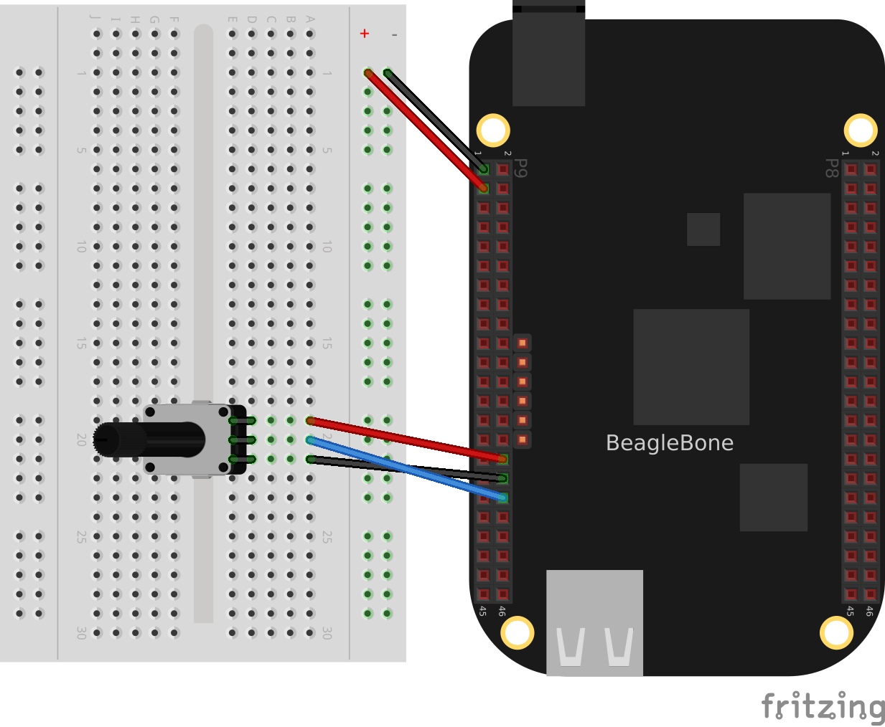
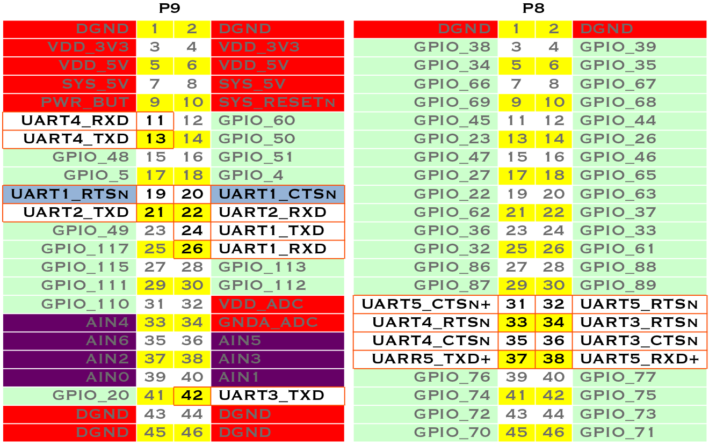

[[sensors]]
== Sensors

=== Introduction

((("USB 2.0 host port")))((("sensors", "interfaces for")))In this chapter, you will learn how to sense the physical world with BeagleBone Black. Various types of electronic sensors, such as cameras and microphones, can be connected to the Bone using one or more interfaces provided by the standard USB 2.0 host port, as shown in <<sensors_host_port>>. 

[[sensors_host_port]]
.The USB 2.0 host port
image::figures/black_hardware_details.png[USB Host Port]

((("P8/P9 cape headers", "diagram of")))((("cape headers", "P8/P9 diagram")))The two 46-pin cape headers (called +P8+ and +P9+) along the long edges of the board (<<sensors_P8P9_fig>>) provide connections for cape add-on boards, digital and analog sensors, and more.

[[sensors_P8P9_fig]]
.The P8 and P9 cape headers
image::figures/P8P9_bb.png[Cape Headers P8 and P9]

((("GPIO pins", "for sensor connections")))((("analog-to-digital converter (ADC) inputs")))((("input mode")))The simplest kind of sensor provides a single digital status, such as off or on, 
and can be handled by an _input mode_ of one of the Bone's 65 general-purpose input/output (GPIO) pins. More complex sensors can be connected by using one of the Bone's seven analog-to-digital converter (ADC) inputs or several I^2^C buses. 

<<displays>> discusses some of the _output mode_ usages of the GPIO pins. 

All these examples assume that you know how to edit a file (<<basics_cloud9>>) and run it, either within the Cloud9 integrated development environment (IDE) or from the command line (<<tips_shell>>).

=== Choosing a Method to Connect Your Sensor

==== Problem

((("sensors", "connection options")))((("P8/P9 cape headers", "sensor connection options")))((("cape headers", "P8/P9 connection options")))You want to acquire and attach a sensor and need to understand your basic options.

==== Solution

<<sensors_cape_headers>> shows many of the possibilities for connecting a sensor.

[[sensors_cape_headers]]
.Some of the many sensor connection options on the Bone
image::figures/cape-headers.png[Sensor Connection Modes]

Choosing the simplest solution available enables you to move on quickly to addressing other system aspects. By exploring each connection type, you can make more informed decisions as you seek to optimize and troubleshoot your design.

==== Discussion

[[sensors_getting_started]]
=== Input and Run a JavaScript Application for Talking to Sensors

==== Problem
((("sensors", "entering and running code")))((("code", "entering and running on sensors")))((("JavaScript", "sensor communication with")))You have your sensors all wired up and your Bone booted up, and you need to know how to enter and run your code.

==== Solution
((("Cloud9", "running JavaScript applications from")))((("bash command window")))You are just a few simple steps from running any of the recipes in this book.

. Plug your Bone into a host computer via the USB cable (<<basics_out_of_the_box>>).
. Start Cloud9 (<<basics_cloud9>>).
. In the +bash+ tab (as shown in <<sensors_cloud9_bash>>), run the following commands:

++++
<pre data-type="programlisting">
root@beaglebone:/var/lib/cloud9# <strong>cd</strong>
root@beaglebone:~#
</pre>
++++

[[sensors_cloud9_bash]]
.Entering commands in the Cloud9 bash tab
image::figures/cloud9-bash-tab.png[Cloud9 bash tab]

((("cd (change directory) command")))((("commands", "cd (change directory)")))((("~ character")))((("directories", "changing")))Here, we issued the _change directory_ (+cd+) command without specifying a target directory. By default, it takes you to your home directory. Notice that the prompt has changed to reflect the change. The path changed from +/var/lib/cloud9+ to +&#x7E;+. The +&#x7E;+ is a shorthand for your home directory.

[NOTE]
====
If you log in as +root+, your home directory is _/root_.  That is, anyone can +cd /root+ to get into your home directory (though directories are initially locked).  If you log in as +debian+, your home is _/home/debian_. If you were to create a new user called +newuser+, that user's home would be _/home/newuser_. By default, all non-root (non-superuser) users have their home directories in _/home_.
====

((("directories", "creating new")))((("pushbutton.js file")))The following commands create a new directory for the sensor recipes, change to it, and use +touch+ to create an empty file called _pushbutton.js_:

++++
<pre data-type="programlisting">
root@beaglebone:/var/lib/cloud9# <strong>cd /root</strong>
root@beaglebone:~# <strong>mkdir boneSensors</strong>
root@beaglebone:~# <strong>cd boneSensors</strong>
root@beaglebone:~/boneSensors# <strong>touch pushbutton.js</strong>
</pre>
++++

Now, add recipe code to the newly created _pushbutton.js_ file to enable it to run:

. In Cloud9, in the Workspace browser on the left, go to the Preferences wheel and select Add Home to Favorites (<<basics_addHome_fig>>). Now, your home directory will show up in the Workspace file tree.
. In the Workspace browser, expand +root+.
. You will see your newly created _boneSensors_ directory; expand it. You will see your empty _pushbutton.js_
. Double-click the _pushbutton.js_ file to open it.
. Paste the code for the recipe you want to run. This example uses <<js_pushbutton_code>>.
. Press ^S (Ctrl-S) to save the file. (You can also go to the File menu in Cloud9 and select Save to save the file, but Ctrl-S is easier.)
. In the +bash+ tab, enter the following commands:

++++
<pre data-type="programlisting">
root@beaglebone:~/boneSensors# <strong>chmod +x pushbutton.js</strong>
root@beaglebone:~/boneSensors# <strong>./pushbutton.js</strong>
data= 0

data= 0

data= 1

data= 1
^C
</pre>
++++

This process will work for any script in this book.

==== Discussion

[[sensors_pushbutton]]
=== Reading the Status of a Pushbutton or Magnetic Switch (Passive On/Off Sensor)

==== Problem

((("sensors", "passive on/off")))((("passive on/off sensors")))((("on/off sensors")))((("pushbutton sensors")))((("magnetic switches")))You want to read a pushbutton, a magnetic switch, or other sensor that is electrically open or closed.

==== Solution

((("pinMode()")))((("b.pinMode()")))((("attachInterrupt()")))((("b.attachInterrupt()")))Connect the switch to a GPIO pin and use BoneScript +pinMode()+ and +pass:[attachInterrupt()]+ functions.

To make this recipe, you will need:

* Breadboard and jumper wires (see <<app_proto>>)
* Pushbutton switch (see <<app_misc>>)
* Magnetic reed switch (optional, see <<app_misc>>)

You can wire up either a pushbutton, a magnetic reed switch, or both on the Bone, as shown in <<js_pushbutton_fig>>.

[[js_pushbutton_fig]]
.Diagram for wiring a pushbutton and magnetic reed switch input
image::figures/pushbutton_bb.png[Bone with pushbutton]

The code in <<js_pushbutton_code>> reads GPIO port +P9_42+, which is attached to the pass:[pushbutton]. 

[[js_pushbutton_code]]
.Monitoring a pushbutton using a callback function (pushbutton.js)
====
[source, javascript]
----

include::code/pushbutton.js[]

----
====

((("pushbutton.js file")))Put this code in a file called _pushbutton.js_ following the steps in <<sensors_getting_started>>. In the Cloud9 +bash+ tab, run it by using the following commands:

++++
<pre data-type="programlisting">
bone$ <strong>chmod +x ./pushbutton.js</strong>
bone$ <strong>./pushbutton.js</strong>
data= 0

data= 0

data= 1

data= 1
^C
</pre>
++++

The +chmod+ command makes it executable (you have to do this only once), and the second command runs it. Try pushing the button. The code reads the pin and prints its current value.

((("code", "stopping")))((("&#x005E;C (Ctrl-C) command")))((("commands", "&#x005E;C (Ctrl-C)")))You will have to press ^C (Ctrl-C) to stop the code.

If you want to use the magnetic reed switch wired as shown in <<js_pushbutton_fig>>, change +P9_42+ to +P9_26+ which is gpio +14+. 

==== Discussion

=== Mapping Header Numbers to gpio Numbers

==== Problem

You have a sensor attached to the P8 or P9 header and need to know which gpio pin it's using.

==== Solution

The +show-pins+ command will display information about all the P8 and P9 header pins.  To see the info for just one pin, used+grep+.

++++
<pre data-type="programlisting">
bone$ <strong>show-pins | grep P9.42</strong>
P9.42         89 fast rx down 7 gpio 0.07 << lo  P9_42 (pinmux_P9_42_default_pin)
</pre>
++++

The numbers following the string +gpio+ are the port number and the pin on that port.  In this cse it's port 0 and pin 7.  To find the gpio number multiply the port number by 32 and add it to the pin number.  This gives 0*32+7=7.  

For P9_26 you get:
++++
<pre data-type="programlisting">
bone$ <strong>show-pins | grep P9.26</strong>
P9.26           96 fast rx  up  7 gpio 0.14 << hi  P9_26 (pinmux_P9_26_default_pin)</pre>
++++
0*32+14=14, so the P9_26 pin in gpio 14.

=== Reading a Position, Light, or Force Sensor (Variable Resistance Sensor)

==== Problem

((("sensors", "variable resistance")))((("variable resistance sensors", "reading")))(((position sensors)))(((light sensors)))(((force-sensitive resistors)))((("flex sensors")))You have a variable resistor, force-sensitive resistor, flex sensor, or any of a number of other sensors that output their value as a variable resistance, and you want to read their value with the Bone.

==== Solution

((("analog-to-digital converter (ADC) inputs")))((("resistor divider circuits")))Use the Bone's analog-to-digital converters (ADCs) and a resistor divider circuit to detect the resistance in the sensor.

The Bone has seven built-in analog inputs that can easily read a resistive value. <<sensors_cape_headers_analog>> shows them on the lower part of the +P9+ header.

[[sensors_cape_headers_analog]]
.Seven analog inputs on the +P9+ header
image::figures/cape-headers-analog.png[Seven analog inputs on P9 header]

To make this recipe, you will need:

* Breadboard and jumper wires (see <<app_proto>>)
* 10 k&#8486; trimpot (see <<app_resistor>>)
or
* Flex resistor (optional, see <<app_resistor>>)
* 22 k&#8486; resistor (see <<app_resistor>>)

===== A variable resistor with three terminals

((("trimpots")))((("variable resistance sensors", "three terminal")))<<sensors_analogIn_fig>> shows a simple variable resistor (trimpot) wired to the Bone. One end terminal is wired to the ADC 1.8 V power supply on pin +P9_32+, and the other end terminal is attached to the ADC ground (+P9_34+). The middle terminal is wired to one of the seven analog-in ports (+P9_36+).

[[sensors_analogIn_fig]]
.Wiring a 10k&#8486; variable resistor (trimpot) to an ADC port

<<sensors_analogIn_code>> shows the BoneScript code used to read the variable resistor.  
Add the code to a file called _analogIn.js_ and run it; then change the resistor and run it again. The voltage read will change.

[[sensors_analogIn_code]]
.Reading an analog voltage (analogIn.js)
====
[source, js]
----

include::code/analogIn.js[]

----
====

[NOTE]
====
The code in <<sensors_analogIn_code>> outputs a value between 0 and 4096.
====

===== A variable resistor with two terminals

((("variable resistance sensors", "two terminal")))Some resistive sensors have only two terminals, such as the flex sensor in <<sensors_flexResistor_fig>>.
The resistance between its two terminals changes when it is flexed.
In this case, we need to add a fixed resistor in series with the flex sensor. 
<<sensors_flexResistor_fig>> shows how to wire in a 22 k&#8486; resistor to give a voltage to measure
across the flex sensor.

[[sensors_flexResistor_fig]]
.Reading a two-terminal flex resistor
image::figures/flexResistor_bb.png[Flex Resistor]

The code in <<sensors_analogIn_code>> also works for this setup.

==== Discussion

=== Reading a Distance Sensor (Analog or Variable Voltage Sensor)

==== Problem

((("sensors", "analog or variable voltage")))((("distance sensors")))((("analog voltage sensors")))((("variable voltage sensors")))((("voltage sensors")))((("LV-MaxSonar-EZ1 Sonar Range Finder")))You want to measure distance with a http://bit.ly/1Mt5Elr[LV-MaxSonar-EZ1 Sonar Range Finder], which outputs a voltage in proportion to the distance.

==== Solution

To make this recipe, you will need:

* Breadboard and jumper wires (see <<app_proto>>)
* LV-MaxSonar-EZ1 Sonar Range Finder (see <<app_misc>>)

All you have to do is wire the EZ1 to one of the Bone's _analog-in_ pins, as shown in <<sensors_ultrasonic_fig>>. The device outputs ~6.4 mV/in when powered from 3.3 V.

[WARNING]
====
Make sure not to apply more than 1.8 V to the Bone's _analog-in_ pins, or you will likely damage them. In practice, this circuit should follow that rule.
====

[[sensors_ultrasonic_fig]]
.Wiring the LV-MaxSonar-EZ1 Sonar Range Finder to the +P9_33+ analog-in port
image::figures/ultrasonicRange_bb.png[Analog]

<<sensors_ultrasonicRange_code>> shows the code that reads the sensor at a fixed interval.

[[sensors_ultrasonicRange_code]]
.Reading an analog voltage (ultrasonicRange.js)
====
[source, js]
----

include::code/ultrasonicRange.js[]

----
====

==== Discussion

[[sensors_hc-sr04]]
=== Reading a Distance Sensor (Variable Pulse Width Sensor)

==== Problem
((("sensors", "variable pulse width")))((("variable pulse width sensors")))((("pulse width sensors")))((("HC-SR04 Ultrasonic Range Sensor")))((("distance sensors")))You want to use a HC-SR04 Ultrasonic Range Sensor with BeagleBone Black.

==== Solution
((("Trigger input")))((("Echo output")))The HC-SR04 Ultrasonic Range Sensor (shown in <<sensors_hc_sr04_image_fig>>) works by sending a trigger pulse to the _Trigger_ input and then measuring the pulse width on the _Echo_ output. The width of the pulse tells you the distance.

[[sensors_hc_sr04_image_fig]]
.HC-SR04 Ultrasonic range sensor
image::figures/hc-sr04.jpg["HC-SR04 Ultrasonic Sensor"]

To make this recipe, you will need:

* Breadboard and jumper wires (see <<app_proto>>)
* 10 k&#8486; and 20 k&#8486; resistors (see <<app_resistor>>)
* HC-SR04 Ultrsonic Range Sensor (see <<app_misc>>)

Wire the sensor as shown in <<sensors_hc-sr04_fig>>. Note that the HC-SR04 is a 5 V
device, so the _banded_ wire (running from +P9_7+ on the Bone to VCC on the range finder) attaches the HC-SR04 to the Bone's 5 V power supply. 

[[sensors_hc-sr04_fig]]
.Wiring an HC-SR04 ultrasonic sensor

<<sensors_hc-sr04_code>> shows BoneScript code used to drive the HC-SR04.  

[[sensors_hc-sr04_code]]
.Driving a HC-SR04 ultrasound sensor (hc-sr04-ultraSonic.js)
====
[source, js]
----

include::code/hc-sr04-ultraSonic.js[]

----
====
This code is more complex than others in this chapter, because we have to tell the device when to start measuring and time the return pulse.

==== Discussion

=== Accurately Reading the Position of a Motor or Dial

==== Problem

((("sensors", "rotation")))((("position sensors")))((("rotary encoders")))((("dial position")))You have a motor or dial and want to detect rotation using a rotary encoder.

==== Solution

((("quadrature encoder")))((("eQEP2 encoder")))Use a rotary encoder (also called a _quadrature encoder_) connected to one of the Bone's eQEP ports, as shown in <<digital_rotaryEncoder_fig>>.

[[digital_rotaryEncoder_fig]]
.Wiring a rotary encoder using eQEP2
image::figures/rotaryEncoder_bb.png[rotaryEncoder]

On the BeagleBone and PocketBeage the three encoders are:
[cols="1,1"]
|===
|eQEP0 | P9.27 and P9.42 OR P1_33 and P2_34 
|eQEP1 | P9.33 and P9.35
|eQEP2 | P8.11 and P8.12 OR P2_24 and P2_33
|===

On the AI it's:
[cols="1,1"]
|===
|eQEP1 | P8.33 and P8.35
|eQEP2 | P8.11 and P8.12 or P9.19 and P9.41
|eQEP3 |P8.24 abd P8.25 or P9.27 and P9.42
|===

To make this recipe, you will need:

* Breadboard and jumper wires (see <<app_proto>>)
* Rotary encoder (see <<app_misc>>)

We are using a quadrature rotary encoder, which has two switches inside that open and close in such a manner that you can tell which way the shaft is turning. In this particular encoder, the two switches have a common lead, which is wired to ground. It also has a pushbutton switch wired to the other side of the device, which we aren't using. 

Wire the encoder to +P8_11+ and +P8_12+, as shown in <<digital_rotaryEncoder_fig>>.

BeagleBone Black has built-in hardware for reading up to three encoders.  
Here, we'll use the _eQEP2_ encoder via the Linux +count+ subsystem.

Then run the following commands:

++++
<pre data-type="programlisting">
bone$ <strong>config-pin P8_11 qep</strong>
bone$ <strong>config-pin P8_12 qep</strong>
bone$ <strong>show-pins | grep qep</strong>
P8.12        12 fast rx  up  4 qep 2 in A    ocp/P8_12_pinmux (pinmux_P8_12_qep_pin)
P8.11        13 fast rx  up  4 qep 2 in B    ocp/P8_11_pinmux (pinmux_P8_11_qep_pin)
</pre>
++++

This will enable _eQEP2_ on pins +P8_11+ and +P8_12+.  The +2+ after the +qep+ returned by +show-pins+ shows it's _eQEP2_.  

Finally, add the code in <<digital_rotaryEncoder_js>> to a file named _rotaryEncoder.js_ and run it.

[[digital_rotaryEncoder_js]]
.Reading a rotary encoder (rotaryEncoder.js)
====
[source, js]
----

include::code/rotaryEncoder.js[]

----
====
Try rotating the encoder clockwise and counter-clockwise. You'll see an output like this:

[source, console]
----
Period updated to 100000000
Enabled
position: 0
 speed: NaN
position: 4
 speed: -4
position: 6
 speed: -2
position: 8
 speed: -2
position: 12
 speed: -4
position: 16
 speed: -4
position: 19
 speed: -3
position: 20
 speed: -1
----
The values you get for +speed+ and +position+ will depend on which way you are turning the device and how quickly. You will need to press ^C (Ctrl-C) to end the pass:[program].

==== Discussion

==== See Also

You can also measure rotation by using a variable resistor (see <<sensors_analogIn_fig>>).

[[sensors_GPS]]
=== Acquiring Data by Using a Smart Sensor over a Serial Connection

==== Problem

((("sensors", "smart")))((("streaming data")))((("global positioning system (GPS)")))((("microcontrollers, reading data from")))((("data", "streaming")))You want to connect a smart sensor that uses a built-in microcontroller to stream data, such as a global positioning system (GPS), to the Bone and read the data from it.

==== Solution

((("serial ports", "UARTs")))((("UARTs (serial ports)")))The Bone has several serial ports (UARTs) that you can use to read data from an external microcontroller included in smart sensors, such as a GPS. Just wire one up, and you'll soon be gathering useful data, such as your own location.

Here's what you'll need:

* Breadboard and jumper wires (see <<app_proto>>)
* GPS receiver (see <<app_misc>>)

Wire your GPS, as shown in <<digital_GPS_fig>>.

[[digital_GPS_fig]]
.Wiring a GPS to UART 4
image::figures/GPS_bb.png[GPS]

((("National Marine Electronics Association (NMEA)")))The GPS will produce raw National Marine Electronics Association (NMEA) data that's easy for a computer to read, but not for a human. 
There are many utilities to help convert such sensor data into a human-readable form. For this GPS, run the following command to load a NMEA parser:

++++
<pre data-type="programlisting">
bone$ <strong>npm install -g nmea</strong>
</pre>
++++

Running the code in <<digital_GPS_code>> will print the current location every time the GPS outputs it.

[[digital_GPS_code]]
.Talking to a GPS with UART 4 (GPS.js)
====
[source, javascript]
----

include::code/GPS.js[]

----
====
If you don't need the NMEA formatting, you can skip the +npm+ part and remove the lines in the code that refer to it.

[NOTE]
====
If you get an error like this

+TypeError: Cannot call method 'readline' of undefined+

add this line to the end of file _/usr/local/lib/node_modules/bonescript/serial.js_:

+exports.serialParsers = m.module.parsers;+
====

==== Discussion

[[cape-headers-serial_fig]]
.Table of UART outputs

[[sensors_i2c_temp]]
=== Measuring a Temperature

==== Problem

((("sensors", "temperature")))((("temperature sensors", "TMP102 sensor")))((("digital temperature sensors")))((("TMP102 sensor")))((("environmental sensors", "temperature")))((("I&#x00B2;C-based serial protocol")))You want to measure a temperature using a digital temperature sensor.

==== Solution

The TMP102 sensor is a common digital temperature sensor that uses a standard I^2^C-based serial protocol.

To make this recipe, you will need:

* Breadboard and jumper wires (see <<app_proto>>)
* Two 4.7 k&#8486; resistors (see <<app_resistor>>)
* TMP102 temperature sensor (see <<app_ic>>)

Wire the TMP102, as shown in <<sensors_i2cTemp_fig>>.

[[sensors_i2cTemp_fig]]
.Wiring an I^2^C TMP102 temperature sensor
image::figures/i2cTemp_bb.png[I^2^C  Temp]

There are two I^2^C buses brought out to the headers. <<sensors_cape_headers_i2c>> shows that you have wired your device to I^2^C bus +2+, but watch out: the buses aren't always numbered the same. When you work with BoneScript, they are numbered +1+ and +2+, but if you work from the Linux command line, they are numbered +0+ and +1+. Confusing, huh?

[[sensors_cape_headers_i2c]]
.Table of I^2^C outputs
image::figures/cape-headers-i2c.png[I^2^C  Temp]

Once the I^2^C  device is wired up, you can use a couple handy I^2^C tools to test the device. Because these are Linux command-line tools, you have to use +1+ as the bus number. +i2cdetect+, shown in <<js_i2cTools>>, shows which I^2^C  devices are on the bus. The +-r+ flag indicates which bus to use. Our TMP102 is appearing at address +0x49+. You can use the +i2cget+ command to read the value. It returns the temperature in hexidecimal and degrees C. In this example, 0x18 = 24{deg}C, which is 75.2{deg}F. (Hmmm, the office is a bit warm today.) Try warming up the TMP102 with your finger and running +i2cget+ again.

[[js_i2cTools]]
.I^2^C tools
====
++++
<pre data-type="programlisting">
bone$ <strong>i2cdetect -y -r 1</strong>
     0  1  2  3  4  5  6  7  8  9  a  b  c  d  e  f
00:          -- -- -- -- -- -- -- -- -- -- -- -- -- 
10: -- -- -- -- -- -- -- -- -- -- -- -- -- -- -- -- 
20: -- -- -- -- -- -- -- -- -- -- -- -- -- -- -- -- 
30: -- -- -- -- -- -- -- -- -- -- -- -- -- -- -- -- 
40: -- -- -- -- -- -- -- -- -- 49 -- -- -- -- -- -- 
50: -- -- -- -- UU UU UU UU -- -- -- -- -- -- -- -- 
60: -- -- -- -- -- -- -- -- -- -- -- -- -- -- -- -- 
70: -- -- -- -- -- -- -- --

bone$ <strong>i2cget -y 1 0x49</strong>
0x18
</pre>
++++
====

<<js_i2cTemp_code>> shows how to read the TMP102 from BoneScript.

[[js_i2cTemp_code]]
.Reading an I^2^C  device (i2cTemp.js)
====
[source, js]
----

include::code/i2cTemp.js[]

----
====
<1> This line states which bus to use. The last digit gives the BoneScript bus number.

<2> This gives the address of the device on the bus.

<3> This line opens the device. All I^2^C commands that follow will apply to this bus and device.

<4> This line reads a byte from the device. The default is to read from address +0+ of the selected device. Address +0+ for the TMP102 is the current temperature. As soon as the register is read, the +onReadByte()+ function is called.((("onReadByte()")))

<5> The value, +x+, passed to +onReadByte()+ is an object. The +.event+ field of the object informs us if we have a callback.

<6> If this is a callback, use +console.log+ to display the contents of object +x+.

<7> Finally, print the result field, +x.res+, after converting it to degrees F.

Run the code by using the following command:

++++
<pre data-type="programlisting">
bone$ <strong>./i2cTemp.js</strong>
onReadByte: {"err":null,"res":24,"event":"callback"}
75.2F
</pre>
++++

==== Discussion

=== Reading Temperature via a Dallas 1-Wire Device

==== Problem

((("sensors", "temperature")))((("environmental sensors", "temperature")))((("temperature sensors", "Dallas Semiconductor DS18B20")))((("Dallas Semiconductor DS18B20")))((("DS18B20 temperature sensor")))You want to measure a temperature using a Dallas Semiconductor DS18B20 temperature sensor.

==== Solution

////
I need to double-check how we provide attribution for recipes, but we'll need to have something more than "From" followed by a link. For now, we should at least do something like what I've changed it to. --BS

--may A bigger question is, when do we need attribution?  I pull bits and pieces from everywhere and try to keep good records of sources.
////

The DS18B20 is an interesting temperature sensor that uses Dallas Semiconductor's 1-wire interface. The data communication requires only one wire! (However, you still need wires from ground and 3.3 V.) You can wire it to any GPIO port.

To make this recipe, you will need:

* Breadboard and jumper wires (see <<app_proto>>)
* 4.7 k&#8486; resistor (see <<app_resistor>>)
* DS18B20 1-wire temperature sensor (see <<app_ic>>)

Wire up as shown in <<sensors_1-wire_fig>>.

[[sensors_1-wire_fig]]
.Wiring a Dallas 1-Wire temperature sensor footnote:[This solution, written by Elias Bakken (@AgentBrum), originally appeared on http://bit.ly/1FaRbbK[Hipstercircuits].]
image::figures/onewire_bb.png[1-wire]

Add the code in <<sensors_onewire_dts_code>> to a file called _BB-W1-00A0.dts_.

[[sensors_onewire_dts_code]]
.Reading a temperature with a DS18B20 (BB-W1-00A0.dts)
====
[source, js]
----

include::code/BB-W1-00A0.dts[]

----
====

Then run the following commands:
////
To DO: update slotes
////

++++
<pre data-type="programlisting">
bone$ <strong>dtc -O dtb -o BB-W1-00A0.dtbo -b 0 -@ BB-W1-00A0.dts</strong>
bone$ <strong>sudo cp BB-W1-00A0.dtbo /lib/firmware/</strong>
bone$ <strong>echo BB-W1 > /sys/devices/bone_capemgr.*/slots</strong>
</pre>
++++

Now run the following command to discover the serial number on your device:

++++
<pre data-type="programlisting">
bone$ <strong>ls /sys/bus/w1/devices/</strong>
28-00000114ef1b  28-00000128197d  w1_bus_master1
</pre>
++++

This shows the serial numbers for all the devices. 

Finally, add the code in <<sensors_onewire__code>> in to a file named _onewire.js_, edit the path assigned to +w1+ so that the path points to your device, and then run it.

[[sensors_onewire__code]]
.Reading a temperature with a DS18B20 (onewire.js)
====
[source, js]
----

include::code/onewire.js[]

----
====

==== Discussion

Each temperature sensor has a unique serial number, so you can have several all sharing the same data line.

[[sensors_sensortag]]
=== Sensing All Sorts of Things with SensorTag via Bluetooth v4.0

==== Problem
((("sensors", "Bluetooth 4.0 interface for")))((("Bluetooth Low Energy (BLE)")))((("TI SensorTag")))((("SensorTag")))((("environmental sensors", "TI SensorTag")))((("temperature sensors", "Sensor Tag")))((("humidity sensor")))((("accelerometers")))((("pressure sensors")))((("magnetometers")))((("gyroscopes")))((("motion sensors")))You have a TI SensorTag, and you want to interface it to BeagleBone Black via Bluetooth Low Energy (BLE).

==== Solution
TI's http://bit.ly/1C58WIN[SensorTag] (shown in <<sensors_sensortag_fig>>) combines six sensors (temperature, humidity, accelerometer, pressure, magnetometer, and gyroscope) in one package that interfaces via http://bit.ly/1EzMo4x[Bluetooth Low Energy]. 

[[sensors_sensortag_fig]]
.SensorTag
image::figures/sensorTag.jpg[SensorTag]

To make this recipe, you will need:

* BLE USB dongle (see <<app_misc>>)
* SensorTag (see <<app_misc>>)
* 5 V adapter for the Bone

Power up your Bone using the 5 V adapter. You need the adapter because the BLE dongle needs extra power for the radios it contains. After it is booted up, log in (<<tips_shell>>) and run the following commands:

++++
<pre data-type="programlisting">
bone$ <strong>sudo apt install libbluetooth-dev</strong>
bone$ <strong>npm install -g sensortag</strong>
</pre>
++++

This installs the Bluetooth tools and the JavaScript library to talk to it.

Add the code in <<sensors_sensorTag_code>> to a file called _sensorTag.js_ and run it.

[[sensors_sensorTag_code]]
.Code for reading the temperature from a SensorTag (sensorTag.js)
====
[source, js]
----

include::code/sensorTag.js[sensorTag.js]

----
====
<1> Read in the various packages that are needed.

<2> +SensorTag.discover+ checks what SensorTags are out there. When found, it calls the inline function that follows.

<3> pass:[This] function is called when the SensorTag is disconnected.

<4> Normally JavaScript does everything synchronously. Here, we want to do the following asynchronously--that is, step-by-step, one after the other. We are passing an array to +async.series()+, which contains the functions to run in the order in which they appear in the array.

<5> Connect to the SensorTag.  

<6> Discover what the SensorTag can do. This is necessary before we can give it any commands.

<7> Enable temperatures. We don't get a temperature reading yet. Rather, we're instructing it to begin reading and report back when they are ready.

<8> Wait a bit for the first temperatures to be read.

<9> This specifies the function to call every time a temperature is ready. The callback is passed +objectTemperature+ (what's read by the touchless IR sensors) and +ambientTemperature+ (the temperature inside the SensorTag). Try putting your hand in front of the device; the +objectTemperature+ should go up.

<10> Define the callback for when the temperature changes.

<11> This commented-out code is used when you want to turn off the temperature readings.

<12> Assign a callback to respond to the +left+ and +right+ button pushes. 

<13> If both buttons are pushed, pass the +callback+ function to +sensorTag.notifySimpleKey()+.

<14> +sensorTag.notifySimpleKey()+ doesn't do anything in this case, but it does evaluate +callback+, allowing it to progress to the next and final state.

<15> When we get to here, we disconnect from the SensorTag, which causes the code to exit (see pass:[]).

[role="pagebreak-before"]
Here's some output from the code:

[source, console]
----
Be sure sensorTag is on
sensorTag = {"uuid":"9059af0b8457"}
connect
discoverServicesAndCharacteristics
enableIrTemperature
readIrTemperature
    object  temperature = 2.8 °C
	ambient temperature = 0 °C
readSimpleRead
notifyIrTemperature
	object  temperature = 31.8 °C
	ambient temperature = 24.8 °C

	object  temperature = 25.9 °C
	ambient temperature = 24.8 °C

	object  temperature = 27.4 °C
	ambient temperature = 24.8 °C

	object  temperature = 32.2 °C
	ambient temperature = 24.8 °C

left: false right: true
left: true right: true
left: false right: false
disconnect
disconnected!
----

==== Discussion

Here, you see examples of how to read all the sensors. Look in _index.js_ (in the same directory) to see all the methods that are defined.

[[sensors_audio]]
=== Playing and Recording Audio

==== Problem

((("audio files", "recording")))((("recording audio files")))((("capes", "audio")))((("USB audio adapters")))((("files", "audio")))BeagleBone doesn't have audio built in, but you want to play and record files.

==== Solution

One approach is to buy an audio cape (<<app_capes>>), but another, possibly cheaper approach is to buy a USB audio adapter, 
such as the one shown in <<usb_audio_dongle>>. Some adapters that I've tested are provided in <<app_misc>>.

[[usb_audio_dongle]]
.A USB audio dongle
image::figures/audioDongle.jpg[Audio Dongle]

((("Advanced Linus Sound Architecture (ALSA)")))Drivers for the http://bit.ly/1MrAJUR[Advanced Linux Sound Architecture] (ALSA) are already installed on the Bone. You can list the recording and playing devices on your Bone by using +aplay+ and +arecord+, as shown in <<sensors_alsa>>. BeagleBone Black has audio-out on the HDMI interface. It's listed as +card 0+ in <<sensors_alsa>>. +card 1+ is my USB audio adapter's audio out.

[[sensors_alsa]]
.Listing the ALSA audio output and input devices on the Bone
====
++++
<pre data-type="programlisting">
bone$ <strong>aplay -l</strong>
**** List of PLAYBACK Hardware Devices ****
card 0: Black [TI BeagleBone Black], device 0: HDMI nxp-hdmi-hifi-0 []
  Subdevices: 1/1
  Subdevice #0: subdevice #0
card 1: Device [C-Media USB Audio Device], device 0: USB Audio [USB Audio]
  Subdevices: 1/1
  Subdevice #0: subdevice #0

bone$ <strong>arecord -l</strong>
**** List of CAPTURE Hardware Devices ****
card 1: Device [C-Media USB Audio Device], device 0: USB Audio [USB Audio]
  Subdevices: 1/1
  Subdevice #0: subdevice #0
</pre>
++++
====

In the +aplay+ output shown in <<sensors_alsa>>, you can see the USB adapter's audio out. By default, the Bone will send audio to the HDMI. You can change that default by creating a file in your home directory called _~/.asoundrc_ and adding the code in <<sensors_asoundrc>> to it.

[[sensors_asoundrc]]
.Change the default audio out by putting this in ~/.asoundrc (audio.asoundrc)
====
[source, js]
----

include::code/audio.asoundrc[]

----
====

You can easily play _.wav_ files with +aplay+:

++++
<pre data-type="programlisting">
bone$ <strong>aplay test.wav</strong>
</pre>
++++

You can play other files in other formats by installing +mplayer+:

++++
<pre data-type="programlisting">
bone$ <strong>sudo apt update</strong>
bone$ <strong>sudo apt install mplayer</strong>
bone$ <strong>mplayer test.mp3</strong>
</pre>
++++

==== Discussion

Adding the simple USB audio adapter opens up a world of audio I/O on the Bone.
