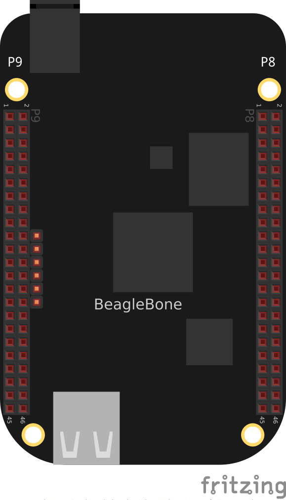
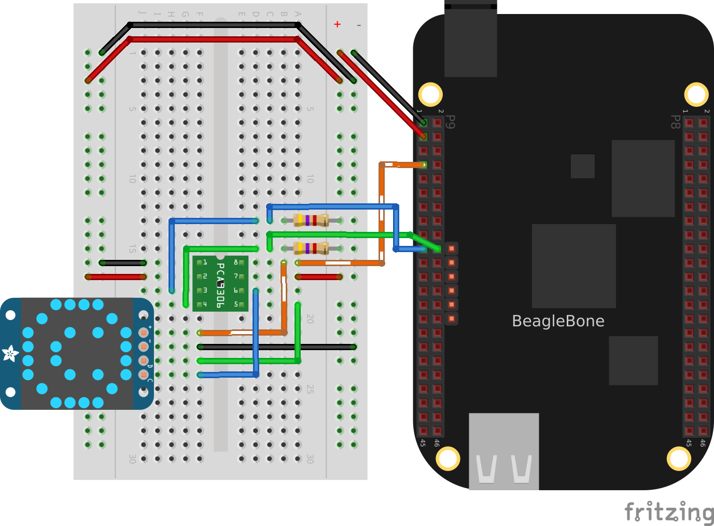
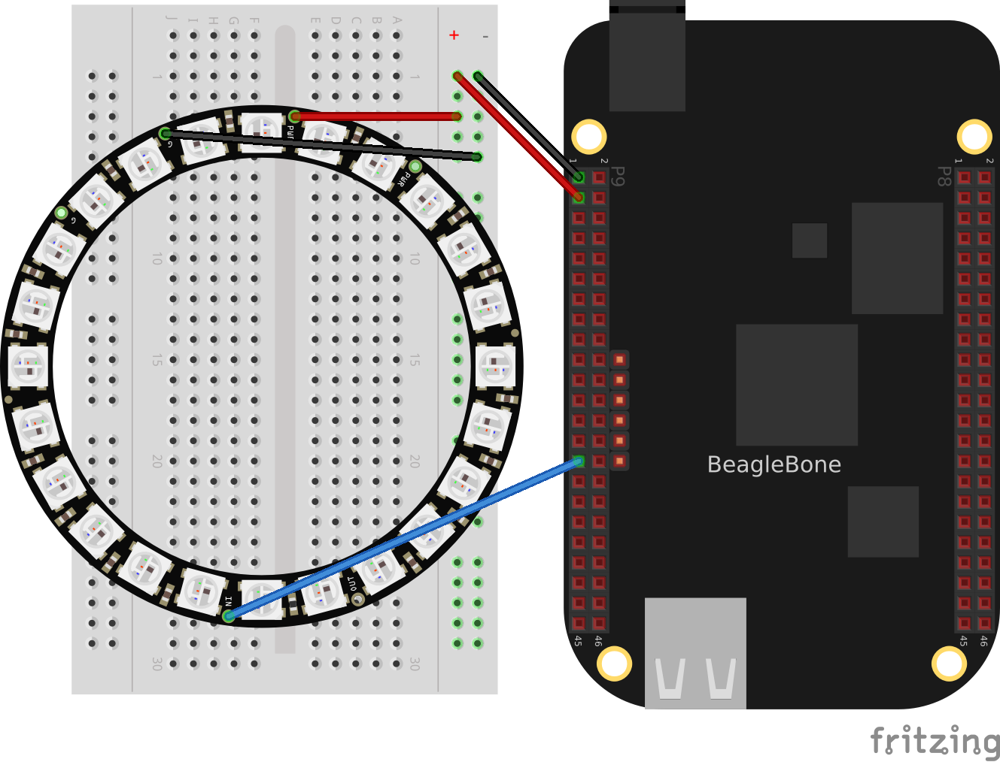

[[displays]]
== Displays and Other Outputs

=== Introduction

In this chapter, you will learn how to control physical hardware via 
BeagleBone Black's general-purpose input/output (GPIO) pins. The Bone has 65 GPIO pins that are brought out on two 46-pin headers, called +P8+ and +P9+, as shown in <<js_P8P9_fig>>.

[NOTE]
====
All the examples in the book assume you have cloned the Cookbook repository on www.github.com. Go here <<basics_repo>> for instructions.
====

[[js_P8P9_fig]]
.The P8 and P9 GPIO headers

The purpose of this chapter is to give simple examples that show how to use various methods of output. Most solutions require a breadboard and some jumper wires.

All these examples assume that you know how to edit a file (<<basics_vsc>>) and run it, either within Visual Studio Code (VSC) integrated development environment (IDE) or from the command line (<<tips_shell>>).

[[displays_onboardLED]]
=== Toggling an Onboard LED

==== Problem
((("LEDs", "toggling onboard")))((("outputs", "toggling onboard LEDs")))((("displays", "toggling onboard LEDs")))((("USER LEDs")))You want to know how to flash the four LEDs that are next to the Ethernet port on the Bone.

==== Solution
Locate the four onboard LEDs shown in <<js_internLED_fig>>. They are labeled +USR0+ through +USR3+, but we'll refer to them as the +USER+ LEDs.

[[js_internLED_fig]]
.The four +USER+ LEDs
image::figures/internLED.png["USER LEDs"]

Place the code shown in <<py_internLED_code>> in a file called _internLED.py_. You can do this using VSC to edit files (as shown in <<basics_vsc>>) or with a more traditional editor (as shown in <<tips_editing_files>>).

[[py_internLED_code]]
.Using an internal LED (internLED.py)
====
[source, python]
----

include::code/internLED.py[]

----
====

[[js_internLED_code]]
.Using an internal LED (internLED.js)
====
[source, javascript]
----

include::code/internLED.js[]

----
====

In the +bash+ command window, enter the following commands:

++++
<pre data-type="programlisting">
bone$ <strong>cd ~/BoneCookbook/docs/03displays/code</strong>
bone$ <strong>./internLED.js</strong>
</pre>
++++

The +USER0+ LED should now be flashing.

[[displays_externalLED]]
=== Toggling an External LED

==== Problem
((("displays", "toggling external LEDs")))((("outputs", "toggling external LEDs")))((("LEDs", "toggling external")))((("series resistors")))((("limiting resistors")))((("resistors", "toggling external LEDs with")))You want to connect your own external LED to the Bone.

==== Solution
Connect an LED to one of the GPIO pins using a series resistor to limit the current.  To make this recipe, you will need:

* Breadboard and jumper wires
* 220 &#8486; to 470 &#8486; resistor
* LED

[WARNING]
====
The value of the current limiting resistor depends on the LED you are using. The Bone can drive only 4 to 6 mA, so you might need a larger resistor to keep from pulling too much current. A 330 &#8486; or 470 &#8486; resistor might be better.
====

<<displays_externLED_fig>> shows how you can wire the LED to pin 14 of the +P9+ header (+P9_14+). Every circuit in this book (<<basics_wire_breadboard>>) assumes you have already wired the rightmost bus to ground (+P9_1+) and the next bus to the left to the 3.3 V (+P9_3+) pins on the header. Be sure to get the polarity right on the LED. The _short_ lead always goes to ground.

[[displays_externLED_fig]]
.Diagram for using an external LED
image::figures/externLED_bb.png["External LED"]

After you've wired it, start VSC (see <<basics_vsc>>) and find the code shown in <<py_externLED_code>>.

[[py_externLED_code]]
.Code for using an external LED (externLED.py)
====
[source, python]
----

include::code/externLED.py[]

----
====
[[js_externLED_code]]
.Code for using an external LED (externLED.js)
====
[source, javascript]
----

include::code/externLED.js[]

----
====
Save your file and run the code as before (<<displays_onboardLED>>).

[[displays_powerSwitch]]
=== Toggling a High-Voltage External Device

==== Problem
((("outputs", "controlling high-voltage devices")))((("120 V devices")))((("high-voltage devices")))((("hardware", "high-voltage devices")))You want to control a device that runs at 120 V.

==== Solution
Working with 120 V can be tricky--even dangerous--if you aren't careful.  Here's a safe way to do it.

To make this recipe, you will need:

* PowerSwitch Tail II

<<displays_powerSwitch_fig>> shows how you can wire the PowerSwitch Tail II to pin +P9_14+.

[[displays_powerSwitch_fig]]
.Diagram for wiring PowerSwitch Tail II
image::figures/powerSwitch_bb.png[Power Switch Tail II]

After you've wired it, because this uses the same output pin as <<displays_externalLED>>, you can run the same code (<<py_externLED_code>>).

[[displays_PWMdiscussion]]
=== Fading an External LED

==== Problem
((("outputs", "fading external LEDs")))((("displays", "fading external LEDs")))((("LEDs", "fading external")))You want to change the brightness of an LED from the Bone.

==== Solution

((("analogWrite()")))((("b.analogWrite()")))((("pulse width modulation (PWM)"))) Use the Bone's pulse width modulation (PWM) hardware to fade an LED. We'll use the same circuit as before (<<displays_externLED_fig>>). Find the code in <<py_fadeLED_code>> Next configure the pins.  We are using P9_14 so run:

++++
<pre>
bone$ <strong>config-pin P9_14 pwm
</pre>
++++

Then run it as before.

[role="pagebreak-before"]
[[py_fadeLED_code]]
.Code for using an external LED (fadeLED.py)
====
[source, python]
----

include::code/fadeLED.py[]

----
====

[role="pagebreak-before"]
[[js_fadeLED_code]]
.Code for using an external LED (fadeLED.js)
====
[source, javascript]
----

include::code/fadeLED.js[]

----
====

==== Discussion
The Bone has several outputs that can be used as pwm's as shown in <<cape-headers-pwm_fig>>.  There are three +EHRPWM+'s (enhanced high resolution pulse width modulation) which each has a pair  of pwm channels.  Each pair must have the same pulse period.  

[[cape-headers-pwm_fig]]
.Table of PWM outputs
image::figures/cape-headers-pwm.png["PWM outputs"]

The pwm's are accessed through +/dev/bone/pwm+

++++
<pre>
bone$ <strong>cd /dev/bone/pwm</strong>
bone$ <strong>ls</strong>
0  1  2
</pre>
++++
Here we see three pwmchips that can be used, each has two channels.  Explore one.
++++
<pre>
bone$ <strong>cd 1</strong>
bone$ <strong>ls</strong>
a  b
bone$ <strong>cd a</strong>
bone$ <strong>ls</strong>
capture  duty_cycle  enable  period  polarity  power  uevent
</pre>
++++
Here is where you can set the period and duty_cycle (in ns) and enable the pwm.
Attach in LED to P9_14 and if you set the period long enough you can see the LED flash.

++++
<pre>
bone$ <strong>echo 1000000000 > period</strong>
bone$ <strong>echo  500000000 > duty_cycle</strong>
bone$ <strong>echo 1 > enable</strong>
</pre>
++++
Your LED should now be flashing.

<<display_pwm_mapping>> are the mapping I've figured out so far. I don't know how to get to the timers.
[[display_pwm_mapping]]
.Headers to pwm channel mapping.
[%autowidth]
|====
| Pin   | pwm | channel
| P9_31 | 0   | a
| P9_29 | 0   | b
| P9_14 | 1   | a
| P9_16 | 1   | b
| P8_19 | 2   | a
| P8_13 | 2   | b
|====

=== Writing to an LED Matrix

==== Problem
((("displays", "LED matrix")))((("outputs", "LED matrix")))((("LEDs", "I&#x00B2;C-based matrix")))((("I&#x00B2;C-based serial protocol")))((("Adafruit Bicolor 8x8 LED Square Pixel Matrix")))You have an I^2^C-based LED matrix to interface.

==== Solution
There are a number of nice LED matrices that allow you to control several LEDs via one interface. This solution uses an http://www.adafruit.com/products/902[Adafruit Bicolor 8x8 LED Square Pixel Matrix w/I^2^C Backpack].

To make this recipe, you will need:

* Breadboard and jumper wires
* Two 4.7 k&#8486; resistors
* I^2^C LED matrix

The LED matrix is a 5 V device, but you can drive it from 3.3 V. Wire, as shown in <<displays_i2cMatrix_fig>>.

[[displays_i2cMatrix_fig]]
.Wiring an I^2^C LED matrix
image::figures/i2cMatrix_bb.png["I^2^C LED matrix"]

<<sensors_i2c_temp>> shows how to use +i2cdetect+ to discover the address of an I^2^C device.

Run the +i2cdetect -y -r 2+ command to discover the address of the display on I^2^C bus 2, as shown in <<displays_i2cdetect>>.

[role="pagebreak-before"]
[[displays_i2cdetect]]
.Using I^2^C command-line tools to discover the address of the display
====
++++
<pre data-type="programlisting">
bone$ <strong>i2cdetect -y -r 2</strong>
     0  1  2  3  4  5  6  7  8  9  a  b  c  d  e  f
00:          -- -- -- -- -- -- -- -- -- -- -- -- -- 
10: -- -- -- -- -- -- -- -- -- -- -- -- -- -- -- -- 
20: -- -- -- -- -- -- -- -- -- -- -- -- -- -- -- -- 
30: -- -- -- -- -- -- -- -- -- -- -- -- -- -- -- -- 
40: -- -- -- -- -- -- -- -- -- 49 -- -- -- -- -- -- 
50: -- -- -- -- UU UU UU UU -- -- -- -- -- -- -- -- 
60: -- -- -- -- -- -- -- -- -- -- -- -- -- -- -- -- 
70: 70 -- -- -- -- -- -- -- 
</pre>
++++
====

Here, you can see a device at +0x49+ and +0x70+. I know I have a temperature sensor at +0x49+, so the LED matrix must be at +0.70+. 

Find the code in <<displays_matrix_i2c>> and run it by using the following command:

====
++++
<pre data-type="programlisting">
bone$ <strong>pip install smbus</strong>  # (Do this only once.)
bone$ <strong>./matrixLEDi2c.py</strong>
</pre>
++++
====

[[displays_matrix_i2c]]
.LED matrix display (matrixLEDi2c.py)
====
[source, c]
----

include::code/matrixLEDi2c.py[]

----
====
<1> This line states which bus to use.

<2> This specifies the address of the LED matrix, +0x70+ in our case.

<3> This indicates which LEDs to turn on. The first byte is for the first column of _green_ LEDs. In this case, all are turned off. The next byte is for the first column of _red_ LEDs. The hex +0x3c+ number is +0b00111100+ in binary. This means the first two red LEDs are off, the next four are on, and the last two are off. The next byte (+0x00+) says the second column of _green_ LEDs are all off, the fourth byte (+0x42+ = +0b01000010+) says just two +red+ LEDs are on, and so on. Declarations define four different patterns to display on the LED matrix, the last being all turned off.

<4> Send three commands to the matrix to get it ready to display.

<5> Now, we are ready to display the various patterns. After each pattern is displayed, we sleep a certain amount of time so that the pattern can be seen.

<6> Finally, send commands to the LED matrix to set the brightness. This makes the disply fade out and back in again.

[[displays_drive5V]]
=== Driving a 5 V Device
// TODO  Not tested for 2nd edition
==== Problem
((("outputs", "controlling 5 V devices")))((("hardware", "5 V devices")))((("5 V devices")))((("level translators")))((("PCA9306 level translator")))You have a 5 V device to drive, and the Bone has 3.3 V outputs.

==== Solution
If you are lucky, you might be able to drive a 5 V device from the Bone's 3.3 V output. Try it and see if it works. If not, you need a level translator.  

What you will need for this recipe:

* A PCA9306 level translator
* A 5 V power supply (if the Bone's 5 V power supply isn't enough)

The PCA9306  translates signals at 3.3 V to 5 V in both directions. It's meant to work with I^2^C devices that have a pull-up resistor, but it can work with anything needing translation.

<<displays_i2cMatrixLevelTrans_fig>> shows how to wire a PCA9306 to an LED matrix. The left is the 3.3 V side and the right is the 5 V side. Notice that we are using the Bone's built-in 5 V power supply.

[[displays_i2cMatrixLevelTrans_fig]]
.Wiring a PCA9306 level translator to an LED matrix

[NOTE]
====
If your device needs more current than the Bone's 5 V power supply provides, you can wire in an external power supply.
====

=== Writing to a NeoPixel LED String Using the PRUs

==== Problem
((("displays", "NeoPixel LED strings")))((("outputs", "NeoPixel LED strings")))((("Adafruit Neopixel LED strings")))((("Neopixel LED strings")))((("LEDs", "Adafruit Neopixel LED strings")))You have an http://www.adafruit.com/products/1138[Adafruit NeoPixel LED string] or http://www.adafruit.com/products/1487[Adafruit NeoPixel LED matrix] and want to light it up.

==== Solution

The PRU Cookbook has a nice discussion (https://markayoder.github.io/PRUCookbook/05blocks/blocks.html#blocks_ws2812[WS2812 (NeoPixel) driver]) on driving NeoPixels.

[[py_neoPixelMatrix_fig]]
.Wiring an Adafruit NeoPixel LED matrix to +P9_29+

// === Writing to a NeoPixel LED String Using LEDscape
// // TODO Remove?
// ==== Problem
// ((("displays", "NeoPixel LED strings")))((("outputs", "NeoPixel LED strings")))((("Adafruit Neopixel LED strings")))((("Neopixel LED strings")))((("LEDs", "Adafruit Neopixel LED strings")))You have an http://www.adafruit.com/products/1138[Adafruit NeoPixel LED string] or http://www.adafruit.com/products/1487[Adafruit NeoPixel LED matrix] and want to light it up.

// ==== Solution

// Wire up an Adafruit NeoPixel LED 8-by-8 matrix as shown in <<js_neoPixelMatrix_fig>>.

// [[js_neoPixelMatrix_fig]]
// .Wiring an Adafruit NeoPixel LED matrix to +P8_30+
// image::figures/neoPixelMatrix_bb.png["NeoPixel Matrix"]

// <<js_neoPixel_code>> shows how to install LEDscape and run the LEDs.

// [[js_neoPixel_code]]
// .Installing and running LEDscape and OpenPixelControl (neoPixel.sh)
// ====
// [source, bash]
// ----

// include::code/neoPixel.sh[]

// ----
// ====

// === Making Your Bone Speak
// // TODO Not tested for 2nd edition
// ==== Problem
// ((("text-to-speech programs")))((("flite text-to-speech program")))((("audio files", "text-to-speech programs")))((("speech")))((("files", "audio")))Your Bone wants to talk.

// ==== Solution
// Just install the _flite_ text-to-speech program:

// ++++
// <pre data-type="programlisting">
// bone$ <strong>sudo apt install flite</strong>
// </pre>
// ++++

// Then add the code from <<speak_code>> in a file called _speak.js_ and run.

// [[speak_code]]
// .A program that talks (speak.js)
// ====
// [source, javascript]
// ----

// include::code/speak.js[]

// ----
// ====

// See <<sensors_audio>> to see how to use a USB audio dongle and set your default audio out.
