[[networking]]
== Internet of Things

=== Introduction

((("networking", "Internet connections")))You can easily connect BeagleBone Black to the Internet via a wire (<<networking_wired>>), wirelessly (<<networking_wireless>>), or through the USB to a host and then to the Internet (<<networking_usb>>). Either way, it opens up a world of possibilities for the "Internet of Things" (IoT). 

Now that you're online, this chapter offers various things to do with your connection.

=== Accessing Your Host Computer's Files on the Bone

==== Problem
((("networking", "accessing files on host computer")))((("host computer", "accessing files from")))((("files", "accessing from host computer")))((("sshfs command")))((("commands", "sshfs")))You want to access a file on a Linux host computer that's attached to the Bone.

==== Solution
If you are running Linux on a host computer attached to BeagleBone Black, it's not hard to mount the Bone's files on the host or the host's files on the Bone by using +sshfs+. Suppose that you want to access files on the host from the Bone. First, install +sshfs+:

++++
<pre data-type="programlisting">
bone$ <strong>sudo apt install sshfs</strong>
</pre>
++++

Now, mount the files to an empty directory (substitute your username on the host computer for +username+ and the IP address of the host for +192.168.7.1+):

++++
<pre data-type="programlisting">
bone$ <strong>mkdir host</strong>
bone$ <strong>sshfs username@$192.168.7.1:. host</strong>
bone$ <strong>cd host</strong>
bone$ <strong>ls</strong>
</pre>
++++

((("ls command")))((("commands", "ls")))((("files", "listing")))((("directories", "listing files in")))The +ls+ command will now list the files in your home directory on your host computer.  You can edit them as if they were local to the Bone.  You can access all the files by substituting +:/+ for the +:.+ following the IP address.

You can go the other way, too. Suppose that you are on your Linux host computer and want to access files on your Bone. Install +sshfs+:

++++
<pre data-type="programlisting">
host$ <strong>sudo apt install sshfs</strong>
</pre>
++++

and then access:

++++
<pre data-type="programlisting">
host$ <strong>mkdir /mnt/bone</strong>
host$ <strong>sshfs debian@$192.168.7.2:/ /mnt/bone</strong>
host$ <strong>cd /mnt/bone</strong>
host$ <strong>ls</strong>
</pre>
++++

Here, we are accessing the files on the Bone as +debian+. We’ve mounted the entire file system, starting with +/+, so you can access any file. Of course, with great power comes great responsibility, so be careful.

==== Discussion
The +sshfs+ command gives you easy access from one computer to another. When you are done, you can unmount the files by using the following commands:

++++
<pre data-type="programlisting">
host$ <strong>umount /mnt/bone</strong>
bone$ <strong>umount home</strong>
</pre>
++++

[[networking_builtin_server]]
=== Serving Web Pages from the Bone

==== Problem
((("networking", "serving web pages")))((("web servers", "using BeagleBone as")))You want to use BeagleBone Black as a web server.

==== Solution
BeagleBone Black already has the +nginx+ web server running.

When you point your browser to _192.168.7.2_, you are using the +nginx+ web server.  The web pages are served from _/var/www/html/. Add the HTML in <<networking_index_html>> to a file called _/var/www/html/test.html_, and then point your browser to _192.168.7.2://test.html_. 

[role="pagebreak-before"]
[[networking_index_html]]
.A sample web page (test.html)
====
[source, html]
----

include::code/test.html[Sample html]

----
====

You will see the web page shown in <<networking_node_page>>.

[[networking_node_page]]
.test.html as served by nginx
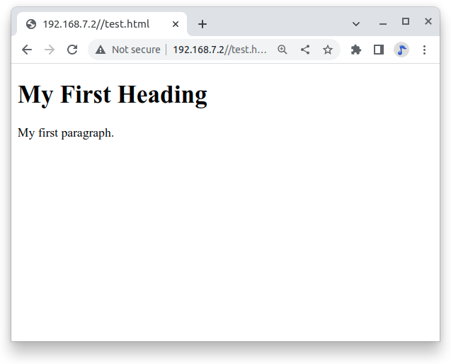

==== Discussion

[[networking_nodejs]]
=== Interacting with the Bone via a Web Browser

==== Problem
((("networking", "interaction via web browsers")))((("web servers", "creating your own")))BeagleBone Black is interacting with the physical world nicely and you want to display that information on a web browser.

==== Solution
https://www.fullstackpython.com/flask.html[Flask] is a Python web framework built with a small core and easy-to-extend philosophy. <<networking_builtin_server>> shows how to use nginx, the web server that's already running. This recipe shows how easy it is to build your own server. This is an adaptation of https://towardsdatascience.com/python-webserver-with-flask-and-raspberry-pi-398423cc6f5d[Python WebServer With Flask and Raspberry Pi].

First, install flask:

++++
<pre data-type="programlisting">
bone$ <strong>sudo apt update</strong>
bone$ <strong>sudo apt install python3-flask</strong>
</pre>
++++

All the code in is the Cookbook repo:

++++
<pre data-type="programlisting">
bone$ <strong>git clone https://github.com/MarkAYoder/BoneCookbook</strong>
bone$ <strong>cd BoneCookbook/doc/06iod/code/flash</strong>
</pre>
++++

===== First Flask - hello, world
Our first example is *helloWorld.py*

[[flask_hello_world]]
.Python code for flask hello world (helloWorld.py)
====
[source, python]
----

include::code/flask/helloWorld.py[simple flask-based web server]

----
====
<1> The first line loads the Flask module into your Python script. 

<2> The second line creates a Flask object called _app_. 

<3> The third line is where the action is, it says to run the index() function when someone accesses the root URL (‘/’) of the server. In this case, send the text “hello, world” to the client’s web browser via return.

<4> The last line says to “listen” on port 8080, reporting any errors.

Now on your host computer, browse to 192.168.7.2:8080flask an you should see.

[[flask_flaskServer]]
.Test page served by our custom flask server
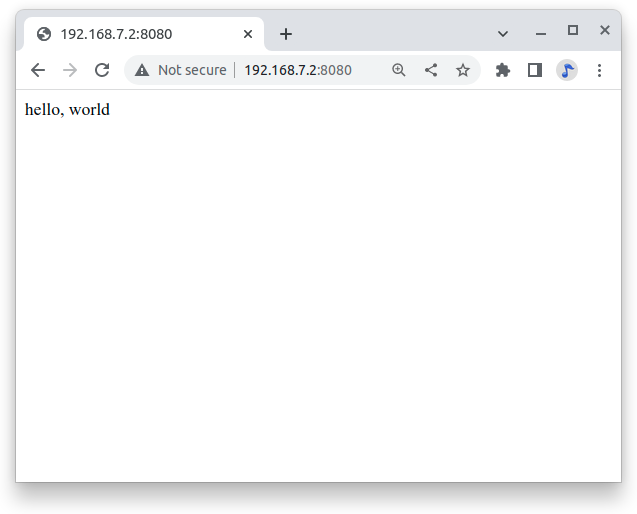

===== Adding a template
Let’s improve our “hello, world” application, by using an HTML template and a CSS file for styling our page.  Note: these have been created for you in the “templates” sub-folder. So, we will create a file named *index1.html*, that has been saved in */templates*.

Here's what's in *templates/index1.html*:

[[flask_index1]]
.Python code for flask hello world (helloWorld.py)
====
[source, html]
----

include::code/flask/templates/index1.html[index1.html]

----
====

Note: a style sheet (style.css) is also included. This will be populated later.

Observe that anything in double curly braces within the HTML template is interpreted as a variable that would be passed to it from the Python script via the render_template function. Now, let’s create a new Python script. We will name it app1.py:

[[flask_app1]]
.Python code for flask index1.html (app1.py)
====
[source, html]
----

include::code/flask/app1.py[app1]

----
====

Note that we create a formatted string("timeString") using the date and time from the "now" object, that has the current time stored on it.

Next important thing on the above code, is that we created a dictionary of variables (a set of keys, such as the title that is associated with values, such as HELLO!) to pass into the template. On “return”, we will return the index.html template to the web browser using the variables in the templateData dictionary.

Execute the Python script:

++++
<pre data-type="programlisting">
bone$ <strong>.\app.py</strong>
</pre>
++++

Open any web browser and browse to 192.168.7.2:8080. You should see:

[[flask_app1]]
.Test page served by app1.py
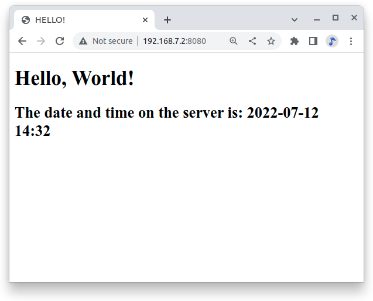

Note that the page’s content changes dynamically any time that you refresh it with the actual variable data passed by Python script. In our case, “title” is a fixed value, but “time” change it every second.

=== Displaying GPIO Status in a Web Browser - reading a button

==== Problem
((("networking", "displaying GPIO pin status")))((("GPIO pins", "displaying status of")))You want a web page to display the status of a GPIO pin.

==== Solution
This solution builds on the Flask-based web server solution in <<networking_nodejs>>.  

To make this recipe, you will need:

* Breadboard and jumper wires (see <<app_proto>>)
* Pushbutton switch (see <<app_misc>>)

Wire your pushbutton as shown in <<js_pushbutton_fig>>. 

Wire a button to *P9_11* and have the web page display the value of the button.

Let’s use a new Python script named *app2.py*.

[[flask_app2]]
.A simple Flask-based web server to read a GPIO (app2.py)
====
[source, python]
----

include::code/flask/app2.py[]

----
====
Look that what we are doing is defining the button on *P9_11* as input, reading its value and storing it in *buttonSts*. Inside the function *index()*, we will pass that value to our web page through “button” that is part of our variable dictionary: *templateData*.

Let’s also see the new *index2.html* to show the GPIO status:

[[flask_index2]]
.A simple Flask-based web server to read a GPIO (index2.html)
====
[source, html]
----

include::code/flask/templates/index2.html[]

----
====

Now, run the following command:

++++
<pre data-type="programlisting">
bone$ <strong>./app2.py</strong>
</pre>
++++

Point your browser to _http://192.168.7.2:8080_, and the page will look like <<networking_GPIOserver_fig>>.

[[flask_app2_fig]]
.Status of a GPIO pin on a web page
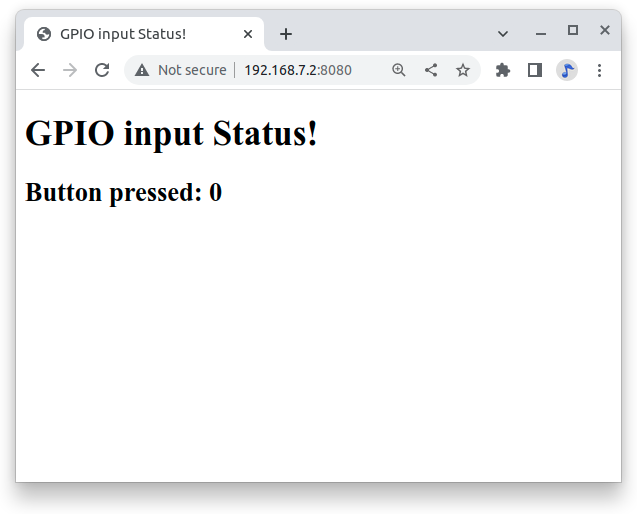

Currently, the +0+ shows that the button isn't pressed. Try refreshing the page while pushing the button, and you will see +1+ displayed.

==== Discussion
It's not hard to assemble your own HTML with the GPIO data. It's an easy extension to write a program to display the status of all the GPIO pins.

=== Controlling GPIOs

==== Problem
You want to control an LED attached to a GPIO pin.

==== Solution
Now that we know how to “read” GPIO Status, let’s change them. What we will do will control the LED via the web page. We have an LED connected to *P9_14*. Controlling remotely we will change its status from LOW to HIGH and vice-versa.

The python script Let’s create a new Python script and named it *app3.py*.

[[flask_app3]]
.A simple Flask-based web server to read a GPIO (app3.py)
====
[source, python]
----

include::code/flask/app3.py[]

----
====

What we have new on above code is the new “route”:
====
@app.route("/<deviceName>/<action>")
====
From the webpage, calls will be generated with the format:

====
http://192.168.7.2:8081/ledRed/on
====
or
====
http://192.168.7.2:8081/ledRed/off
====
For the above example, *ledRed* is the “deviceName” and *on* or *off* are examples of possible “action”. Those routes will be identified and properly “worked”. The main steps are:

* Convert the string “ledRED”, for example, on its equivalent GPIO pin.

The integer variable ledRed is equivalent to P9_14. We store this value on variable “actuator”

* For each actuator, we will analyze the “action”, or “command” and act properly.
If “action = on” for example, we must use the command: GPIO.output(actuator, GPIO.HIGH)

* Update the status of each actuator
* Update the variable library
* Return the data to index.html

Let’s now create an index.html to show the GPIO status of each actuator and more important, create “buttons” to send the commands:

[[flask_index3]]
.A simple Flask-based web server to write a GPIO (index3.html)
====
[source, html]
----

include::code/flask/templates/index3.html[]

----
====

++++
<pre data-type="programlisting">
bone$ <strong>./app3.py</strong>
</pre>
++++

Point your browser as before and you will see:

[[flask_app3_fig]]
.Status of a GPIO pin on a web page
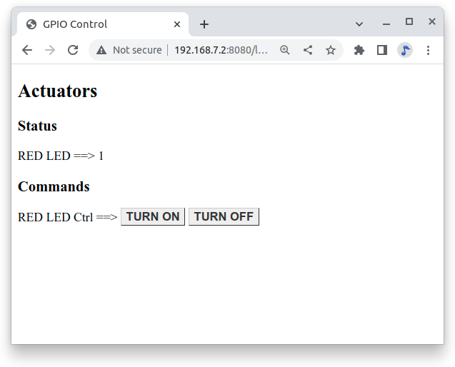

Try clickingthe "TURN ON" and "TURN OFF" buttons and your LED will respond.

=== Plotting Data

==== Problem
. ((("networking", "plotting live data")))((("plotting live data")))((("data", "plotting live")))((("flot plotting package")))You have live data coming into your Bone, and you want to plot it.

==== Solution
There are a number of http://bit.ly/1MrHm9L[JavaScript-based plotting packages] out there. This recipe uses http://www.flotcharts.org/[flot] because it strikes a nice balance between ease-of-use and power.

To make this recipe, you will need:

* Breadboard and jumper wires (see <<app_proto>>)
* 10 k&#8486; trimpot (variable resistor) (see <<app_resistor>>)

Wire your variable resistor to +P9_36+, as shown in <<sensors_analogIn_fig>>.
Go to http://bit.ly/1E5DW85[jsfiddle Flot Demo] for a nice quick demo. You will the screen shown in <<networking_flot_demo>>. Try changing the variable resistor, and watch the plot respond in real time.

[[networking_flot_demo]]
.jsfiddle Flot Demo
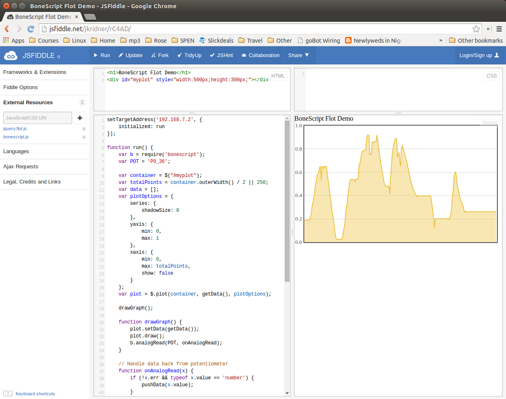

See <<networking_jsfiddle>> for a description of the jsfiddle panels. In <<networking_flot_demo>>, the lower-right panel displays a live scrolling chart of the values being read from the variable resistor.

==== Discussion
You can perform plotting externally, via the http://jsfiddle.net/[jsfiddle] site, or locally.

===== Plotting with jsfiddle
The HTML panel in <<networking_flot_demo>> simply creates an area called +myplot+ in which to draw the plot. The JavaScript code in <<networking_flot_js>> then reads the analog in and creates the plot to display.

[[networking_flot_js]]
.Code for plotting data with Flot (flotDemo.js)
====
[source, js]
----

include::code/flotDemo.js[]

----
====
<1> Direct the browser where to find the Bone.  After it is initialized, it calls +run+ to get things going.

<2> Read in the BoneScript library.

<3> Pick which analog-in to use.

<4> Pick where on the web page to draw the plot.  In this case, the code defines only one place, +myplot+.

<5> Decide how many points can be plotted.

<6> Set various plotting options.

<7> Initialize the plot.

<8> Draw the graph on the web page.

<9> Set the data and draw. Then read the next value and call +onAnalogRead+ when it's ready.

<10> If no error, add newest value to the data array.

<11> Do it all over again in 20 ms.

===== Plotting locally
You can do plotting locally by following the process in <<networking_jQuery_local>>:

. Copy the JavaScript code in the lower-left panel and save it in a file called _pass:[flotDemo.js]_.

. Copy the HTML in the upper-left panel and add the header material. <<networking_flotDemo>> loads the +flot+ library in addition to +jquery+ and our own code.

[[networking_flotDemo]]
.flotDemo.html (flotDemo.html)
====
[source, html]
----

include::code/flotDemo.html[]

----
====

[start=3]
. Put both files in the _serverExample_ subdirectory under the Cloud9 IDE (_/var/lib/cloud9_).

. Browse to _http://192.168.7.2/serverExample/flotDemo.html_, and you'll have a local version of your demo running.

Go explore the http://www.flotcharts.org/[Flot site] and see what other plots you pass:[can do].

=== Sending an Email

==== Problem
((("networking", "sending email")))((("email")))((("Gmail")))You want to send an email via Gmail from the Bone.

==== Solution
First, you need to https://mail.google.com[set up a Gmail account], if you don't already have one. Next, install +nodemailer+:

++++
<pre data-type="programlisting">
bone$ <strong>npm install -g nodemailer</strong>
</pre>
++++

Then add the code in <<networking_nodemailer_code>> to a file named _nodemailer-test.js_ in the _serverExample_ directory. Be sure to substitute your own Gmail username and password for +user+ and +pass+.

[[networking_nodemailer_code]]
.Sending email using nodemailer (nodemailer-test.js)
====
[source, js]
----

include::code/nodemailer-test.js[nodemailer-test.js]

----
====

Then run the script to send the email:

++++
<pre data-type="programlisting">
bone$ <strong>chmod +x nodemailer-test.js</strong>
bone$ <strong>.\nodemailer-test.js</strong>
</pre>
++++

[WARNING]
====
((("security issues", "email")))This solution requires your Gmail password to be in plain text in a file, which is a security problem. Make sure you know who has access to your Bone. Also, if you remove the microSD card, make sure you know who has access to it. Anyone with your microSD card can read your Gmail password.
====

==== Discussion
((("bulk email")))Be careful about putting this into a loop.  Gmail presently limits you to http://group-mail.com/email-marketing/how-to-send-bulk-emails-using-gmail/[500 emails per day and 10 MB per message].

=== Sending an SMS Message

==== Problem
((("networking", "sending SMS messages")))((("SMS messages")))((("text messages")))((("Twilio")))You want to send a text message from BeagleBone Black.

==== Solution
There are a number of SMS services out there. This recipe uses Twilio because you can use it for free, but you will need to http://bit.ly/1MrHBBF[verify the number] to which you are texting. First, go to https://www.twilio.com/[Twilio's home page] and set up an account. Note your account SID and authorization token. If you are using the free version, be sure to http://bit.ly/19c7GZ7[verify your numbers].

Next, install Trilio by using the following command:

++++
<pre data-type="programlisting">
bone$ <strong>npm install -g twilio</strong>
</pre>
++++

Finally, add the code in <<networking_twilio_code>> to a file named _twilio-test.js_ and run it. Your text will be sent.

[[networking_twilio_code]]
.Sending SMS messages using Twilio (_twilio-test.js_)
====
[source, js]
----

include::code/twilio-test.js[nodemailer-test.js]

----
====

==== Discussion
Twilio allows a small number of free text messages, enough to test your code and to play around some.

=== Displaying the Current Weather Conditions

==== Problem
((("networking", "displaying weather conditions")))((("current weather conditions")))((("weather APIs")))You want to display the current weather conditions.

==== Solution
Because your Bone is on the network, it's not hard to access the current weather conditions from a weather API. First, install a JavaScript module:

++++
<pre data-type="programlisting">
bone$ <strong>npm install -g weather-js</strong>  (Took about 4 minutes on a slow connection)
</pre>
++++

Then add the code in <<networking_weather_code>> to a file named _weather.js_.

[[networking_weather_code]]
.Code for getting current weather conditions (_weather.js_)
====
[source, js]
----

include::code/weather.js[]

----
====
<1> Prints everything returned by the weather site.

<2> Prints only the current weather conditions.

<3> Prints the forecast for the next day.

Run this by using the following commands:

++++
<pre data-type="programlisting">
bone$ <strong>chmod +x weather.js</strong>
bone$ <strong>./weather.js</strong>
...
{
  "temperature": "74",
  "skycode": "28",
  "skytext": "Mostly Cloudy",
  "date": "2014-07-28",
  "observationtime": "14:53:00",
  "observationpoint": "Terre Haute, Terre Haute International Airport - 
      Hulman Field",
  "feelslike": "74",
  "humidity": "53",
  "winddisplay": "15 mph NW",
  "day": "Monday",
  "shortday": "Mon",
  "windspeed": "15",
  "imageUrl": "http://wst.s-msn.com/i/en-us/law/28.gif"
}
</pre>
++++

==== Discussion
The weather API returns lots of information. Use JavaScript to extract the information you want.

=== Sending and Receiving Tweets

==== Problem
((("networking", "sending/receiving Twitter posts")))((("tweets, sending/receiving")))((("Twitter posts")))You want to send and receive tweets (Twitter posts) with your Bone.

==== Solution
First, install the Twitter node package:

++++
<pre data-type="programlisting">
bone$ <strong>npm install node-twitter</strong>
</pre>
++++
Before creating a Twitter app, you need to authenticate with Twitter:  

. Go to https://apps.twitter.com/[the Twitter Application Management page] and click Create New App. 
. Fill in the requested information and click "Create your Twitter application." You can leave the Callback URL blank. 
. Click the API Keys tab. If you plan to have the Bone send tweets, click "modify app permissions" to the right of "Access level." 
. Select "Read and Write" and click "Update settings."  
. Click the API Keys tab.
. Near the bottom of the page, click "Create my access token."
. Create a file called _twitterKeys.js_ and add the following code to it, substituting your keys for _xxx_:

[source, js]
----
exports.API_KEY      = 'xxx';
exports.API_SECRET   = 'xxx';
exports.TOKEN        = 'xxx';
exports.TOKEN_SECRET = 'xxx';
----

Add the code in <<networking_timeline_code>> to a file called _twitterTimeLine.js_ and run it to see your timeline.

[[networking_timeline_code]]
.Code to display your Twitter timeline (twitterTimeLine.js)
====
[source, js]
----

include::code/twitterTimeLine.js[]

----
====

Use the code in <<networking_send_code>> to send a tweet with a picture.

[[networking_send_code]]
.Code to send a tweet with a picture (twitterUpload.js)
====
[source, js]
----

include::code/twitterUpload.js[]

----
====

The code in <<networking_pushbutton_code>> sends a tweet whenever a button is pushed.

[[networking_pushbutton_code]]
.Tweet when a button is pushed (twitterPushbutton.js)
====
[source, js]
----

include::code/twitterPushbutton.js[]

----
====

To see many other examples, go to http://bit.ly/18AvSTW[iStrategyLabs' node-twitter GitHub page].

==== Discussion
This opens up many new possibilities. You can read a temperature sensor and tweet its value whenever it changes, or you can turn on an LED whenever a certain hashtag is used. What are you going to tweet?

[[networking_node_red]]
=== Wiring the IoT with Node-RED

==== Problem
((("networking", "graphical programing via Node-RED")))((("Node-RED")))((("Internet", "interactions via Node-RED")))You want BeagleBone to interact with the Internet, but you want to program it graphically.

==== Solution
http://nodered.org/[Node-RED] is a visual tool for wiring the IoT. It makes it easy to turn on a light when a certain hashtag is tweeted, or spin a motor if the forecast is for hot weather.

===== Installing Node-RED
To install Node-RED, run the following commands:

++++
<pre data-type="programlisting">
bone$ <strong>cd</strong>          # Change to home directory
bone$ <strong>git clone https://github.com/node-red/node-red.git</strong>
bone$ <strong>cd node-red/</strong>
bone$ <strong>npm install --production</strong>    # almost 6 minutes
bone$ <strong>cd nodes</strong>
bone$ <strong>git clone https://github.com/node-red/node-red-nodes.git</strong> # 2 seconds
bone$ <strong>cd ~/node-red</strong>
</pre>
++++

To run Node-RED, use the following commands:

++++
<pre data-type="programlisting">
bone$ <strong>cd ~/node-red</strong>
bone$ <strong>node red.js</strong>
Welcome to Node-RED
===================

18 Aug 16:31:43 - [red] Version: 0.8.1.git
18 Aug 16:31:43 - [red] Loading palette nodes
18 Aug 16:31:49 - [26-rawserial.js] Info : only really needed for 
                  Windows boxes without serialport npm module installed.
18 Aug 16:31:56 - ------------------------------------------
18 Aug 16:31:56 - [red] Failed to register 44 node types
18 Aug 16:31:56 - [red] Run with -v for details
18 Aug 16:31:56 - ------------------------------------------
18 Aug 16:31:56 - [red] Server now running at http://127.0.0.1:1880/
18 Aug 16:31:56 - [red] Loading flows : flows_yoder-debian-bone.json
</pre>
++++

The second-to-last line informs you that Node-RED is listening on part +1880+. Point your browser to http://192.168.7.2:1880, and you will see the screen shown in <<networking_node_red_fig>>.

[[networking_node_red_fig]]
.The Node-RED web page
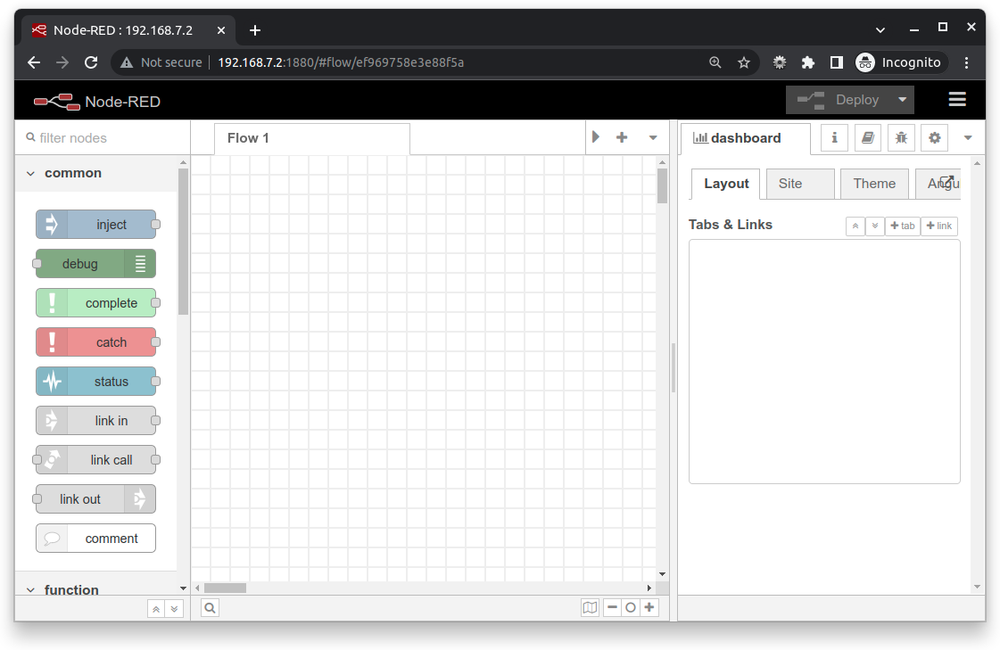

===== Building a Node-RED Flow
The example in this recipe builds a Node-RED flow that will toggle an LED whenever a certain hashtag is tweeted. But first, you need to set up the Node-RED flow with the +twitter+ node:

. On the Node-RED web page, scroll down until you see the +social+ nodes on the left side of the page.
. Drag the +twitter+ node to the canvas, as shown in <<networking_node_twitter_fig>>.

[[networking_node_twitter_fig]]
.Node-RED twitter node
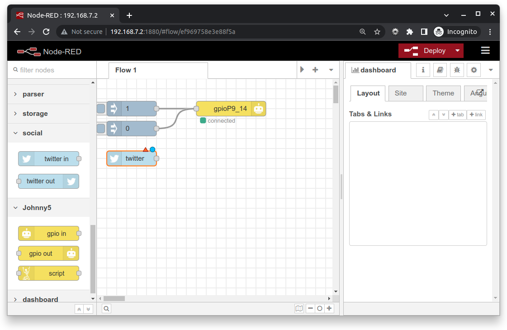

[start=3]
. Authorize Twitter by double-clicking the +twitter+ node. You'll see the screen shown in <<networking_node_twitter_auth_fig>>.

[[networking_node_twitter_auth_fig]]
.Node-RED Twitter authorization, step 1
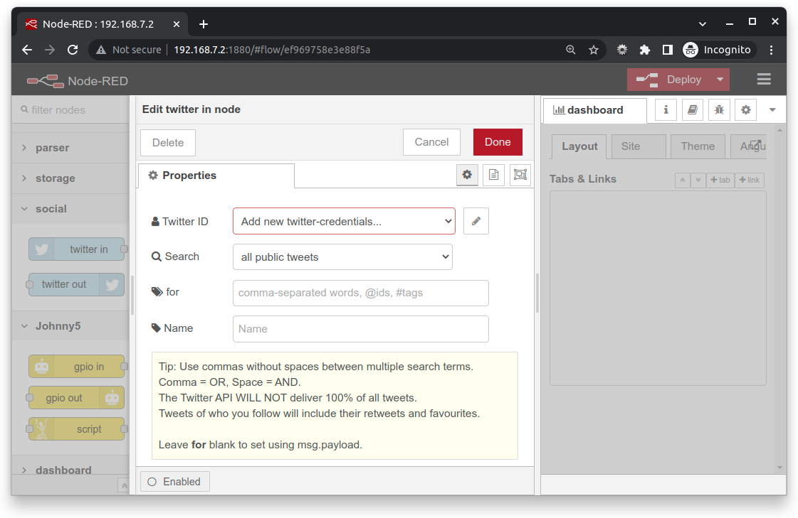

[start=4]
. Click the pencil button to bring up the dialog box shown in <<networking_node_twitter_auth2_fig>>.

[[networking_node_twitter_auth2_fig]]
.Node-RED twitter authorization, step 2
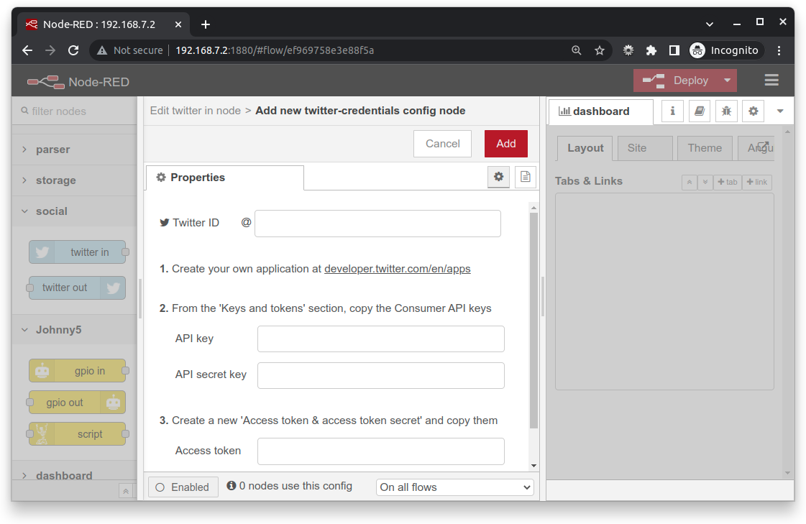

[start=5]
. Click the "here" link, as shown in <<networking_node_twitter_auth2_fig>>, and you'll be taken to Twitter to authorize Node-RED.

. Log in to Twitter and click the "Authorize app" button (<<networking_node_twitter_auth3_fig>>).

[[networking_node_twitter_auth3_fig]]
.Node-RED Twitter site authorization
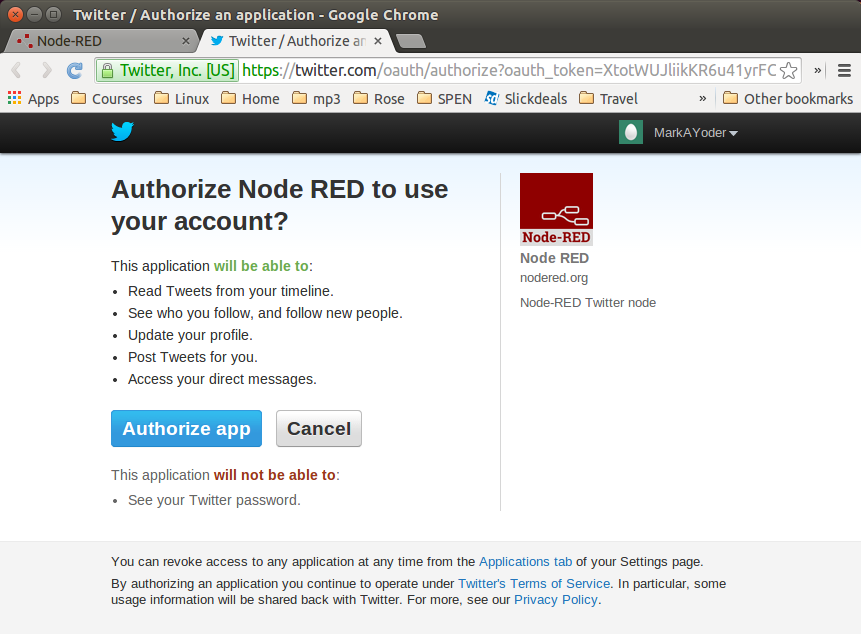

[start=7]
. When you're back to Node-RED, click the Add button, add your Twitter credentials, enter the hashtags to respond to (<<networking_node_twitter_beagle_fig>>), and then click the Ok pass:[button].

[[networking_node_twitter_beagle_fig]]
.Node-RED adding the #BeagleBone hashtag
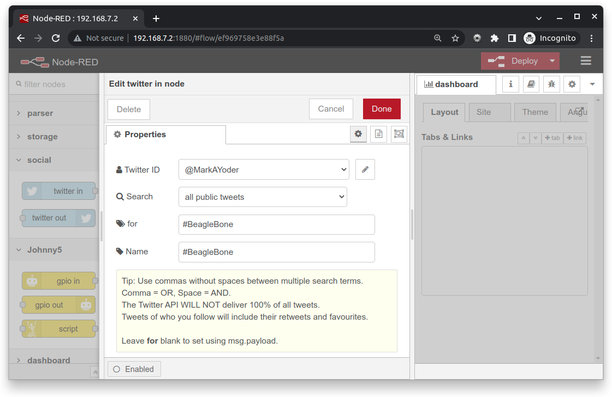

[start=8]
. Go back to the left panel, scroll up to the top, and then drag the +debug+ node to the canvas. (+debug+ is in the +output+ section.)((("debugging", "in node-RED")))
. Connect the two nodes by clicking and dragging (<<networking_node_twitter_debug_fig>>).

[[networking_node_twitter_debug_fig]]
.Node-RED Twitter adding +debug+ node and connecting
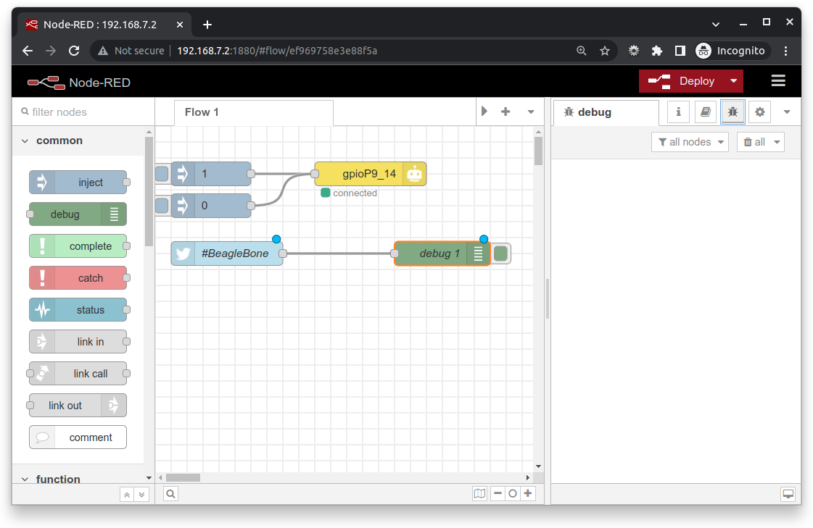

[start=10]
. In the right panel, in the upper-right corner, click the "debug" tab.
. Finally, click the Deploy button above the "debug" tab.

Your Node-RED flow is now running on the Bone. Test it by going to Twitter and tweeting something with the hashtag +#BeagleBone+. Your Bone is now responding to events happening out in the world.

===== Adding an LED Toggle
((("LEDs", "toggling with Node-RED")))Now, we're ready to add the LED toggle:

. Wire up an LED as shown in <<displays_externalLED>>. Mine is wired to +P9_14+.  
. Scroll to the bottom of the left panel and drag the +bbb-discrete-out+ node (second from the bottom of the +bbb+ nodes) to the canvas and wire it (<<networking_node_bbb_out_fig>>).

[[networking_node_bbb_out_fig]]
.Node-RED adding bbb-discrete-out node
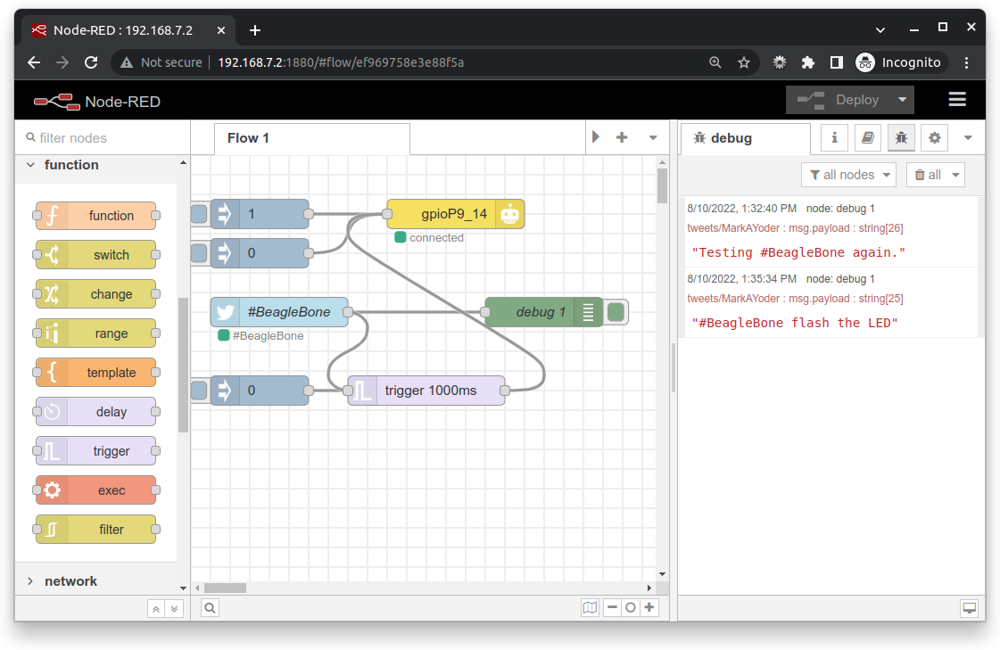

[start=3]
. Double-click the node, select your GPIO pin and "Toggle state," and then set "Startup as" to +1+ (<<networking_node_bbb_out_setup_fig>>).

[[networking_node_bbb_out_setup_fig]]
.Node-RED adding bbb-discrete-out configuration
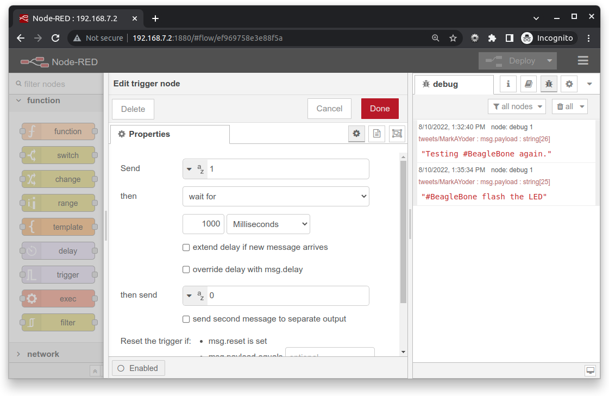

[start=4]
. Click Ok and then Deploy.

Test again. The LED will toggle every time the hashtag +#BeagleBone+ is tweeted. With a little more exploring, you should be able to have your Bone ringing a bell or spinning a motor in response to tweets.

==== Discussion

[[networking_apache]]
=== Serving Web Pages from the Bone by Using Apache

==== Problem
((("networking", "serving web pages")))((("web servers", "using BeagleBone as")))((("Apache web servers")))You want to use BeagleBone Black as an Apache web server.

==== Solution
https://httpd.apache.org/[Apache] (the most popular web server on the Internet since 1996) is already running on the Bone. Point your browser to _http://192.168.7.2:8080/_, and you'll see a screen that looks like <<networking_apacheNoFiles>>.

[[networking_apacheNoFiles]]
.Apache running on the Bone with no files to view
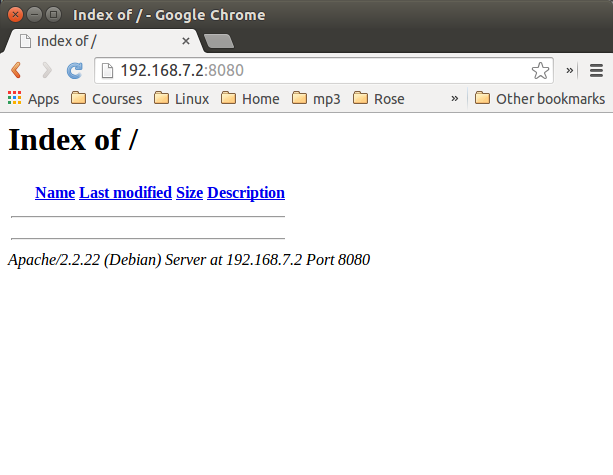

What you are seeing is a listing of the files in Apache's root directory (_/var/www/_).  In this case, there are no files to show. Add the HTML in <<networking_index_html>> to a file called _/var/www/test.html_ and refresh your browser. You will see the screen shown in <<networking_apacheTest_html>>.

[[networking_apacheTest_html]]
.The test.html file appears
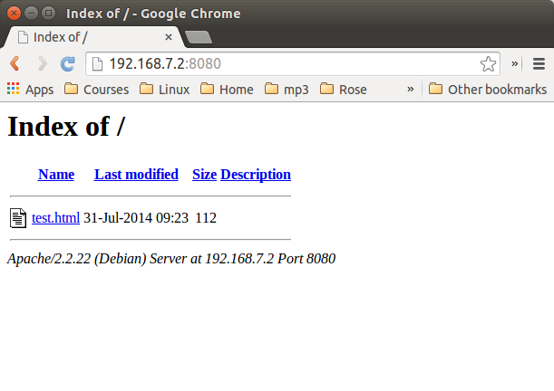

Click the _test.html_ link to display the screen in <<networking_apacheIndex>>.

[[networking_apacheIndex]]
.Apache running on the Bone showing test.html
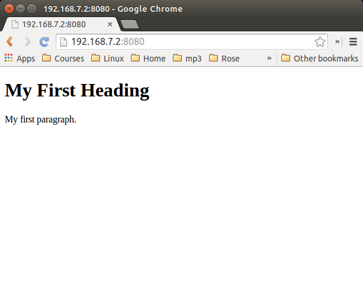

You can place any number of files in _/var/www/_ and access them with Apache.

==== Discussion

=== Communicating over a Serial Connection to an Arduino or LaunchPad

==== Problem
((("networking", "interaction over serial connection")))((("serial ports", "interaction via")))((("UARTs (serial ports)")))((("Arduino")))((("LaunchPad")))You would like your Bone to talk to an Arduino or LaunchPad.

==== Solution
The common serial port (also know as a UART) is the simplest way to talk between the two.  Wire it up as shown in <<networking_launchPad_fig>>.

[WARNING]
====
BeagleBone Black runs at 3.3 V. When wiring other devices to it, ensure that they are also 3.3 V. The LaunchPad I'm using is 3.3 V, but many Arduinos are 5.0 V and thus won't work. Or worse, they might damage your Bone.
====

[[networking_launchPad_fig]]
.Wiring a LaunchPad to a Bone via the common serial port
image::figures/launchPad_bb.png[MSP430 LaunchPad]

Add the code (or _sketch_, as it's called in Arduino-speak) in <<js_launchPad_code>> to a file called _launchPad.ino_ and run it on your LaunchPad.

[[js_launchPad_code]]
.LaunchPad code for communicating via the UART (launchPad.ino)
====
[source, c]
----

include::code/launchPad/launchPad.ino[]

----
====
<1> Set the mode for the built-in red and green LEDs.

<2> Start the serial port at 9600 baud.

<3> Prompt the user, which in this case is the Bone.

<4> Set the LEDs to the current values of the +red+ and +green+ variables.

<5> Wait for characters to arrive on the serial port.

<6> After the characters are received, read it and respond to it.

On the Bone, add the script in <<js_launchPadBeagle_code>> to a file called _launchPad.js_ and run it.

[[js_launchPadBeagle_code]]
.Code for communicating via the UART (launchPad.js)
====
[source, c]
----

include::code/launchPad.js[]

----
====
<1> Select which serial port to use. <<networking_cape-headers-serial_fig>> shows what's available. We've wired +P9_24+ and +P9_26+, so we are using serial port +/dev/ttyO1+. (Note that's the letter _O_ and not the number _zero_.)

<2> Set the baudrate to 9600, which matches the setting on the LaunchPad.

<3> Read one line at a time up to the newline character (+\n+).

<4> Open the serial port and call +onSerial()+ whenever there is data available.

<5> Determine what event has happened on the serial port and respond to it.

<6> If the serial port has been ++open++ed, start calling +sendCommand()+ every 1000 ms.

<7> These are the two commands to send.

<8> Write the character out to the serial port and to the LaunchPad.

<9> Move to the next command.

[[networking_cape-headers-serial_fig]]
.Table of UART outputs
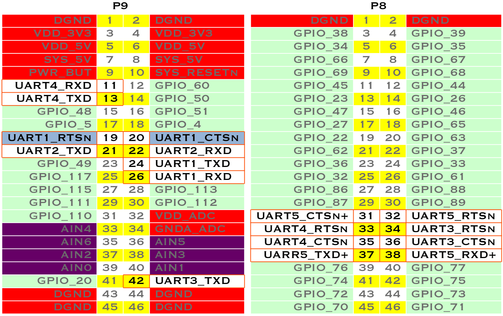

==== Discussion
When you run the script in <<js_launchPadBeagle_code>>, the Bone opens up the serial port and every second sends a new command, either +r+ or +g+. The LaunchPad waits for the command and, when it arrives, responds by toggling the corresponding LED.
