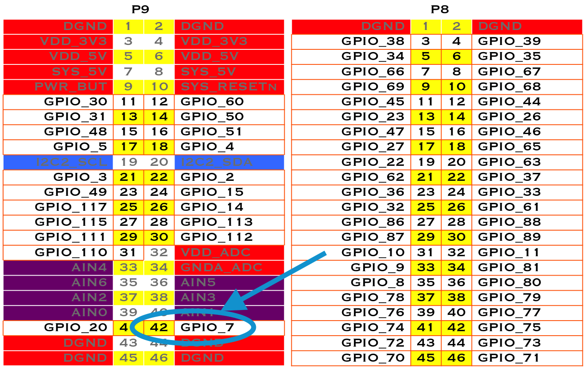

[[kernel]]
== The Kernel

=== Introduction
((("Linux kernel", "functions of")))((("kernel", see="Linux kernel")))The kernel is the heart of the Linux operating system. It's the software that takes the low-level requests, such as reading or writing files, or reading and writing general-purpose input/output (GPIO) pins, and maps them to the hardware. When you install a new version of the OS (<<basics_latest_os>>), you get a certain version of the kernel. 

You usually won't need to mess with the kernel, but sometimes you might want to try something new that requires a different kernel. This chapter shows how to switch kernels. The nice thing is you can have multiple kernels on your system at the same time and select from among them which to boot up.

[NOTE]
====
We assume here that you are logged on to your Bone as +root+ and superuser privileges. You also need to be logged in to your Linux host computer as a nonsuperuser.
====

=== Updating the Kernel

==== Problem
((("Linux kernel", "updating")))((("software", "updating Linux kernel")))You have an out-of-date kernel and want to want to make it current.

==== Solution
Use the following command to determine which kernel you are running:

++++
<pre data-type="programlisting">
bone$ <strong>uname -a</strong>
Linux beaglebone <strong>3.8.13-bone67</strong> #1 SMP Wed Sep 24 21:30:03 UTC 2014 armv7l
 GNU/Linux
</pre>
++++

The +3.8.13-bone67+ string is the kernel version.

To update to the current kernel, ensure that your Bone is on the Internet (<<networking_usb>> or <<networking_wired>>) and then run the following commands:

++++
<pre data-type="programlisting">
bone$ <strong>apt-cache pkgnames | grep linux-image | sort | less</strong>
...
linux-image-3.15.8-armv7-x5
linux-image-3.15.8-bone5
linux-image-3.15.8-bone6
...
linux-image-3.16.0-rc7-bone1
...
linux-image-3.8.13-bone60
linux-image-3.8.13-bone61
linux-image-3.8.13-bone62
bone$ <strong>sudo apt install linux-image-3.14.23-ti-r35</strong>
bone$ <strong>sudo reboot</strong>
bone$ <strong>uname -a</strong>
Linux beaglebone 3.14.23-ti-r35 #1 SMP PREEMPT Wed Nov 19 21:11:08 UTC 2014 armv7l
 GNU/Linux
</pre>
++++

The first command lists the versions of the kernel that are available. The second command installs one. After you have rebooted, the new kernel will be running.

If the current kernel is doing its job adequately, you probably don't need to update, but sometimes a new software package requires a more up-to-date kernel. Fortunately, precompiled kernels are available and ready to download.  

==== Discussion

[[kernel_building_modules]]
=== Building and Installing Kernel Modules

==== Problem

((("hardware", "building drivers for")))((("Linux kernel", "building/installing modules")))((("drivers", "building")))You need to use a peripheral for which there currently is no driver, or you need to improve the performance of an interface previously handled in user space.

==== Solution

The solution is to run in kernel space by building a kernel module. There are entire http://bit.ly/1Fb0usf[books on writing Linux Device Drivers]. This recipe assumes that the driver has already been written and shows how to compile and install it. After you've followed the steps for this simple module, you will be able to apply them to any other module.

For our example module, add the code in <<kernel_simple_module>> to a file called _hello.c_.

[[kernel_simple_module]]
.Simple Kernel Module (hello.c)
====
[source, js]
----

include::code/hello.c[]

----
====

((("Linux kernel", "Kernel Headers")))When compiling on the Bone, all you need to do is load the Kernel Headers for the version of the kernel you're running:

++++
<pre data-type="programlisting">
bone$ <strong>sudo apt install linux-headers-`uname -r`</strong>
</pre>
++++

[NOTE]
====
((("&#x60; character (backtick)")))((("backtick (&#x60;) character")))The quotes around +`uname -r`+ are backtick characters. On a United States keyboard, the backtick key is to the left of the 1 key.
====

This took a little more than three minutes on my Bone. The +`uname -r`+ part of the command looks up what version of the kernel you are running and loads the headers for it. 

Next, add the code in <<kernel_Makefle>> to a file called _Makefile_.

[[kernel_Makefle]]
.Simple Kernel Module (_Makefile_)
====
[source, js]
----

include::code/Makefile.display[]

----
====

[NOTE]
====
((("makefiles")))((("tab character")))Replace the two instances of +<TAB>+ with a tab character (the key left of the Q key on a United States keyboard). The tab characters are very important to makefiles and must appear as shown.
====

Now, compile the kernel module by using the +make+ command:

++++
<pre data-type="programlisting">
bone$ <strong>make</strong>
make -C /lib/modules/3.8.13-bone67/build \
      SUBDIRS=/root/cookbook-atlas/code/hello modules
make[1]: Entering directory `/usr/src/linux-headers-3.8.13-bone67'
  CC [M]  /root/cookbook-atlas/code/hello/hello.o
  Building modules, stage 2.
  MODPOST 1 modules
  CC      /root/cookbook-atlas/code/hello/hello.mod.o
  LD [M]  /root/cookbook-atlas/code/hello/hello.ko
make[1]: Leaving directory `/usr/src/linux-headers-3.8.13-bone67'
bone$ <strong>ls</strong>
Makefile        hello.c   hello.mod.c  hello.o
Module.symvers  hello.ko  hello.mod.o  modules.order
</pre>
++++

Notice that several files have been created. _hello.ko_ is the one you want. Try a couple of commands with it:

++++
<pre data-type="programlisting">
bone$ <strong>modinfo hello.ko</strong>
filename:       /root/hello/hello.ko
srcversion:     87C6AEED7791B4B90C3B50C
depends:        
vermagic:       3.8.13-bone67 SMP mod_unload modversions ARMv7 thumb2 p2v8
bone$ <strong>sudo insmod hello.ko</strong>
bone$ <strong>dmesg | tail -4</strong>
[419313.320052] bone-iio-helper helper.15: ready
[419313.322776] bone-capemgr bone_capemgr.9: slot #8: Applied #1 overlays.
[491540.999431] Loading hello module...
[491540.999476] Hello world
</pre>
++++

((("insmod command")))((("commands", "insmod")))((("dmesg command")))((("commands", "dmesg")))((("system messages, viewing")))((("advanced operations", "viewing system messages")))((("commands", "tail")))((("tail command")))The first command displays information about the module. The +insmod+ command inserts the module into the running kernel. If all goes well, nothing is displayed, but the module does print something in the kernel log. The +dmesg+ command displays the messages in the log, and the +tail -4+ command shows the last four messages. The last two messages are from the module. It worked!

==== Discussion

[[kernel_LEDs]]
=== Controlling LEDs by Using SYSFS Entries

==== Problem
((("Linux kernel", "controlling LEDs from command line")))((("LEDs", "controlling from command line")))((("sysfs virtual file system", "controlling LEDs with")))((("files", "virtual file system for")))You want to control the onboard LEDs from the command line.

==== Solution
On Linux, http://bit.ly/1AjhWUW[everything is a file]; that is, you can access all the inputs and outputs, the LEDs, and so on by opening the right _file_ and reading or writing to it. For example, try the following:

++++
<pre data-type="programlisting">
bone$ <strong>cd /sys/class/leds/</strong>
bone$ <strong>ls</strong>
beaglebone:green:usr0  beaglebone:green:usr2
beaglebone:green:usr1  beaglebone:green:usr3
</pre>
++++

What you are seeing are four directories, one for each onboard LED. Now try this:

++++
<pre data-type="programlisting">
bone$ <strong>cd beaglebone\:green\:usr0</strong>
bone$ <strong>ls</strong>
brightness  device  max_brightness  power  subsystem  trigger  uevent
bone$ <strong>cat trigger</strong>
none nand-disk mmc0 mmc1 timer oneshot [heartbeat] 
     backlight gpio cpu0 default-on transient 
</pre>
++++

The first command changes into the directory for LED +usr0+, which is the LED closest to the edge of the board. The +[heartbeat]+ indicates that the default trigger (behavior) for the LED is to blink in the heartbeat pattern. Look at your LED.  Is it blinking in a heartbeat pattern?

Then try the following:

++++
<pre data-type="programlisting">
bone$ <strong>echo none > trigger</strong>
bone$ <strong>cat trigger</strong> 
[none] nand-disk mmc0 mmc1 timer oneshot heartbeat
       backlight gpio cpu0 default-on transient 
</pre>
++++

This instructs the LED to use +none+ for a trigger. Look again. It should be no longer blinking.

Now, try turning it on and off:

++++
<pre data-type="programlisting">
bone$ <strong>echo 1 > brightness</strong>
bone$ <strong>echo 0 > brightness</strong>
</pre>
++++

The LED should be turning on and off with the commands.

==== Discussion

[[kernel_gpio_sysfs]]
=== Controlling GPIOs by Using SYSFS Entries

==== Problem
((("Linux kernel", "controlling GPIO pins via sysfs")))((("GPIO pins", "controlling via sysfs entries")))((("sysfs virtual file system", "controlling GPIO pins with")))You want to control a GPIO pin from the command line.

==== Solution
<<kernel_LEDs>> introduces the +sysfs+. This recipe shows how to read and write a GPIO pin. 

===== Reading a GPIO Pin via sysfs
Suppose that you want to read the state of the +P9_42+ GPIO pin. (<<sensors_pushbutton>> shows how to wire a switch to +P9_42+.)  First, you need to map the +P9+ header location to GPIO number using <<kernel_gpio_map_fig>>, which shows that +P9_42+ maps to GPIO 7.

[[kernel_gpio_map_fig]]
.Mapping P9_42 header position to GPIO 7

Next, change to the GPIO +sysfs+ directory:

++++
<pre data-type="programlisting">
bone$ <strong>cd /sys/class/gpio/</strong>
bone$ <strong>ls</strong>
export  gpiochip0  gpiochip32  gpiochip64  gpiochip96  unexport
</pre>
++++

The +ls+ command shows all the GPIO pins that have be exported. In this case, none have, so you see only the four GPIO controllers. Export using the +export+ command:

++++
<pre data-type="programlisting">
bone$ <strong>echo 7 > export</strong>
bone$ <strong>ls</strong>
export  gpio7  gpiochip0  gpiochip32  gpiochip64  gpiochip96  unexport
</pre>
++++

Now you can see the _gpio7_ directory. Change into the _gpio7_ directory and look around:

++++
<pre data-type="programlisting">
bone$ <strong>cd gpio7</strong>
bone$ <strong>ls</strong>
active_low  direction  edge  power  subsystem  uevent  value
bone$ <strong>cat direction</strong>
in
bone$ <strong>cat value</strong>
0
</pre>
++++

Notice that the pin is already configured to be an input pin. (If it wasn't already configured that way, use +echo in > direction+ to configure it.) You can also see that its current value is +0+—that is, it isn't pressed. Try pressing and holding it and running again:

++++
<pre data-type="programlisting">
bone$ <strong>cat value</strong>
1
</pre>
++++

The +1+ informs you that the switch is pressed. When you are done with GPIO 7, you can always +unexport+ it:

++++
<pre data-type="programlisting">
bone$ <strong>cd ..</strong>
bone$ <strong>echo 7 > unexport</strong>
bone$ <strong>ls</strong>
export  gpiochip0  gpiochip32  gpiochip64  gpiochip96  unexport
</pre>
++++

===== Writing a GPIO Pin via sysfs
Now, suppose that you want to control an external LED. <<displays_externalLED>> shows how to wire an LED to +P9_14+. <<kernel_gpio_map_fig>> shows +P9_14+ is GPIO 50. Following the approach in <<kernel_gpio_sysfs>>, enable GPIO 50 and make it an output:

++++
<pre data-type="programlisting">
bone$ <strong>cd /sys/class/gpio/</strong>
bone$ <strong>echo 50 > export</strong>
bone$ <strong>ls</strong>
gpio50  gpiochip0  gpiochip32  gpiochip64  gpiochip96
bone$ <strong>cd gpio50</strong>
bone$ <strong>ls</strong>
active_low  direction  edge  power  subsystem  uevent  value
bone$ <strong>cat direction</strong>
in
</pre>
++++

By default, +P9_14+ is set as an input. Switch it to an output and turn it on:

++++
<pre data-type="programlisting">
bone$ <strong>echo out > direction</strong>
bone$ <strong>echo 1 > value</strong>
bone$ <strong>echo 0 > value</strong>
</pre>
++++

The LED turns on when a +1+ is written to +value+ and turns off when a +0+ is written.

==== Discussion

[[kernel_compiling]]
=== Compiling the Kernel

==== Problem
((("Linux kernel", "compiling")))You need to download, patch, and compile the kernel from its source code.

==== Solution
This is easier than it sounds, thanks to some very powerful scripts.

[WARNING]
====
Be sure to run this recipe on your host computer. The Bone has enough computational power to compile a module or two, but compiling the entire kernel takes lots of time and resourses.
====

===== Downloading and Compiling the Kernel

((("Linux kernel", "downloading")))To download and compile the kernel, follow these steps:

[source, bash]
----
host$ git clone https://github.com/RobertCNelson/bb-kernel.git # <1>
host$ cd bb-kernel
host$ git tag # <2>
host$ git checkout 3.8.13-bone60 -b v3.8.13-bone60 # <3>
host$ ./build_kernel.sh # <4>
----
<1> The first command clones a repository with the tools to build the kernel for the Bone.

<2> This command lists all the different versions of the kernel that you can build. You'll need to pick one of these. How do you know which one to pick? A good first step is to choose the one you are currently running.  +uname -a+ will reveal which one that is. When you are able to reproduce the current kernel, go to http://kernelnewbies.org/[Linux Kernel Newbies] to see what features are available in other kernels. http://bit.ly/1AjiL00[LinuxChanges] shows the features in the newest kernel and http://bit.ly/1MrIHx3[LinuxVersions] links to features of pervious kernels.

<3> When you know which kernel to try, use +git checkout+ to check it out. This command checks out at tag +3.8.13-bone60+ and creates a new branch, +v3.8.13-bone60+.

<4> +build_kernel+ is the master builder. If needed, it will download the cross compilers needed to compile the kernel (linaro [http://www.linaro.org/] is the current cross compiler). If there is a kernel at _~/linux-dev_, it will use it; otherwise, it will download a copy to _bb-kernel/ignore/linux-src_. It will then patch the kernel so that it will run on the Bone. 

After the kernel is patched, you'll see a screen similar to <<kernel_config_fig>>, on which you can configure the kernel.

[[kernel_config_fig]]
.Kernel configuration menu
image::figures/KernelConfig3.16.png[Kernel configuration menu]

You can use the arrow keys to navigate. No changes need to be made, so you can just press the right arrow and Enter to start the kernel compiling. The entire process took about 25 minutes on my 8-core host. 

The _bb-kernel/KERNEL_ directory contains the source code for the kernel. The _bb-kernel/deploy_ directory contains the compiled kernel and the files needed to run it.

[[kernel_install]]
===== Installing the Kernel on the Bone
((("Linux kernel", "installing")))To copy the new kernel and all its files to the microSD card, you need to halt the Bone, and then pull the microSD card out and put it in an microSD card reader on your host computer. Run +Disk+ (see <<basics_latest_os>>) to learn where the microSD card appears on your host (mine appears in _/dev/sdb_). Then open the _bb-kernel/system.sh_ file and find this line near the end:

[source, console]
----
#MMC=/dev/sde
----

Change that line to look like this (where +/dev/sdb+ is the path to your device):

[source, console]
----
MMC=/dev/sdb
----

Now, while in the _bb-kernel_ directory, run the following command:

++++
<pre data-type="programlisting">
host$ <strong>tools/install_kernel.sh</strong>
[sudo] password for yoder: 

I see...
fdisk -l:
Disk /dev/sda: 160.0 GB, 160041885696 bytes
Disk /dev/sdb: 3951 MB, 3951034368 bytes
Disk /dev/sdc: 100 MB, 100663296 bytes

lsblk:
NAME   MAJ:MIN RM   SIZE RO TYPE MOUNTPOINT
sda      8:0    0 149.1G  0 disk 
├─sda1   8:1    0 141.1G  0 part /
├─sda2   8:2    0     1K  0 part 
└─sda5   8:5    0     8G  0 part [SWAP]
sdb      8:16   1   3.7G  0 disk 
├─sdb1   8:17   1    16M  0 part 
└─sdb2   8:18   1   3.7G  0 part 
sdc      8:32   1    96M  0 disk 
-----------------------------
Are you 100% sure, on selecting [/dev/sdb] (y/n)? y
</pre>
++++

The script lists the partitions it sees and asks if you have the correct one. If you are sure, press Y, and the script will uncompress and copy the files to the correct locations on your card. When this is finished, eject your card, plug it into the Bone, and boot it up. Run +uname -a+, and you will see that you are running your compiled kernel.

==== Discussion

[[kernel_using_cross_compiler]]
=== Using the Installed Cross Compiler

==== Problem
((("Linux kernel", "using installed cross-compiler")))You have followed the instructions in <<kernel_compiling>> and want to use the cross compiler it has downloaded.

[TIP]
====

You can cross-compile without installing the entire kernel source by running the following:

++++
<pre data-type="programlisting">
host$ <strong>sudo apt install gcc-arm-linux-gnueabihf</strong>
</pre>
++++

Then skip down to <<kernel_skip_to_here>>. 
====

==== Solution

<<kernel_compiling>> installs a cross compiler, but you need to set up a couple of things so that it can be found. <<kernel_compiling>> installed the kernel and other tools in a directory called _bb-kernel_. Run the following commands to find the path to the cross compiler:

++++
<pre data-type="programlisting">
host$ <strong>cd bb-kernel/dl</strong>
host$ <strong>ls</strong>
gcc-linaro-arm-linux-gnueabihf-4.7-2013.04-20130415_linux
gcc-linaro-arm-linux-gnueabihf-4.7-2013.04-20130415_linux.tar.xz
</pre>
++++

Here, the path to the cross compiler contains the version number of the compiler. Yours might be different from mine. +cd+ into it:

++++
<pre data-type="programlisting">
host$ <strong>cd gcc-linaro-arm-linux-gnueabihf-4.7-2013.04-20130415_linux</strong>
host$ <strong>ls</strong>
20130415-gcc-linaro-arm-linux-gnueabihf  bin  libexec
arm-linux-gnueabihf                      lib  share
</pre>
++++

At this point, we are interested in what's in _bin_:

++++
<pre data-type="programlisting">
host$ <strong>cd bin</strong>
host$ <strong>ls</strong>
arm-linux-gnueabihf-addr2line     arm-linux-gnueabihf-gfortran
arm-linux-gnueabihf-ar            arm-linux-gnueabihf-gprof
arm-linux-gnueabihf-as            arm-linux-gnueabihf-ld
arm-linux-gnueabihf-c++           arm-linux-gnueabihf-ld.bfd
arm-linux-gnueabihf-c++filt       arm-linux-gnueabihf-ldd
arm-linux-gnueabihf-cpp           arm-linux-gnueabihf-ld.gold
arm-linux-gnueabihf-ct-ng.config  arm-linux-gnueabihf-nm
arm-linux-gnueabihf-elfedit       arm-linux-gnueabihf-objcopy
arm-linux-gnueabihf-g++           arm-linux-gnueabihf-objdump
arm-linux-gnueabihf-gcc           arm-linux-gnueabihf-pkg-config
arm-linux-gnueabihf-gcc-4.7.3     arm-linux-gnueabihf-pkg-config-real
arm-linux-gnueabihf-gcc-ar        arm-linux-gnueabihf-ranlib
arm-linux-gnueabihf-gcc-nm        arm-linux-gnueabihf-readelf
arm-linux-gnueabihf-gcc-ranlib    arm-linux-gnueabihf-size
arm-linux-gnueabihf-gcov          arm-linux-gnueabihf-strings
arm-linux-gnueabihf-gdb           arm-linux-gnueabihf-strip
</pre>
++++

What you see are all the cross-development tools. You need to add this directory to the +$PATH+ the shell uses to find the commands it runs:

++++
<pre data-type="programlisting">
host$ <strong>pwd</strong>
/home/yoder/BeagleBoard/bb-kernel/dl/\
    gcc-linaro-arm-linux-gnueabihf-4.7-2013.04-20130415_linux/bin
    
host$ <strong>echo $PATH</strong>
    /usr/local/sbin:/usr/local/bin:/usr/sbin:/usr/bin:/sbin:/bin:\
    /usr/games:/usr/local/games
</pre>
++++

The first command displays the path to the directory where the cross-development tools are located. The second shows which directories are searched to find commands to be run. Currently, the cross-development tools are not in the +$PATH+. Let's add it:

++++
<pre data-type="programlisting">
host$ <strong>export PATH=`pwd`:$PATH</strong>
host$ <strong>echo $PATH</strong>
/home/yoder/BeagleBoard/bb-kernel/dl/\
    gcc-linaro-arm-linux-gnueabihf-4.7-2013.04-20130415_linux/bin:\
    /usr/local/sbin:/usr/local/bin:/usr/sbin:/usr/bin:/sbin:/bin:\
    /usr/games:/usr/local/games
</pre>
++++

[NOTE]
====
Those are backtick characters (left of the "1" key on your keyboard) around +pwd+.((("&#x60; character (backtick)")))((("backtick (&#x60;) character")))  
====

The second line shows the +$PATH+ now contains the directory with the cross-development tools.

[[kernel_skip_to_here]]
==== Setting Up Variables
Now, set up a couple of variables to know which compiler you are using:

++++
<pre data-type="programlisting">
host$ <strong>export ARCH=arm</strong>
host$ <strong>export CROSS_COMPILE=arm-linux-gnueabihf-</strong>
</pre>
++++

These lines set up the standard environmental variables so that you can determine which cross-development tools to use. Test the cross compiler by adding <<kernel_helloWorld>> to a file named _helloWorld.c_.

[[kernel_helloWorld]]
.Simple helloWorld.c to test cross compiling (helloWorld.c)
====
[source, c]
----

include::code/helloWorld.c[]

----
====

You can then cross-compile by using the following commands:

++++
<pre data-type="programlisting">
host$ <strong>${CROSS_COMPILE}gcc helloWorld.c</strong>
host$ <strong>file a.out</strong>
a.out: ELF 32-bit LSB executable, ARM, version 1 (SYSV), 
 dynamically linked (uses shared libs), for GNU/Linux 2.6.31, 
 BuildID[sha1]=0x10182364352b9f3cb15d1aa61395aeede11a52ad, not stripped
</pre>
++++

The +file+ command shows that +a.out+ was compiled for an ARM processor.

==== Discussion

[[kernel_patches]]
=== Applying Patches

==== Problem
((("Linux kernel", "patch file application")))((("patches, applying")))((("files", "patch file application")))You have a patch file that you need to apply to the kernel.

==== Solution
<<kernel_hello_patch>> shows a patch file that you can use on the kernel. 

[[kernel_hello_patch]]
.Simple kernel patch file (hello.patch)
====
[source, c]
----

include::code/hello.patch[]

----
====

Here's how to use it:

. Install the kernel sources (<<kernel_compiling>>).
. Change to the kernel directory (+cd bb-kernel/KERNEL+).
. Add <<kernel_hello_patch>> to a file named _hello.patch_ in the _bb-kernel/KERNEL_ directory.
. Run the following commands:

++++
<pre data-type="programlisting">
host$ <strong>cd bb-kernel/KERNEL</strong>
host$ <strong>patch -p1 &lt; hello.patch</strong>
patching file hello/Makefile
patching file hello/hello.c
</pre>
++++

The output of the +patch+ command apprises you of what it's doing. Look in the _hello_ directory to see what was created:

++++
<pre data-type="programlisting">
host$ <strong>cd hello</strong>
host$ <strong>ls</strong>
hello.c  Makefile
</pre>
++++

==== Discussion
<<kernel_building_modules>> shows how to build and install a module, and <<kernel_create_patch>> shows how to create your own patch file.

[[kernel_create_patch]]
=== Creating Your Own Patch File

==== Problem
((("Linux kernel", "patch file creation")))((("files", "patch file creation")))You made a few changes to the kernel, and you want to share them with your friends.

==== Solution
Create a patch file that contains just the changes you have made. Before making your changes, check out a new branch:

++++
<pre data-type="programlisting">
host$ <strong>cd bb-kernel/KERNEL</strong>
host$ <strong>git status</strong>
# On branch master
nothing to commit (working directory clean)
</pre>
++++

Good, so far no changes have been made. Now, create a new branch:

++++
<pre data-type="programlisting">
host$ <strong>git checkout -b hello1</strong>
host$ <strong>git status</strong>
# On branch hello1
nothing to commit (working directory clean)
</pre>
++++

You've created a new branch called _hello1_ and checked it out. Now, make whatever changes to the kernel you want. I did some work with a simple character driver that we can use as an example:

++++
<pre data-type="programlisting">
host$ <strong>cd bb-kernel/KERNEL/drivers/char/</strong>
host$ <strong>git status</strong>
# On branch hello1
# Changes not staged for commit:
#   (use "git add file..." to update what will be committed)
#   (use "git checkout -- file..." to discard changes in working directory)
#
#	modified:   Kconfig
#	modified:   Makefile
#
# Untracked files:
#   (use "git add file..." to include in what will be committed)
#
#	examples/
no changes added to commit (use "git add" and/or "git commit -a")
</pre>
++++

Add the files that were created and commit them:

++++
<pre data-type="programlisting">
host$ <strong>git add Kconfig Makefile examples</strong>
host$ <strong>git status</strong>
# On branch hello1
# Changes to be committed:
#   (use "git reset HEAD file..." to unstage)
#
#	modified:   Kconfig
#	modified:   Makefile
#	new file:   examples/Makefile
#	new file:   examples/hello1.c
#
host$ <strong>git commit -m "Files for hello1 kernel module"</strong>
[hello1 99346d5] Files for hello1 kernel module
 4 files changed, 33 insertions(+)
 create mode 100644 drivers/char/examples/Makefile
 create mode 100644 drivers/char/examples/hello1.c
 </pre>
++++

Finally, create the patch file:

++++
<pre data-type="programlisting">
host$ <strong>git format-patch master --stdout &gt; hello1.patch</strong>
 </pre>
++++

==== Discussion

