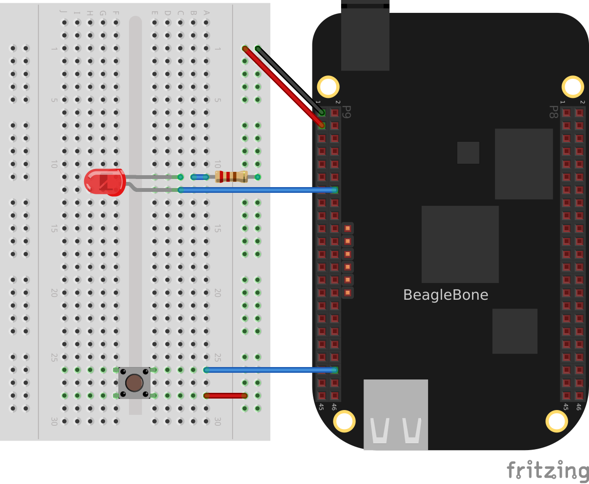
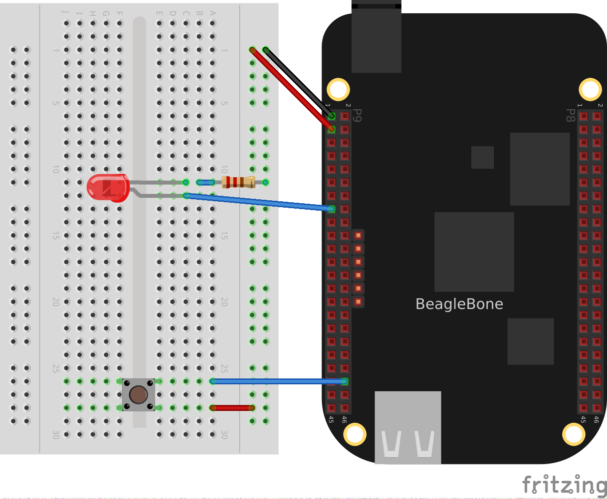
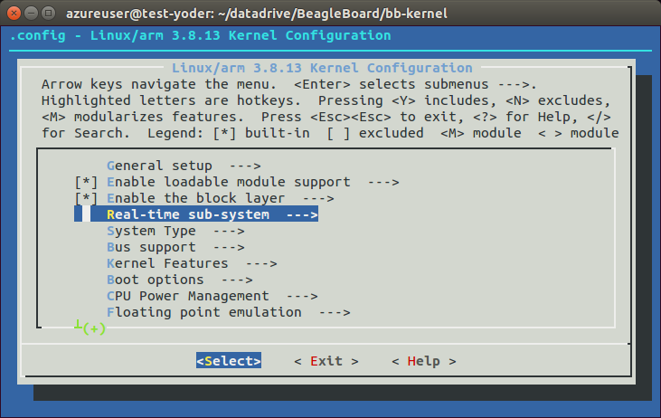
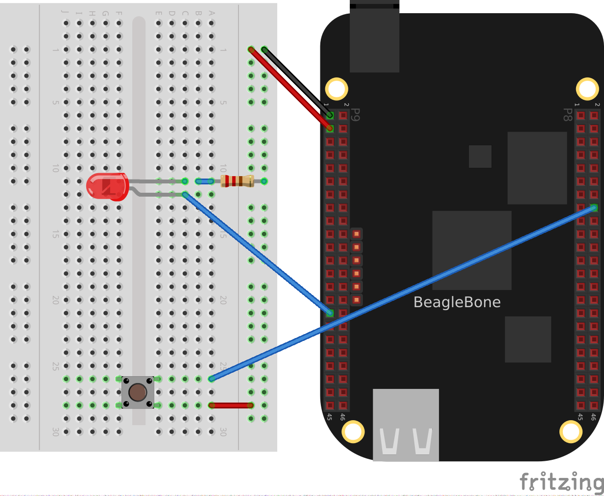

[[realtime]]
== Real-Time I/O

=== Introduction
((("real-time systems")))((("input/output (I/O)", "soft vs. hard real-time systems")))Sometimes, when BeagleBone Black interacts with the physical world, it needs to respond in a timely manner. For example, your robot has just detected that one of the driving motors needs to turn a bit faster. Systems that can respond quickly to a real event are known as _real-time_ systems. There are two broad categories of real-time systems: soft and hard.  

((("soft real-time systems")))((("hard real-time systems")))In a _soft real-time_ system, the real-time requirements should be met _most_ of the time, where _most_ depends on the system. A video playback system is a good example. The goal might be to display 60 frames per second, but it doesn't matter much if you miss a frame now and then. In a 100 percent _hard real-time_ system, you can never fail to respond in time. Think of an airbag deployment system on a car. You can't even be pass:[50 ms late].

((("Linux", "real-time processing with")))((("ARM processor")))((("programmable real-time units (PRUs)")))Systems running Linux generally can't do 100 percent hard real-time processing, because Linux gets in the way. However, the Bone has an ARM processor running Linux and two additional 32-bit programmable real-time units (PRUs [http://bit.ly/1EzTPZv]) available to do real-time processing. Although the PRUs can achieve 100 percent hard real-time, they take some effort to use.

This chapter shows several ways to do real-time input/output (I/O), starting with the effortless, yet slower BoneScript and moving up with increasing speed (and effort) to using the PRUs.

[NOTE]
====
In this chapter, as in the others, we assume that you are logged in as +root+ (as indicated by the +bone$+ prompt). This gives you quick access to the general-purpose input/output (GPIO) ports without having to use +sudo+ each time.
====

[[realtime_BoneScript]]
=== I/O with BoneScript

==== Problem
((("input/output (I/O)", "with BoneScript")))((("BoneScript", "input/output (I/O) with")))You want to read an input pin and write it to the output as quickly as possible with BoneScript.

==== Solution
<<sensors_pushbutton>> shows how to read a pushbutton switch and <<displays_externalLED>> controls an external LED. This recipe combines the two to read the switch and turn on the LED in response to it. To make this recipe, you will need:

* Breadboard and jumper wires (see <<app_proto>>)
* Pushbutton switch (see <<app_misc>>)
* 220 &#8486; resistor (see <<app_resistor>>)
* LED (see <<app_opto>>)

Wire up the pushbutton and LED as shown in <<realtime_pushLED_fig>>.

[[realtime_pushLED_fig]]
.Diagram for wiring a pushbutton and LED with the LED attached to P9_12

The code in <<realtime_pushLED_code>> reads GPIO port +P9_42+, which is attached to the pass:[pushbutton], and turns on the LED attached to +P9_12+ when the button is pushed.

[[realtime_pushLED_code]]
.Monitoring a pushbutton using a callback function (pushLED.js)
====
[source, javascript]
----

include::code/pushLED.js[]

----
====

Add the code to a file named _pushLED.js_ and run it by using the following commands:

++++
<pre data-type="programlisting">
bone$ <strong>chmod +x pushLED.js</strong>
bone$ <strong>./pushLED.js</strong>
</pre>
++++

Press ^C (Ctrl-C) to stop the code.

==== Discussion

[[realtime_libsoc]]
=== I/O with C and libsoc

==== Problem
((("input/output (I/O)", "with C and libsoc")))((("C language", "real time I/O with")))((("libsoc library")))You want to use the C language to process inputs in real time, or BoneScript isn't fast enough.

==== Solution
<<realtime_BoneScript>> shows how to control an LED with a pushbutton using BoneScript. This recipe accomplishes the same thing using C and +libsoc+. <<misc_libsoc>> shows how to use C and +libsoc+ to access the GPIO pins.

Wire up the pushbutton and LED as shown in <<realtime_pushLED_fig>>. Follow the instructions in <<misc_libsoc>> to install +libsoc+. Then add the code in <<realtime_pushLED_c_code>> to a file named _pushLED.c_.

[[realtime_pushLED_c_code]]
.Code for reading a switch and blinking an LED using libsoc (pushLED.c)
====
[source, c]
----

include::code/pushLED.c[]

----
====

Compile and run the code:

++++
<pre data-type="programlisting">
bone$ <strong>gcc -o pushLED pushLED.c /usr/local/lib/libsoc.so</strong>
bone$ <strong>./pushLED</strong>
libsoc-debug: debug enabled (libsoc_set_debug)
libsoc-gpio-debug: requested gpio (60, libsoc_gpio_request)
libsoc-gpio-debug: GPIO already exported (60, libsoc_gpio_request)
libsoc-gpio-debug: requested gpio (7, libsoc_gpio_request)
libsoc-gpio-debug: GPIO already exported (7, libsoc_gpio_request)
libsoc-gpio-debug: setting direction to out (60, libsoc_gpio_set_direction)
libsoc-gpio-debug: setting direction to in (7, libsoc_gpio_set_direction)
BOTH: 3
libsoc-gpio-debug: setting edge to both (7, libsoc_gpio_set_edge)
BOTH: 3
libsoc-gpio-debug: creating new callback (7, libsoc_gpio_callback_interrupt)
Push the button...
libsoc-debug: debug disabled (libsoc_set_debug)
Got it (1), button = 1
Got it (2), button = 0
Got it (3), button = 1
Got it (4), button = 1
Got it (5), button = 0
libsoc-debug: debug enabled (libsoc_set_debug)
libsoc-gpio-debug: callback thread was stopped 
           (7, libsoc_gpio_callback_interrupt_cancel)
libsoc-gpio-debug: freeing gpio (7, libsoc_gpio_free)
libsoc-gpio-debug: freeing gpio (60, libsoc_gpio_free)
</pre>
++++

The code responds quickly to the pushbutton. If you need more speed, comment-out the +printf+ command in the interrupt service routine.

==== Discussion

[[realtime_devmem2]]
=== I/O with devmem2

==== Problem
((("input/output (I/O)", "with devmem2")))((("devmem2 utility")))((("AM335x Technical Reference Manual")))Your C code using +libsoc+ isn't responding fast enough to the input signal. You want to read the GPIO registers directly.

==== Solution
The solution is to use a simple utility called +devmem2+, with which you can read and write registers from the command line.

[WARNING]
====
((("binary numbers")))((("hex numbers")))This solution is much more involved than the previous ones. You need to understand binary and hex numbers and be able to read the http://bit.ly/1B4Cm45[AM335x Technical Reference Manual].
====

First, download and install +devmem2+:

++++
<pre data-type="programlisting">
bone$ <strong>wget http://free-electrons.com/pub/mirror/devmem2.c</strong>
bone$ <strong>gcc -o devmem2 devmem2.c</strong>
bone$ <strong>mv devmem2 /usr/bin</strong>
</pre>
++++

This solution will read a pushbutton attached to +P9_42+ and flash an LED attached to +P9_13+. Note that this is a change from the previous solutions that makes the code used here much simpler. Wire up your Bone as shown in <<realtime_pushLEDmmap_fig>>.

[[realtime_pushLEDmmap_fig]]
.Diagram for wiring a pushbutton and LED with the LED attached to P9_13

Now, flash the LED attached to +P9_13+ using the Linux +sysfs+ interface (<<kernel_gpio_sysfs>>). To do this, first look up which GPIO number +P9_13+ is attached to by referring to <<tips_cape_headers_digital>>. Finding +P9_13+ at GPIO 31, export GPIO 31 and make it an output:

++++
<pre data-type="programlisting">
bone$ <strong>cd cd /sys/class/gpio/</strong>
bone$ <strong>echo 31 > export</strong>
bone$ <strong>cd gpio31</strong>
bone$ <strong>echo out > direction</strong>
bone$ <strong>echo 1 > value</strong>
bone$ <strong>echo 0 > value</strong>
</pre>
++++

The LED will turn on when +1+ is echoed into +value+ and off when +0+ is echoed. 

Now that you know the LED is working, look up its memory address. This is where things get very detailed. First, download the http://bit.ly/1B4Cm45[AM335x Technical Reference Manual]. Look up +GPIO0+ in the Memory Map chapter (sensors). Table 2-2 indicates that +GPIO0+ starts at address +0x44E0_7000+. Then go to Section 25.4.1, "GPIO Registers." This shows that +GPIO_DATAIN+ has an offset of +0x138+, +GPIO_CLEARDATAOUT+ has an offset of +0x190+, and +GPIO_SETDATAOUT+ has an offset of +0x194+.  

This means you read from address +0x44E0_7000+ + +0x138+ = +0x44E0_7138+ to see the status of the LED:

++++
<pre data-type="programlisting">
bone$ <strong>devmem2 0x44E07138</strong>
/dev/mem opened.
Memory mapped at address 0xb6f8e000.
Value at address 0x44E07138 (0xb6f8e138): 0xC000C404

</pre>
++++

The returned value +0xC000C404+ (+1100 0000 0000 0000 1100 0100 0000 0100+ in binary) has bit 31 set to +1+, which means the LED is on. Turn the LED off by writing +0x80000000+ (+1000 0000 0000 0000 0000 0000 0000 0000+ binary) to the +GPIO_CLEARDATA+ register at +0x44E0_7000+ + +0x190+ = +0x44E0_7190+:

++++
<pre data-type="programlisting">
bone$ <strong>devmem2 0x44E07190 w 0x80000000</strong>
/dev/mem opened.
Memory mapped at address 0xb6fd7000.
Value at address 0x44E07190 (0xb6fd7190): 0x80000000
Written 0x80000000; readback 0x0
</pre>
++++

The LED is now off.

You read the pushbutton switch in a similar way. <<tips_cape_headers_digital>> says +P9_42+ is GPIO 7, which means bit 7 is the state of +P9_42+. The +devmem2+ in this example reads +0x0+, which means all bits are +0+, including GPIO 7. Section 25.4.1 of the Technical Reference Manual instructs you to use offset +0x13C+ to read +GPIO_DATAOUT+. Push the pushbutton and run +devmem2+:

++++
<pre data-type="programlisting">
bone$ <strong>devmem2 0x44e07138</strong>
/dev/mem opened.
Memory mapped at address 0xb6fe2000.
Value at address 0x44E07138 (0xb6fe2138): 0x4000C484
</pre>
++++

Here, bit 7 is set in +0x4000C484+, showing the button is pushed.

==== Discussion
This is much more tedious than the previous methods, but it's what's necessary if you need to minimize the time to read an input. <<realtime_mmap>> shows how to read and write these addresses from C.

[[realtime_mmap]]
=== I/O with C and mmap()

==== Problem
((("input/output (I/O)", "with C and mmap()")))((("C language", "mapping GPIO registers with mmap() and")))((("mmap()")))Your C code using +libsoc+ isn't responding fast enough to the input signal.

==== Solution
In smaller processors that aren't running an operating system, you can read and write a given memory address directly from C. With Linux running on Bone, many of the memory locations are hardware protected, so you can't accidentally access them directly. 

This recipe shows how to use +mmap()+ (memory map) to map the GPIO registers to an array in C. Then all you need to do is access the array to read and write the registers.

[WARNING]
====
This solution is much more involved than the previous ones. You need to understand binary and hex numbers and be able to read the AM335x Technical Reference Manual.
====

This solution will read a pushbutton attached to +P9_42+ and flash an LED attached to +P9_13+. Note that this is a change from the previous solutions that makes the code used here much simpler.

[TIP]
====
See <<realtime_devmem2>> for details on mapping the GPIO numbers to memory addresses.
====

Add the code in <<realtime_pushLEDmmap_h>> to a file named _pushLEDmmap.h_.
[[realtime_pushLEDmmap_h]]
.Memory address definitions (pushLEDmmap.h)

====
[source, c]
----

include::code/pushLEDmmap.h[pushLEDmmap.h]

----
====

Add the code in <<realtime_pushLEDmmap_c>> to a file named _pushLEDmmap.c_.
[[realtime_pushLEDmmap_c]]
.Code for directly reading memory addresses (pushLEDmmap.c)

====
[source, c]
----

include::code/pushLEDmmap.c[pushLEDmmap.c]

----
====

Now, compile and run the code:

++++
<pre data-type="programlisting">
bone$ <strong>gcc -O3 pushLEDmmap.c -o pushLEDmmap</strong>
bone$ <strong>./pushLEDmmap</strong>
Mapping 44E07000 - 44E08000 (size: 1000)
GPIO mapped to 0xb6fac000
GPIO SETDATAOUTADDR mapped to 0xb6fac194
GPIO CLEARDATAOUT mapped to 0xb6fac190
Start copying GPIO_07 to GPIO_31
^C
Ctrl-C pressed, cleaning up and exiting...
</pre>
++++

The code is in a tight +while+ loop that checks the status of GPIO 7 and copies it to GPIO 31.

==== Discussion

[[realtime_xenomai]]
=== Modifying the Linux Kernel to Use Xenomai

==== Problem
((("input/output (I/O)", "with Xenomai")))((("Xenomai")))((("Linux kernel", "modifying to use Xenomai")))Your program can't get control of the processor quickly enough to do your real-time processing.

==== Solution
http://xenomai.org/[Xenomai] is a set of kernel patches that allow the Bone to respond to real-time events in a predicable way. These instructions are based on Bruno Martins' http://bit.ly/1EXIEZu[Xenomai on the BeagleBone Black in 14 easy steps].

[TIP]
====
((("Machinekit distribution")))The Xenomai kernel is used to provide real-time motion control within the Machinekit distribution for the Bone. You might get a quick start by checking out the images provided on http://bit.ly/1NK71xS[the Machinekit blog].
====

[NOTE]
====
The Xenomai kernel is now available in the BeagleBoard.org Debian package feeds, and you can install it by using +sudo apt install xenomai-runtime+. Nevertheless, we find it useful to include the details of building the Xenomai kernel.
====

[WARNING]
====
This recipe requires downloading and patching the kernel. This is advanced work.
====

First, download, compile, and install the kernel, following the instructions in <<kernel_compiling>>. This will ensure that everything is in place and working before you start changing things.

Next, visit http://bit.ly/1C6QxwN[Xenomai's download page] to find the latest version of Xenomai (at the time of this writing, it's 2.6.4). Download it with the following command (substituting the URL for the latest version you find on Xenomai's download page):

++++
<pre data-type="programlisting">
host$ <strong>wget http://download.gna.org/xenomai/stable/latest/xenomai-2.6.4.tar.bz2</strong>
</pre>
++++

Check out the latest kernel:

++++
<pre data-type="programlisting">
host$ <strong>cd bb-kernel/KERNEL</strong>
host$ <strong>uname -a</strong>
host$ <strong>git tags | sort | less</strong>
</pre>
++++

Pick the tag that is close to your current version of the kernel. This command checks out the +3.8.13-bone67+ version of the kernel and creates a branch named +xenomai+:

++++
<pre data-type="programlisting">
host$ <strong>git checkout 3.8.13-bone67 -b xenomai</strong>
</pre>
++++

===== Patching the kernel

Patch the kernel by using the following commands:

////
Lines are too long in following listing.
////

++++
<pre data-type="programlisting">
host$ <strong>cd bb-kernel/KERNEL</strong>
host$ <strong>patch -p1 &lt; ../../xenomai-2.6.4/ksrc/arch/arm/patches/\
       beaglebone/ipipe-core-3.8.13-beaglebone-pre.patch</strong>
host$ <strong>patch -p1 &lt; ../../xenomai-2.6.4/ksrc/arch/arm/patches/\
       ipipe-core-3.8.13-arm-4.patch</strong>
host$ <strong>patch -p1 &lt; ../../xenomai-2.6.4/ksrc/arch/arm/patches/\
       beaglebone/ipipe-core-3.8.13-beaglebone-post.patch</strong>
</pre>
++++

[NOTE]
====
These commands assume +bb-kernel+ and +xenomai-2.6.4+ are at the same directory level.
====

Then get one more patch from http://bit.ly/1Mti9gQ[Xenomai's website]. Add the code in <<realtime_thumb>> to a file named _thumb.patch_.

[[realtime_thumb]]
.One last patch (_thumb.patch_)
====
[source, js]
----

include::code/thumb.patch[]

----
====

Run the following command to apply the patch:

++++
<pre data-type="programlisting">
host$ <strong>patch -p1 &lt; thumb.patch</strong>
</pre>
++++

Prepare the kernel:

++++
<pre data-type="programlisting">
host$ <strong>cd ../../xenomai-2.6.4/scripts</strong>
host$ <strong>./prepare-kernel.sh --arch=arm --linux=../../bb-kernel/KERNEL/</strong>
</pre>
++++

Now you're ready to compile the kernel with these new patches:

++++
<pre data-type="programlisting">
host$ <strong>cd ../../bb-kernel</strong>
host$ <strong>tools/rebuild.sh</strong>
</pre>
++++

When the configuration menu displays (as shown in <<realtime_xenomai_config>>), make the following changes:

. Select "CPU Power Management" -> "CPU Frequency scaling, disable [ ] CPU Frequency scaling."
. Select "Real-time sub-system" ->" Drivers" -> "Testing drivers, enable everything."

[[realtime_xenomai_config]]
.Configuing Xenomai

Then sit back and wait awhile. After the new kernel is built, install it following the instructions in <<kernel_install>>.

===== Setting up the Bone
You are now ready to test the new Xenomai kernel. Copy Xenomai to the Bone:

++++
<pre data-type="programlisting">
host$ <strong>scp -r xenomai-2.6.4 192.168.7.2:.</strong>
</pre>
++++

[NOTE]
====
This command assumes that the Bone is at 192.168.7.2.
====

Run the following commands on the Bone:

++++
<pre data-type="programlisting">
bone$ <strong>cd ~/xenomai-2.6.4</strong>
bone$ <strong>./configure CFLAGS="-march=armv7-a -mfpu=vfp3" LDFLAGS="-march=armv7-a \
        -mfpu=vfp3"</strong>
bone$ <strong>make</strong>
bone$ <strong>make install</strong>
</pre>
++++

+./configure+ takes about a minute, +make+ six more minutes, and +install+ another minute.

Next, copy the drivers:

++++
<pre data-type="programlisting">
bone$ <strong>cd; mkdir xenomai_drivers; cd xenomai_drivers</strong>

host$ <strong>cd bb-kernel/KERNEL/drivers/xenomai/testing</strong>
host$ <strong>scp *.ko 192.168.7.2:xenomai_drivers</strong>

bone$ <strong>sudo insmode xeno_klat.ko</strong>
</pre>
++++

===== Testing
Go ahead and run some tests:

++++
<pre data-type="programlisting">
bone$ <strong>usr/xenomai/bin/latency</strong>
== Sampling period: 1000 us
== Test mode: periodic user-mode task
== All results in microseconds
warming up...
RTT|  00:00:01  (periodic user-mode task, 1000 us period, priority 99)
RTH|----lat min|----lat avg|----lat max|-overrun|---msw|---lat best|--lat worst
RTD|      3.624|      3.833|     20.458|       0|     0|      3.624|     20.458
RTD|      2.749|      3.749|     22.583|       0|     0|      2.749|     22.583
RTD|      2.749|      4.583|     25.499|       0|     0|      2.749|     25.499
RTD|      2.749|      3.708|     20.541|       0|     0|      2.749|     25.499
RTD|      2.749|      3.749|     21.916|       0|     0|      2.749|     25.499
---|-----------|-----------|-----------|--------|------|-------------------------
RTS|      2.749|      3.916|     25.499|       0|     0| 00:00:05/00:00:05
</pre>
++++

==== Discussion
The details of how to use Xenomai are beyond the scope of this book, but you can browse over to http://xenomai.org/[Xenomai's website] for examples and help on what to do next.

[[realtime_PRUSpeak]]
=== I/O with PRU Speak

==== Problem
((("input/output (I/O)", "with programmable real-time units (PRUs)")))((("programmable real-time units (PRUs)")))((("PRU Speak")))You require better timing than running C on the ARM can give you.

==== Solution
The AM335x processor on the Bone has an ARM processor that is running Linux, but it also has two 32-bit PRUs that are available for processing I/O. It takes a fair amount of understanding to program the PRU. Fortunately, a http://bit.ly/1AjlarF[2014 Google Summer of Code] project produced http://bit.ly/1wXT1eO[PRU Speak], an adaptation of the http://botspeak.org/[BotSpeak] language for the PRU. This solution shows how to use it.

===== Background
PRU Speak comprises three main parts:

Kernel::
 The +pru_speak.ko+ Linux kernel driver module loads PRU code and provides communication between the kernel and the firmware running on the PRU. An associated device tree overlay called +BB_PRUSPEAK-00A0.dtbo+ configures the pin access and firmware loaded on to the PRUs.((("Linux kernel", "PRU Speak")))
Firmware::
 +pru0_firmware+ and +pru1_firmware+ are the firmware files for each of the two PRUs.
Userspace::
 A Python user space component includes +bs_tcp_server.py+; a TCP socket listener that provides an interface to the PRU Speak interpreter; and +pru_speak.py+, a library for invoking PRU Speak commands from within a Python script.

===== Prerequisites
Many of the pins easily accessible by the PRU are taken up by the HDMI interface discussed in <<tips_hdmi>>. If you haven't already edited _uEnv.txt_, you can run these commands to disable the HDMI interface and reboot:

++++
<pre data-type="programlisting">
bone$ <strong>sed -i \
 '/cape_disable=capemgr.disable_partno=BB-BONELT-HDMI,BB-BONELT-HDMIN$/ \
      \s/^#//' /boot/uEnv.txt</strong>
bone$ <strong>sudo reboot</strong>
</pre>
++++

To build the firmware files, you first need to install the TI PRU C compiler:

++++
<pre data-type="programlisting">
bone$ <strong>sudo apt update</strong>
bone$ <strong>sudo apt install ti-pru-cgt-installer</strong>
Reading package lists... Done
Building dependency tree       
Reading state information... Done
The following NEW packages will be installed:
  ti-pru-cgt-installer
0 upgraded, 1 newly installed, 0 to remove and 30 not upgraded.
Need to get 13.1 kB of archives.
After this operation, 67.6 kB of additional disk space will be used.
Get:1 http://repos.rcn-ee.net/debian/ wheezy/main ti-pru-cgt-installer \
              all 2.1.0-1~bpo70+20141201+1 [13.1 kB]
Fetched 13.1 kB in 0s (38.1 kB/s)         
Selecting previously unselected package ti-pru-cgt-installer.
(Reading database ... 59608 files and directories currently installed.)
Unpacking ti-pru-cgt-installer \
              (from .../ti-pru-cgt-installer_2.1.0-1~bpo70+20141201+1_all.deb) ...
Setting up ti-pru-cgt-installer (2.1.0-1~bpo70+20141201+1) ...
--2015-01-19 18:59:14--  http://downloads.ti.com/codegen/esd/cgt_public_sw/\
PRU/2.1.0/ti_cgt_pru_2.1.0_armlinuxa8hf_busybox_installer.sh
Resolving downloads.ti.com (downloads.ti.com)... 23.62.97.64, 23.62.97.66
Connecting to downloads.ti.com (downloads.ti.com)|23.62.97.64|:80... connected.
HTTP request sent, awaiting response... 200 OK
Length: 39666613 (38M) [application/x-sh]
Saving to: `ti_cgt_pru_2.1.0_armlinuxa8hf_busybox_installer.sh'

100%[====================================>] 39,666,613  75.3K/s   in 7m 39s  

2015-01-19 19:06:54 (84.5 KB/s)-`ti_cgt_pru_2.1.0_arm..hf_busybox_installer.sh'\
         saved [39666613/39666613]

Installing PRU Code Generation tools version 2.1.0 into /
  please wait, or press CTRL-C to abort

Extracting archive
Installing files
[####################] 100%  
Installed successfully into /
</pre>
++++

===== Installation
Clone the PRU Speak repository and run the _install.sh_ shell script:

++++
<pre data-type="programlisting">
bone$ <strong>git clone git://github.com/jadonk/pruspeak.git</strong>
bone$ <strong>cd pruspeak</strong>
bone$ <strong>./install.sh</strong>
if [ ! -d "/lib/modules/3.8.13-bone68/build" ]; then apt install \
        linux-headers-3.8.13-bone68; fi
make -C /lib/modules/3.8.13-bone68/build M=/root/pruspeak/src/driver modules
make[1]: Entering directory `/usr/src/linux-headers-3.8.13-bone68'
  CC [M]  /root/pruspeak/src/driver/pru_speak.o
  Building modules, stage 2.
  MODPOST 1 modules
  CC      /root/pruspeak/src/driver/pru_speak.mod.o
  LD [M]  /root/pruspeak/src/driver/pru_speak.ko
make[1]: Leaving directory `/usr/src/linux-headers-3.8.13-bone68'
make -C /lib/modules/3.8.13-bone68/build M=/root/pruspeak/src/driver 
modules_install
make[1]: Entering directory `/usr/src/linux-headers-3.8.13-bone68'
  INSTALL /root/pruspeak/src/driver/pru_speak.ko
  DEPMOD  3.8.13-bone68
make[1]: Leaving directory `/usr/src/linux-headers-3.8.13-bone68'
lnkpru -i/usr/share/ti/cgt-pru/lib pru0_firmware.obj pru0_syscall.obj \
         AM3359_PRU.cmd -o=pru0_firmware
lnkpru -i/usr/share/ti/cgt-pru/lib pru1_firmware.obj  AM3359_PRU.cmd 
-o=pru1_firmware
install -m 444 pru0_firmware /lib/firmware
install -m 444 pru1_firmware /lib/firmware
dtc -O dtb -o BB-PRUSPEAK-00A0.dtbo -b 0 -@ BB-PRUSPEAK-00A0.dts 
install -m 644 BB-PRUSPEAK-00A0.dtbo /lib/firmware
python setup.py build
running build
running build_py
python setup.py build
running build
running build_py
python setup.py install
running install
.
.
.
Processing pru_speak-0.0-py2.7.egg
Removing /usr/local/lib/python2.7/dist-packages/pru_speak-0.0-py2.7.egg
Copying pru_speak-0.0-py2.7.egg to /usr/local/lib/python2.7/dist-packages
pru-speak 0.0 is already the active version in easy-install.pth

Installed /usr/local/lib/python2.7/dist-packages/pru_speak-0.0-py2.7.egg
Processing dependencies for pru-speak==0.0
Searching for ply==3.4
Best match: ply 3.4
Processing ply-3.4-py2.7.egg
ply 3.4 is already the active version in easy-install.pth

Using /usr/local/lib/python2.7/dist-packages/ply-3.4-py2.7.egg
Finished processing dependencies for pru-speak==0.0
install -m 755 bs_tcp_server.py /usr/bin
install -m 755 bs_shell.py /usr/bin
</pre>
++++

===== Runing the Kernel Module
Use the +modprobe+ command to load the kernel module and +config-pin+ to load the device tree overlay:

++++
<pre data-type="programlisting">
bone$ <strong>modprobe pru_speak</strong>
bone$ <strong>config-pin overlay BB-PRUSPEAK</strong>
</pre>
++++

The kernel module will need to be reloaded after rebooting, unless it's been added to _/etc/modules-load.d/modules.conf_ and _/boot/uEnv.txt_.

===== Running the Script
The PRU is now ready to run code. Add the code in <<realtime_pruSpeak_code>> to a file named _pruSpeak.py_. This code copies the input on +P8_16+ to the output on +P9_31+.

[role="pagebreak-before"]
[[realtime_pruSpeak_code]]
.Code for copying P8_16 to P9_31 using the PRU (pruSpeak.py)
====
[source, c]
----

include::code/pruSpeak.py[]

----
====

Then run the code by using the following command:

++++
<pre data-type="programlisting">
bone$ <strong>./pruSpeak.py</strong>
Generating LALR tables
Initializing PRU Speak
0       0x110000FF      SET var1, DIO[14]
1       0x01400000      SET DIO[0], var1
2       0x15000000      GOTO 0
3       0x7F000000      ENDSCRIPT

[285212927, 20971520, 352321536, 2130706432]
[]
PRU Speak object deleted
</pre>
++++

The code will return immediately, but the PRU will continue to run.

The PRU has quick access to only a subset of GPIO pins. This example reads GPIO +P8_16+ and writes to +P9_31+, so you have to wire up the pushbutton and LED as shown in <<realtime_pushLEDpru_fig>>.

[[realtime_pushLEDpru_fig]]
.Diagram for wiring a pushbutton and LED for the PRU

Now, when you push the button, the LED should respond.

==== Discussion
In addition to invoking PRU Speak scripts via Python, it is also possible to open a shell or TCP socket to the interpreter. When running a script, it is also possible to modify variables to communicate with the running script.

===== Running PRU Speak via Shell
To invoke a shell interface to PRU Speak, run _bs_shell.py_:

++++
<pre data-type="programlisting">
bone$ <strong>bs_shell.py</strong>
Generating LALR tables
Initializing PRU Speak
ps&gt;<strong>SCRIPT</strong>
...<strong>SET DIO[0],var1</strong>
...<strong>GOTO 0</strong>
...<strong>ENDSCRIPT</strong>
...
0       0x01400001      SET DIO[0],var1
1       0x15000000      GOTO 0
2       0x7F000000      ENDSCRIPT

[]
ps&gt;<strong>RUN</strong>
...
[20971521, 352321536, 2130706432]
[]
ps&gt;<strong>SET var1,1</strong>
...
[1]
ps&gt;<strong>SET var1,0</strong>
...
[0]
ps&gt;Closing terminal
PRU Speak object deleted
</pre>
++++

((("&#x005E;C (Ctrl-C) command")))((("commands", "&#x005E;C (Ctrl-C)")))Press Enter on a blank line to complete input to the shell. Press ^C (Ctrl-C) to exit the shell.

===== Running PRU Speak via TCP socket
Running the interpreter over a TCP socket enables tools like Labview to communicate with the Bone in a platform-independent way. Use netcat (+nc+) to interact with the interpreter from the command line:

++++
<pre data-type="programlisting">
bone$ <strong>bs_tcp_server.py 2&amp;&gt;1 &gt; /var/log/pruspeak.log &amp;</strong>
[1] 2594
bone # <strong>nc localhost 6060</strong>
<strong>SCRIPT</strong>

<strong>SET DIO[0],1</strong>

<strong>WAIT 100</strong>

<strong>SET DIO[0],0</strong>

<strong>WAIT 100</strong>

<strong>GOTO 0</strong>

<strong>ENDSCRIPT</strong>

<strong>RUN</strong>

<strong>^C</strong>
</pre>
++++

Press ^C (Ctrl-C) to exit +nc+.

[NOTE]
====
Currently, pressing ^D (Ctrl-D) within +nc+ will cause the socket listener script to close.
====

You should now see the LED blinking.

===== Looking Ahead
At the time of this writing, PRU Speak is still under heavy development. Be sure to check http://bit.ly/1B4DrsC[the README file] for the latest installation and usage guidelines. Currently, only direct PRU GPIO access is implemented, but support for ADCs and additional GPIOs is in the works.

If you are looking to develop your own firmware for the PRUs, this example should provide a template for extending your own interface code.
