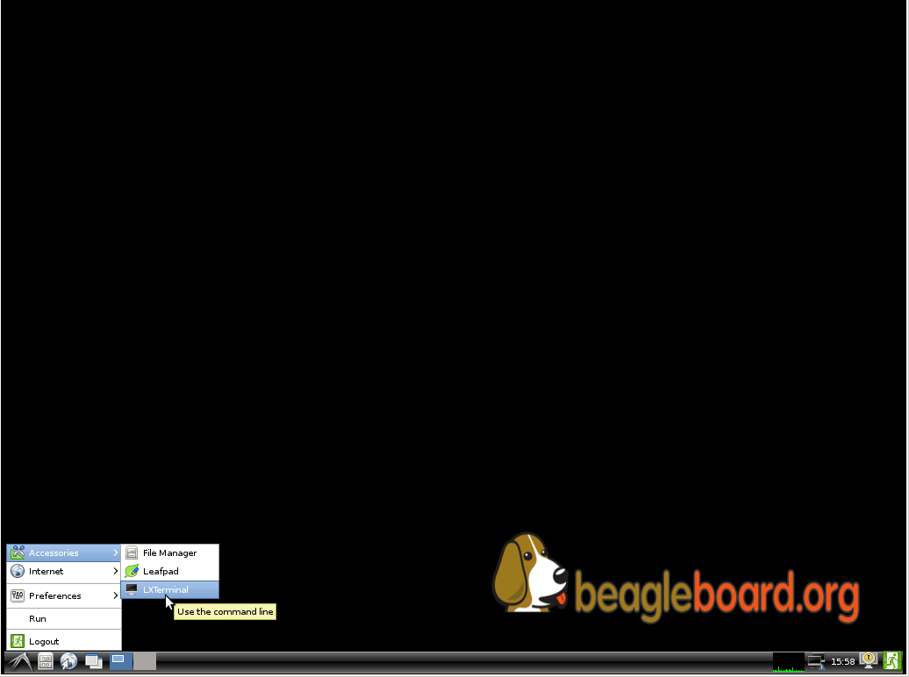
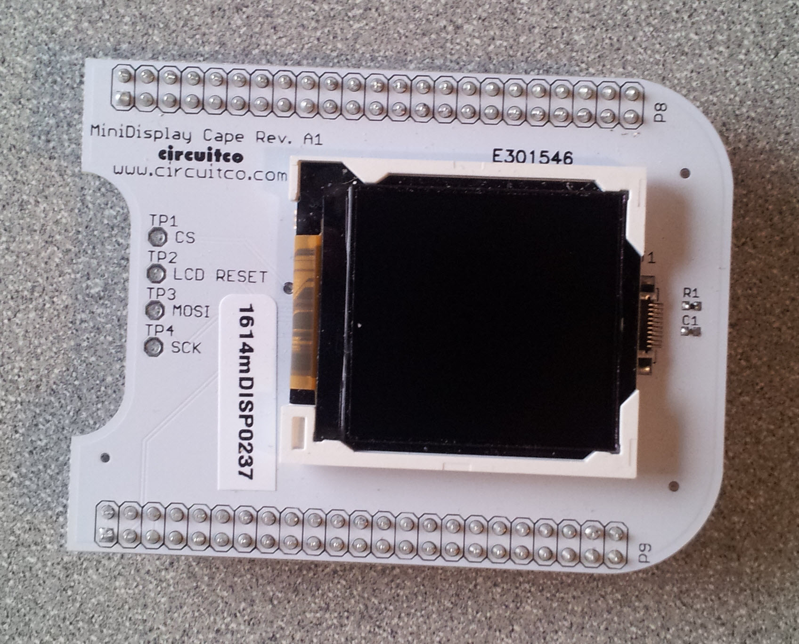
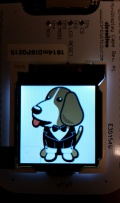
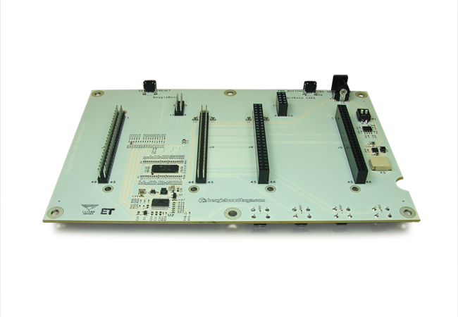
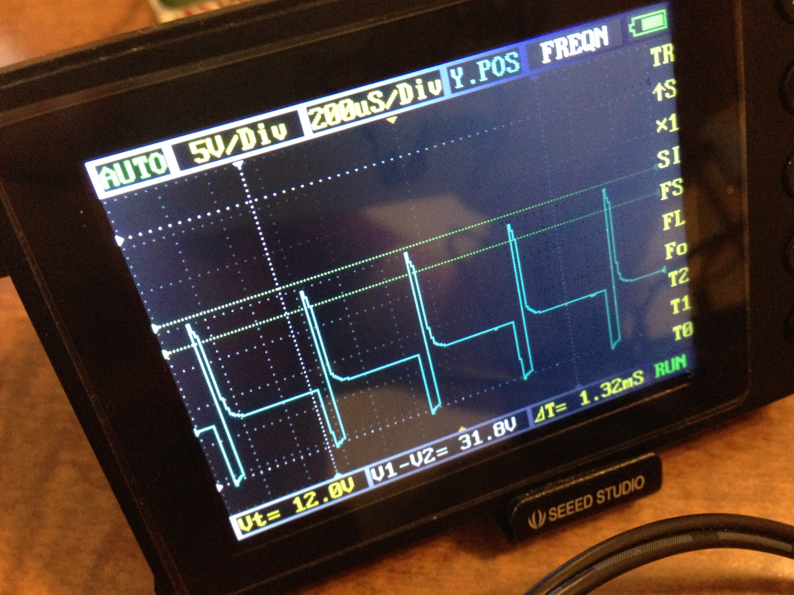
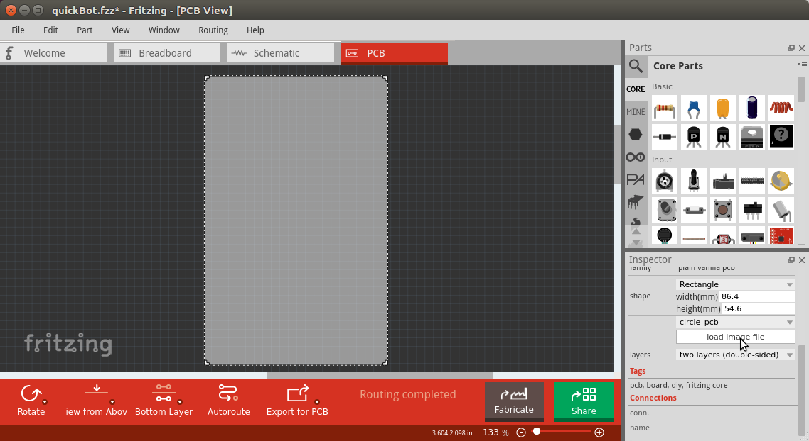
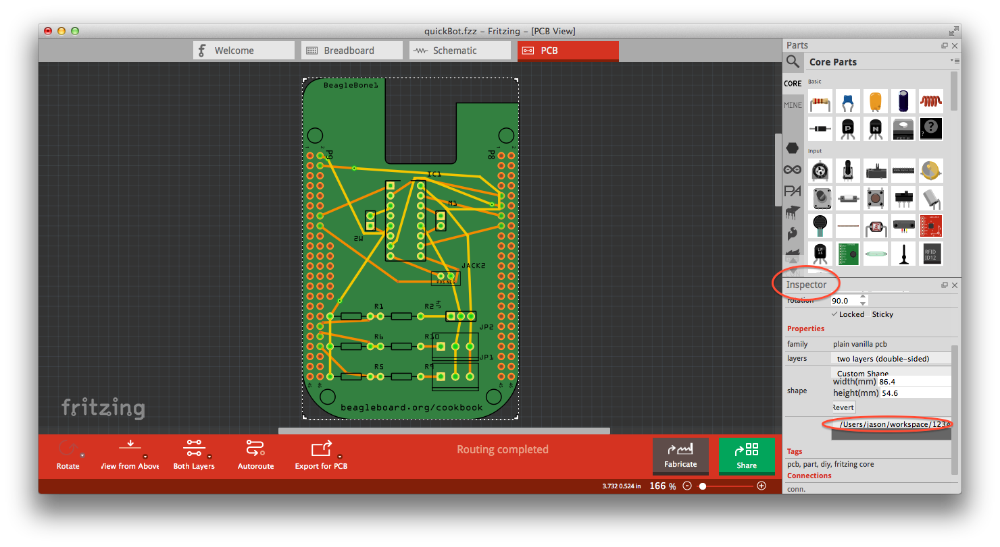
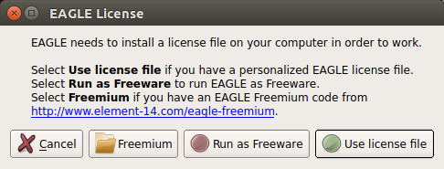
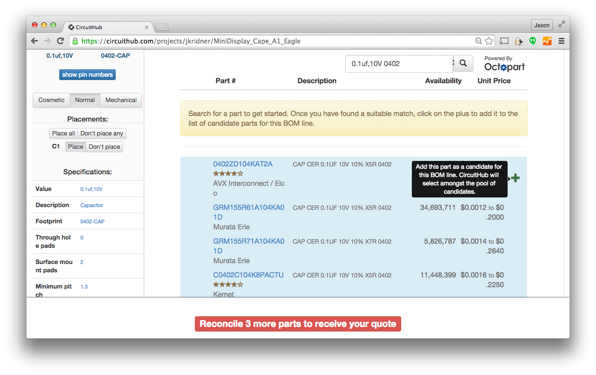

[[capes]]
== Capes

=== Introduction

((("debugging", "breadboards")))Previous chapters of this book show a variety of ways to interface BeagleBone Black to the physical world by using a breadboard and wiring to the +P8+ and +P9+ headers. This is a great approach because it's easy to modify your circuit to debug it or try new things. At some point, though, you might want a more permanent solution, either because you need to move the Bone and you don't want wires coming loose, or because you want to share your hardware with the masses. 

((("capes", "basics of")))You can easily expand the functionality of the Bone by adding a  http://bit.ly/1wucweC[_cape_]. A cape is simply a board--often a printed circuit board (PCB)&#x2014;that connects to the +P8+ and +P9+ headers and follows a few standard pin usages. You can stack up to four capes onto the Bone. Capes can range in size from Bone-sized (<<capes_miniDisplay>>) to much larger than the Bone (<<capes_7inLCD>>).

This chapter shows how to attach a couple of capes, move your design to a protoboard, then to a PCB, and finally on to mass production.

[[capes_7inLCD]]
=== Using a Seven-Inch LCD Cape

==== Problem
((("capes", "LCD display, seven-inch")))((("displays", "LCD, seven-inch")))((("LCD displays")))You want to display the Bone's desktop on a portable LCD.

==== Solution
A number of http://bit.ly/1AjlXJ9[LCD capes] are built for the Bone, ranging in size from three to seven inches. This recipe attaches a seven-inch http://bit.ly/1NK8Hra[BeagleBone LCD7] from http://circuitco.com/[CircuitCo] (shown in <<capes_7inLCD_fig>>) to the Bone.

[[capes_7inLCD_fig]]
.Seven-inch LCD from CircuitCo footnote:[<<capes_7inLCD_fig>> was originally posted by CircuitCo at http://elinux.org/File:BeagleBone-LCD7-Front.jpg under a http://creativecommons.org/licenses/by-sa/3.0/[Creative Commons Attribution-ShareAlike 3.0 Unported License].]
image::figures/LCD.png[7 inch LCD]

To make this recipe, you will need:

* Seven-inch LCD cape
* A 5 V power supply

Just attach the Bone to the back of the LCD, making sure pin 1 of +P9+ lines up with pin 1 of +P9+ on the LCD. Apply a 5 V power supply, and the desktop will appear on your LCD, as shown in <<capes_LCD7Desktop>>. 

[[capes_LCD7Desktop]]
.Seven-inch LCD desktop

((("keyboards")))((("mouse")))Attach a USB keyboard and mouse, and you have a portable Bone. https://www.adafruit.com/products/922[Wireless keyboard and mouse combinations] make a nice solution to avoid the need to add a USB hub.

[[capes_miniDisplay]]
=== Using a 128 x 128-Pixel LCD Cape

==== Problem
((("capes", "LCD display, 128 x 128-pixel")))((("LCD displays")))((("MiniDisplay")))You want to use a small LCD to display things other than the desktop.

==== Solution
The http://bit.ly/1xd0r8p[MiniDisplay] is a 128 x 128 full-color LCD cape that just fits on the Bone, as shown in <<capes_miniDisplay_fig>>. 

[[capes_miniDisplay_fig]]
.MiniDisplay 128 x 128-pixel LCD from CircuitCo

To make this recipe, you will need:

* MiniDisplay LCD cape

Attach to the Bone and apply power. Then run the following commands:

++++
<pre data-type="programlisting">
# From http://elinux.org/CircuitCo:MiniDisplay_Cape
# Datasheet:
# https://www.crystalfontz.com/products/document/3277/ST7735_V2.1_20100505.pdf
bone$ <strong>wget http://elinux.org/images/e/e4/Minidisplay-example.tar.gz</strong>
bone$ <strong>tar zmxvf Minidisplay-example.tar.gz</strong>
bone$ <strong>cd minidisplay-example</strong>
bone$ <strong>make</strong>
bone$ <strong>./minidisplay-test</strong>
Unable to initialize SPI: No such file or directory
Aborted
</pre>
++++

[WARNING]
====
You might get a compiler warning, but the code should run fine.
====

((("Serial Peripheral Interface (SPI)")))((("input/output (I/O)", "via Serial Peripheral Interface (SPI)")))The MiniDisplay uses the Serial Peripheral Interface (SPI) interface, and it's not initialized. The http://bit.ly/1xd0r8p[manufacturer's website] suggests enabling SPI0 by using the following commands:

++++
<pre data-type="programlisting">
bone$ <strong>export SLOTS=/sys/devices/bone_capemgr.*/slots</strong>
bone$ <strong>echo BB-SPIDEV0 &gt; $SLOTS</strong>
</pre>
++++

Hmmm, something isn't working here. Here's how to see what happened:

++++
<pre data-type="programlisting">
bone$ <strong>dmesg | tail</strong>
[  625.334497] bone_capemgr.9: part_number 'BB-SPIDEV0', version 'N/A'
[  625.334673] bone_capemgr.9: slot #11: generic override
[  625.334720] bone_capemgr.9: bone: Using override eeprom data at slot 11
[  625.334769] bone_capemgr.9: slot #11: 'Override Board Name,00A0,Override \
               Manuf,BB-SPIDEV0'
[  625.335026] bone_capemgr.9: slot #11: \Requesting part number/version based \
               'BB-SPIDEV0-00A0.dtbo
[  625.335076] bone_capemgr.9: slot #11: Requesting firmware \
               'BB-SPIDEV0-00A0.dtbo' \
               for board-name 'Override Board Name', version '00A0'
[  625.335144] bone_capemgr.9: slot #11: dtbo 'BB-SPIDEV0-00A0.dtbo' loaded; \
               converting to live tree
[  625.341842] bone_capemgr.9: slot #11: BB-SPIDEV0 conflict P9.21 \
               (#10:bspwm_P9_21_b) 
[  625.351296] bone_capemgr.9: slot #11: Failed verification
</pre>

<dl class="calloutlist">
 <dt></dt>
  <dd>Shows there is a conflict for pin <code>P9_21</code>: it's already configured for pulse width modulation (PWM).</dd>

</dl>
++++

Here's how to see what's already configured:

++++
<pre data-type="programlisting">
bone$ <strong>cat $SLOTS</strong>
 0: 54:PF--- 
 1: 55:PF--- 
 2: 56:PF--- 
 3: 57:PF--- 
 4: ff:P-O-L Bone-LT-eMMC-2G,00A0,Texas Instrument,BB-BONE-EMMC-2G
 5: ff:P-O-L Bone-Black-HDMI,00A0,Texas Instrument,BB-BONELT-HDMI
 7: ff:P-O-L Override Board Name,00A0,Override Manuf,bspm_P9_42_27
 8: ff:P-O-L Override Board Name,00A0,Override Manuf,bspm_P9_41_27
 9: ff:P-O-L Override Board Name,00A0,Override Manuf,am33xx_pwm
10: ff:P-O-L Override Board Name,00A0,Override Manuf,bspwm_P9_21_b 
</pre>

<dl class="calloutlist">
 <dt></dt>
  <dd>You can see the eMMC, HDMI, and three PWMs are already using some of the pins. Slot 10 shows <code>P9_21</code> is in use by a PWM.</dd>
</dl>
++++
[role="pagebreak-before"]
You can unconfigure it by using the following commands:

++++
<pre data-type="programlisting">
bone$ <strong>echo -10 &gt; $SLOTS</strong>
bone$ <strong>cat $SLOTS</strong>
 0: 54:PF--- 
 1: 55:PF--- 
 2: 56:PF--- 
 3: 57:PF--- 
 4: ff:P-O-L Bone-LT-eMMC-2G,00A0,Texas Instrument,BB-BONE-EMMC-2G
 5: ff:P-O-L Bone-Black-HDMI,00A0,Texas Instrument,BB-BONELT-HDMI
 7: ff:P-O-L Override Board Name,00A0,Override Manuf,bspm_P9_42_27
 8: ff:P-O-L Override Board Name,00A0,Override Manuf,bspm_P9_41_27
 9: ff:P-O-L Override Board Name,00A0,Override Manuf,am33xx_pwm
</pre>
++++
Now +P9_21+ is free for the MiniDisplay to use.

[NOTE]
====
In future Bone images, all of the pins will already be allocated as part of the main device tree using runtime pinmux helpers and configured at runtime using the http://bit.ly/1EXLeP2[+config-pin+ utility]. This would eliminate the need for device tree overlays in most cases.
====

Now, configure it for the MiniDisplay and run a test:

++++
<pre data-type="programlisting">
bone$ <strong>echo BB-SPIDEV0 &gt; $SLOTS</strong>
bone$ <strong>./minidisplay-test</strong>
</pre>
++++

You then see Boris, as shown in <<capes_miniDisplayBoris>>.

[[capes_miniDisplayBoris]]
.MiniDisplay showing Boris footnote:[<<capes_miniDisplayBoris>> was originally posted by David Anders at http://elinux.org/File:Minidisplay-boris.jpg under a http://creativecommons.org/licenses/by-sa/3.0/[Creative Commons Attribution-ShareAlike 3.0 Unported License].]

=== Connecting Multiple Capes

==== Problem
((("capes", "connecting multiple")))((("stacking headers")))((("non-stacking headers")))((("cape headers", "stacking vs. non-stacking")))You want to use more than one cape at a time.

==== Solution
First, look at each cape that you want to stack mechanically. Are they all using stacking
headers like the ones shown in <<capes_stacking_headers>>? No more than one should be using non-stacking headers.

[[capes_stacking_headers]]
.Stacking headers
image::figures/stacking_headers.JPG[]

Note that larger LCD panels might provide expansion headers, such as the ones
shown in <<capes_lcd_backside>>, rather than the stacking headers, and that those can also be used for adding
additional capes.

[[capes_lcd_backside]]
.Back side of LCD7 cape footnote:[<<capes_lcd_backside>> was originally posted by CircuitCo at http://elinux.org/File:BeagleBone-LCD-Backside.jpg under a http://creativecommons.org/licenses/by-sa/3.0/[Creative Commons Attribution-ShareAlike 3.0 Unported License].]

Next, take a note of each pin utilized by each cape. The http://beaglebonecapes.com[BeagleBone Capes catalog] provides a graphical representation for the pin usage of most capes, as shown in <<Audio_cape_pins_fig>> for the Circuitco Audio Cape.

[[Audio_cape_pins_fig]]
.Pins utilized by CircuitCo Audio Cape footnote:[<<Audio_cape_pins_fig>> was originally posted by Djackson at http://elinux.org/File:Audio_pins_revb.png under a http://creativecommons.org/licenses/by-sa/3.0/[Creative Commons Attribution-ShareAlike 3.0 Unported License].]
image::figures/audioCape.png[CircuitCo Audio Cape]

In most cases, the same pin should never be used on two different capes, though in some cases, pins can be shared. Here are some exceptions:

+GND+:: 
 The ground (+GND+) pins should be shared between the capes, and there's no need to worry about consumed resources on those pins.
+VDD_3V3+:: 
 The 3.3 V power supply (+VDD_3V3+) pins can be shared by all capes to supply power, but the total combined consumption of all the capes should be less than 500 mA (250 mA per +VDD_3V3+ pin).
+VDD_5V+:: 
 The 5.0 V power supply (+VDD_5V+) pins can be shared by all capes to supply power, but the total combined consumption of all the capes should be less than 2 A (1 A per +VDD_5V+ pin). It is possible for one, and only one, of the capes to _provide_ power to this pin rather than consume it, and it should provide at least 3 A to ensure proper system function. Note that when no voltage is applied to the DC connector, nor from a cape, these pins will not be powered, even if power is provided via USB.
+SYS_5V+:: 
 The regulated 5.0 V power supply (+SYS_5V+) pins can be shared by all capes to supply power, but the total combined consumption of all the capes should be less than 500 mA (250 mA per +SYS_5V+ pin).
+VADC+ and +AGND+:: 
 The ADC reference voltage pins can be shared by all capes.
+I2C2_SCL+ and +I2C2_SDA+:: I^2^C is a shared bus, and the +I2C2_SCL+ and +I2C2_SDA+ pins default to having this bus enabled for use by cape expansion ID EEPROMs.

[[capes_soldering]]
=== Moving from a Breadboard to a Protoboard

==== Problem
((("capes", "protoboards for")))((("breadboards", "vs. protoboards")))((("protoboards")))((("soldering", "components to protoboards")))((("prototypes", "soldering protoboards")))You have your circuit working fine on the breadboard, but you want a more reliable solution.

==== Solution
Solder your components to a protoboard. 

To make this recipe, you will need:

* Protoboard
* Soldering iron
* Your other components

Many places make premade circuit boards that are laid out like the breadboard we have been using. <<capes_beaglebread_fig>> shows the http://bit.ly/1HCwtB4[BeagleBone Breadboard], which is just one protoboard option.

[[capes_beaglebread_fig]]
.BeagleBone breadboard footnote:[<<capes_beaglebread_fig>> was originally posted by William Traynor at http://elinux.org/File:BeagleBone-Breadboard.jpg under a http://creativecommons.org/licenses/by-sa/3.0/[Creative Commons Attribution-ShareAlike 3.0 Unported License].]
image::figures/breadboard.png[BeagleBone Breadboard]

You just solder your parts on the protoboard as you had them on the breadboard.

[[capes_creating_prototype_schematic]]
=== Creating a Prototype Schematic

==== Problem
((("capes", "prototype schematics")))((("prototypes", "schematics for")))You've wired up a circuit on a breadboard. How do you turn that prototype into a schematic others can read and that you can import into other design tools?

==== Solution
((("Fritzing", "creating circuit schematics with")))((("hardware", "creating prototype schematics", seealso="prototypes")))((("circuit schematics")))((("printed-circuit layout")))In <<tips_fritzing>>, we introduced Fritzing as a useful tool for drawing block diagrams. Fritzing can also do circuit schematics and printed-circuit layout. For example, <<capes_quickRobo_fig>> shows a block diagram for a simple robot controller (_pass:[quickBot.fzz]_ is the name of the Fritzing file used to create the diagram).

[[capes_quickRobo_fig]]
.A simple robot controller diagram (quickBot.fzz)
image::figures/quickBot_bb.png[Simple robot diagram]

The controller has an H-bridge to drive two DC motors (<<motors_dcDirection>>), an IR range sensor, and two headers for attaching analog encoders for the motors. Both the IR sensor and the encoders have analog outputs that exceed 1.8 V, so each is run through a voltage divider (two resistors) to scale the voltage to the correct range (see <<sensors_hc-sr04>> for a voltage divider example).

<<capes_quickRobo_schemRaw>> shows the schematic automatically generated by Fritzing. It's a mess. It's up to you to fix it.

[[capes_quickRobo_schemRaw]]
.Automatically generated schematic
image::figures/quickBot_schemRaw.png[Autogenerated schematic]

<<capes_quickRobo_schem>> shows my cleaned-up schematic. I did it by moving the parts around until it looked better.

[[capes_quickRobo_schem]]
.Cleaned-up schematic
image::figures/quickBot_schem.png[Cleaned up schematic]

[[capes_quickRobo_schemZoom]]
.Zoomed-in schematic
image::figures/quickBot_schemZoom.png[Zoomed in schematic]

You might find that you want to create your design in a more advanced design tool, perhaps because it has the library components you desire, it integrates better with other tools you are using, or it has some other feature (such as simulation) of which you'd like to take advantage.

[[capes_verify]]
=== Verifying Your Cape Design

==== Problem
((("capes", "design verification")))((("design verification")))You've got a design. How do you quickly verify that it works?

==== Solution
To make this recipe, you will need:

* An oscilloscope

Break down your design into functional subcomponents and write tests for each. Use components you already know are working, such as the onboard LEDs, to display the test status with the code in <<capes_quickBot_motor_test_code>>.

[[capes_quickBot_motor_test_code]]
.Testing the quickBot motors interface (quickBot_motor_test.js)
====
++++
<pre data-type="programlisting">#!/usr/bin/env node
var b = require('bonescript');
var M1_SPEED    = 'P9_16'; 
var M1_FORWARD  = 'P8_15';
var M1_BACKWARD = 'P8_13';
var M2_SPEED    = 'P9_14';
var M2_FORWARD  = 'P8_9';
var M2_BACKWARD = 'P8_11';
var freq = 50; 
var fast = 0.95;
var slow = 0.7;
var state = 0;  

b.pinMode(M1_FORWARD, b.OUTPUT); 
b.pinMode(M1_BACKWARD, b.OUTPUT);
b.pinMode(M2_FORWARD, b.OUTPUT);
b.pinMode(M2_BACKWARD, b.OUTPUT);
b.analogWrite(M1_SPEED, 0, freq); 
b.analogWrite(M2_SPEED, 0, freq);

updateMotors(); 

function updateMotors() { 
    //console.log("Setting state = " + state); 
    updateLEDs(state); 
    switch(state) { 
        case 0:
        default:
            M1_set(0); 
            M2_set(0);
            state = 1; 
            break;
        case 1:
            M1_set(slow);
            M2_set(slow);
            state = 2;
            break;
        case 2:
            M1_set(slow);
            M2_set(-slow);
            state = 3;
            break;
        case 3:
            M1_set(-slow);
            M2_set(slow);
            state = 4;
            break;
        case 4:
            M1_set(fast);
            M2_set(fast);
            state = 0;
            break;
    }
    setTimeout(updateMotors, 2000); 
}

function updateLEDs(state) { 
    switch(state) {
    case 0:
        b.digitalWrite("USR0", b.LOW);
        b.digitalWrite("USR1", b.LOW);
        b.digitalWrite("USR2", b.LOW);
        b.digitalWrite("USR3", b.LOW);
        break;
    case 1:
        b.digitalWrite("USR0", b.HIGH);
        b.digitalWrite("USR1", b.LOW);
        b.digitalWrite("USR2", b.LOW);
        b.digitalWrite("USR3", b.LOW);
        break;
    case 2:
        b.digitalWrite("USR0", b.LOW);
        b.digitalWrite("USR1", b.HIGH);
        b.digitalWrite("USR2", b.LOW);
        b.digitalWrite("USR3", b.LOW);
        break;
    case 3:
        b.digitalWrite("USR0", b.LOW);
        b.digitalWrite("USR1", b.LOW);
        b.digitalWrite("USR2", b.HIGH);
        b.digitalWrite("USR3", b.LOW);
        break;
    case 4:
        b.digitalWrite("USR0", b.LOW);
        b.digitalWrite("USR1", b.LOW);
        b.digitalWrite("USR2", b.LOW);
        b.digitalWrite("USR3", b.HIGH);
        break;
    }
}

function M1_set(speed) { 
    speed = (speed &gt; 1) ? 1 : speed; 
    speed = (speed &lt; -1) ? -1 : speed;
    b.digitalWrite(M1_FORWARD, b.LOW);
    b.digitalWrite(M1_BACKWARD, b.LOW);
    if(speed &gt; 0) {
        b.digitalWrite(M1_FORWARD, b.HIGH);
    } else if(speed &lt; 0) {
        b.digitalWrite(M1_BACKWARD, b.HIGH);
    }
    b.analogWrite(M1_SPEED, Math.abs(speed), freq); 
}

function M2_set(speed) {
    speed = (speed &gt; 1) ? 1 : speed;
    speed = (speed &lt; -1) ? -1 : speed;
    b.digitalWrite(M2_FORWARD, b.LOW);
    b.digitalWrite(M2_BACKWARD, b.LOW);
    if(speed &gt; 0) {
        b.digitalWrite(M2_FORWARD, b.HIGH);
    } else if(speed &lt; 0) {
        b.digitalWrite(M2_BACKWARD, b.HIGH);
    }
    b.analogWrite(M2_SPEED, Math.abs(speed), freq);
}</pre>

<dl class="calloutlist">
<dt></dt>
<dd>
Define each pin as a variable. This makes it easy to change to another pin if you decide that is necessary.
</dd>
<dt></dt>
<dd>
Make other simple parameters variables. Again, this makes it easy to update them. When creating this test, I found that the PWM frequency to drive the motors needed to be relatively low to get over the kickback shown in <a data-type="xref" href="#quickBot_motor_kickback"/>. I also found that I needed to get up to about 70 percent duty cycle for my circuit to reliably start the motors turning.
</dd>
<dt></dt>
<dd>
Use a simple variable such as <code>state</code> to keep track of the test phase. This is used in a <code>switch</code> statement to jump to the code to configure for that test phase and updated after configuring for the current phase in order to select the next phase. Note that the next phase isn&#8217;t entered until after a two-second delay, as specified in the call to <code>setTimeout()</code>.
</dd>
<dt></dt>
<dd>
Perform the initial setup of all the pins.
</dd>
<dt></dt>
<dd>
The first time a PWM pin is used, it is configured with the update frequency. It is important to set this just once to the right frequency, because other PWM channels might use the same PWM controller, and attempts to reset the PWM frequency might fail. The <code>pinMode()</code> function doesn&#8217;t have an argument for providing the update frequency, so use the <code>analogWrite()</code> function, instead. You can review using the PWM in <a data-type="xref" href="#motors_servo"/>.
</dd>
<dt></dt>
<dd>
<code>updateMotors()</code> is the test function for the motors and is defined after all the setup and initialization code. The code calls this function every two seconds using the <code>setTimeout()</code> JavaScript function. The first call is used to prime the loop.
</dd>
<dt></dt>
<dd>
The call to <code>console.log()</code> was initially here to observe the state transitions in the debug console, but it was replaced with the <code>updateLEDs()</code> call. Using the <code>USER</code> LEDs makes it possible to note the state transitions without having visibility of the debug console. <code>updateLEDs()</code> is defined later.
</dd>
<dt></dt>
<dd>
The <code>M1_set()</code> and <code>M2_set()</code> functions are defined near the bottom and do the work of configuring the motor drivers into a particular state. They take a single argument of <code>speed</code>, as defined between <code>-1</code> (maximum reverse), <code>0</code> (stop), and <code>1</code> (maximum forward).
</dd>
<dt></dt>
<dd>
Perform simple bounds checking to ensure that speed values are between <code>-1</code> and <code>1</code>.
</dd>
<dt></dt>
<dd>
The <code>analogWrite()</code> call uses the absolute value of <code>speed</code>, making any negative numbers a positive magnitude.
</dd>
</dl>

++++
====

[[quickBot_motor_kickback]]
.quickBot motor test showing kickback

Using the solution in <<basics_autorun>>, you can untether from your coding station to test your design at your lab workbench, as shown in <<quickBot_scope_fig>>.

[[quickBot_scope_fig]]
.quickBot motor test code under scope
image::figures/quickBot_motor_test_scope.JPG[quickBot under scope]

SparkFun provides a http://bit.ly/18AzuoR[useful guide to using an oscilloscope]. You might want to check it out if you've never used an oscilloscope before.
Looking at the stimulus you'll generate _before_ you connect up your hardware will help you avoid surprises.

[[capes_layout]]
=== Laying Out Your Cape PCB

==== Problem
((("capes", "printed circuit board layout")))((("Fritzing", "printed circuit board tab in")))((("Autoroute")))You've generated a diagram and schematic for your circuit and verified that they are correct. How do you create a PCB?

==== Solution
If you've been using Fritzing, all you need to do is click the PCB tab, and there's your board. Well, almost. Much like the schematic view shown in <<capes_creating_prototype_schematic>>, you need to do some layout work before it's actually usable. I just moved the components around until they seemed to be grouped logically and then clicked the Autoroute button.  After a minute or two of trying various layouts, Fritzing picked the one it determined to be the best. <<capes_quickRobo_pcb>> shows the results.

[[capes_quickRobo_pcb]]
.Simple robot PCB
image::figures/quickBot_pcb.png[Simple robot PCB]

The http://bit.ly/1HCxokQ[Fritzing pre-fab web page] has a few helpful hints, including checking the widths of all your traces and cleaning up any questionable routing created by the autorouter.

==== Discussion
The PCB in <<capes_quickRobo_pcb>> is a two-sided board. One color (or shade of gray in the printed book) represents traces on one side of the board, and the other color (or shade of gray) is the other side. Sometimes, you'll see a trace come to a small circle and then change colors. This is where it is switching sides of the board through what's called a _via_. One of the goals of PCB design is to minimize the number of vias.

<<capes_quickRobo_pcb>> wasn't my first try or my last. My approach was to see what was needed to hook where and move the components around to make it easier for the autorouter to carry out its job.

[NOTE]
====
There are entire books and websites dedicated to creating PCB layouts. Look around and see what you can find. http://bit.ly/1wXTLki[SparkFun's guide to making PCBs] is particularly useful.
====

===== Customizing the Board Outline

One challenge that slipped my first pass review was the board outline. The part we installed in <<tips_fritzing>> is meant to represent BeagleBone Black, not a cape, so the outline doesn't have the notch cut out of it for the Ethernet pass:[connector]. 

The http://bit.ly/1xd1aGV[Fritzing custom PCB outline page] describes how to create and use a custom board outline. Although it is possible to use a drawing tool like https://inkscape.org/en/[Inkscape], I chose to use http://bit.ly/1b2aZmn[the SVG _path_ command] directly to create <<capes_boardoutline_code>>.

[[capes_boardoutline_code]]
.Outline SVG for BeagleBone cape (beaglebone_cape_boardoutline.svg)
====
++++
<pre data-type="programlisting">&lt;?xml version='1.0' encoding='UTF-8' standalone='no'?&gt;
&lt;svg xmlns="http://www.w3.org/2000/svg" version="1.1"
    width="306"  height="193.5"&gt;&lt;!----&gt;
 &lt;g id="board"&gt;&lt;!----&gt;
  &lt;path fill="#338040" id="boardoutline" d="M 22.5,0 l 0,56 L 72,56
      q 5,0 5,5 l 0,53.5 q 0,5 -5,5 L 0,119.5 L 0,171 Q 0,193.5 22.5,193.5 
      l 238.5,0 c 24.85281,0 45,-20.14719 45,-45 L 306,45 
      C 306,20.14719 285.85281,0 261,0 z"/&gt;&lt;!----&gt;
 &lt;/g&gt;
&lt;/svg&gt;
</pre>
++++
====

++++
<dl class="calloutlist">
<dt></dt><dd>
This is a standard SVG header. The width and height are set based on the BeagleBone outline provided in the Adafruit library.
</dd>
<dt></dt><dd>
Fritzing requires the element to be within a layer called <code>board</code>.
</dd>
<dt></dt><dd>
Fritzing requires the color to be <code>#338040</code> and the layer to be called <code>boardoutline</code>. The units end up being 1/90 of an inch. That is, take the numbers in the SVG code and divide by 90 to get the numbers from the System Reference Manual.
</dd>
</dl>
++++

The measurements are taken from the http://bit.ly/1C5rSa8[BeagleBone Black System Reference Manual], as shown in <<capes_dimensions_fig>>.

[[capes_dimensions_fig]]
.Cape dimensions
image::figures/srm_cape_dimensions.png[Cape dimensions in SRM]

You can observe the rendered output of <<capes_boardoutline_code>> quickly by opening the file in a web browser, as shown in <<capes_boardoutline_fig>>.

[[capes_boardoutline_fig]]
.Rendered cape outline in Chrome
image::figures/beaglebone_cape_boardoutline.png[Board outline in Chrome]

After you have the SVG outline, you'll need to select the PCB in Fritzing and select a custom shape in the Inspector box. Begin with the original background, as shown in <<capes_fritzing1>>.

[[capes_fritzing1]]
.PCB with original board, without notch for Ethernet connector
image::figures/fritzing1.png[PCB orginal baord]

Hide all but the Board Layer (<<capes_fritzing2>>).

[[capes_fritzing2]]
.PCB with all but the Board Layer hidden
image::figures/fritzing2.png[PCB orginal baord hidden]

Select the PCB1 object and  then, in the Inspector pane, scroll down to the "load image file" button (<<capes_fritzing3>>).

[[capes_fritzing3]]
.Clicking :load image file: with PCB1 selected

Navigate to the _beaglebone_cape_boardoutline.svg_ file created in <<capes_boardoutline_code>>, as shown in <<capes_fritzing4>>.

[[capes_fritzing4]]
.Selecting the .svg file
image::figures/fritzing4.png[PCB selecting svg file]

Turn on the other layers and line up the Board Layer with the rest of the PCB, as shown in <<capes_fritzing_inspector_fig>>.

[[capes_fritzing_inspector_fig]]
.PCB Inspector

Now, you can save your file and send it off to be made, as described in <<capes_prototype>>.

===== PCB Design Alternatives
There are other free PCB design programs. Here are a few.

////
TO PROD: The headings I've marked as bold lines really should be subheadings of "PCB Design Alternatives," but AsciiDoc won't let me go that deep (to the ====== level). Is what I've done the best solution, or is there a way to create another heading level?
////

*EAGLE*

((("Eagle PCB")))((("DesignSpark PCB")))http://www.cadsoftusa.com/[Eagle PCB] and http://bit.ly/19cbwS0[DesignSpark PCB] are two popular design programs. Many capes (and other PCBs) are designed with Eagle PCB, and the files are available. For example, the MiniDisplay cape (<<capes_miniDisplay>>) has the schematic shown in <<capes_miniDisplay_schem>> and PCB shown in <<capes_miniDisplay_pcb>>.

[[capes_miniDisplay_schem]]
.Schematic for the MiniDisplay cape
image::figures/miniDisplay_Cape_schem.png[Schematic for miniDisplay]

[[capes_miniDisplay_pcb]]
.PCB for MiniDisplay cape
image::figures/miniDisplay_Cape_pcb.png[PCB for miniDisplay]

A good starting point is to take the PCB layout for the MiniDisplay and edit it for your project. The connectors for +P8+ and +P9+ are already in place and ready to go.

Eagle PCB is a powerful system with many good tutorials online. The free version runs on Windows, Mac, and Linux, but it has three http://bit.ly/1E5Kh3l[limitations]:

* The usable board area is limited to 100 x 80 mm (4 x 3.2 inches).
* You can use only two signal layers (Top and Bottom).
* The schematic editor can create only one sheet.

You can install Eagle PCB on your Linux host by using the following command:

++++
<pre data-type="programlisting">
host$ <strong>sudo apt install eagle</strong>
Reading package lists... Done
Building dependency tree       
Reading state information... Done
...
Setting up eagle (6.5.0-1) ...
Processing triggers for libc-bin (2.19-0ubuntu6.4) ...
host$ <strong>eagle</strong>
</pre>
++++

You'll see the startup screen shown in <<capes_Eagle_License>>.

[[capes_Eagle_License]]
.Eagle PCB startup screen

Click "Run as Freeware." When my Eagle started, it said it needed to be updated. To update on Linux, follow the link provided by Eagle and download _eagle-lin-7.2.0.run_ (or whatever version is current.). Then run the following commands:

++++
<pre data-type="programlisting">
host$ <strong>chmod +x eagle-lin-7.2.0.run</strong>
host$ <strong>./eagle-lin-7.2.0.run</strong>
</pre>
++++

A series of screens will appear. Click Next. When you see a screen that looks like <<capes_eagle3>>, note the Destination Directory.

[[capes_eagle3]]
.The Eagle installation destination directory
image::figures/eagle3.png[Eagle install destination directory]

Continue clicking Next until it's installed. Then run the following commands (where +~/eagle-7.2.0+ is the path you noted in <<capes_eagle3>>):

++++
<pre data-type="programlisting">
host$ <strong>cd /usr/bin</strong>
host$ <strong>sudo rm eagle</strong>
host$ <strong>sudo ln -s ~/eagle-7.2.0/bin/eagle .</strong>
host$ <strong>cd</strong>
host$ <strong>eagle</strong>
</pre>
++++

The +ls+ command links +eagle+ in _/usr/bin_, so you can run +eagle+ from any directory. After +eagle+ starts, you'll see the start screen shown in <<capes_eagle7>>.

[[capes_eagle7]]
.The Eagle start screen
image::figures/eagle7.png[Eagle start screen]

Ensure that the correct version number appears.

If you are moving a design from Fritzing to Eagle, see <<capes_schematic_migration>> for tips on converting from one to the other.

*DesignSpark PCB*

The free http://bit.ly/19cbwS0[DesignSpark PCB] doesn't have the same limitations as Eagle PCB, but it runs only on Windows. Also, it doesn't seem to have the following of Eagle at this time.

[[capes_upverter]]
*Upverter*

((("Upverter")))In addition to free solutions you run on your desktop, you can also work with a browser-based tool called https://upverter.com/[Upverter]. With Upverter, you can collaborate easily, editing your designs from anywhere on the Internet. It also provides many conversion options and a PCB fabrication service.

[NOTE]
====
Don't confuse Upverter with Upconverter (<<capes_schematic_migration>>). Though their names differ by only three letters, they differ greatly in what they do.
====

[[capes_kicad]]

*Kicad*

((("Kicad")))Unlike the previously mentioned free (no-cost) solutions, http://bit.ly/1b2bnBg[Kicad] is open source and provides some features beyond those of Fritzing. Notably, http://circuithub.com/[CircuitHub] (discussed in <<capes_production>>) provides support for uploading Kicad designs.

[[capes_schematic_migration]]
=== Migrating a Fritzing Schematic to Another Tool

==== Problem
((("Fritzing", "exporting schematics from")))((("circuit schematics")))((("schematic-file-converters")))((("Upconverter")))((("files", "converting schematics")))You created your schematic in Fritzing, but it doesn't integrate with everything you need. How can you move the schematic to another tool?

==== Solution

Use the http://bit.ly/1wXUkdM[Upverter schematic-file-converter] Python script. For example, suppose that you want to convert the Fritzing file for the diagram shown in <<capes_quickRobo_fig>>. First, install Upverter.

I found it necessary to install +libfreetype6+ and +freetype-py+ onto my system, but you might not need this first step:

++++
<pre data-type="programlisting">
host$ <strong>sudo apt install libfreetype6</strong>
Reading package lists... Done
Building dependency tree       
Reading state information... Done
libfreetype6 is already the newest version.
0 upgraded, 0 newly installed, 0 to remove and 154 not upgraded.
host$ <strong>sudo pip install freetype-py</strong>
Downloading/unpacking freetype-py
  Running setup.py egg_info for package freetype-py
    
Installing collected packages: freetype-py
  Running setup.py install for freetype-py
    
Successfully installed freetype-py
Cleaning up...
</pre>
++++

[NOTE]
====
All these commands are being run on the Linux-based host computer, as shown by the +host$+ prompt. Log in as a normal user, not +root+.
====

Now, install the +schematic-file-converter+ tool:

++++
<pre data-type="programlisting">
host$ <strong>git clone git@github.com:upverter/schematic-file-converter.git</strong>
Cloning into 'schematic-file-converter'...
remote: Counting objects: 22251, done.
remote: Total 22251 (delta 0), reused 0 (delta 0)
Receiving objects: 100% (22251/22251), 39.45 MiB | 7.28 MiB/s, done.
Resolving deltas: 100% (14761/14761), done.
Checking connectivity... done.
Checking out files: 100% (16880/16880), done.
host$ <strong>cd schematic-file-converter</strong>
host$ <strong>sudo python setup.py install</strong>
.
.
.
Extracting python_upconvert-0.8.9-py2.7.egg to \
    /usr/local/lib/python2.7/dist-packages
Adding python-upconvert 0.8.9 to easy-install.pth file

Installed /usr/local/lib/python2.7/dist-packages/python_upconvert-0.8.9-py2.7.egg
Processing dependencies for python-upconvert==0.8.9
Finished processing dependencies for python-upconvert==0.8.9
host$ <strong>cd ..</strong>
host$ <strong>python -m upconvert.upconverter -h</strong>
usage: upconverter.py [-h] [-i INPUT] [-f TYPE] [-o OUTPUT] [-t TYPE]
                      [-s SYMDIRS [SYMDIRS ...]] [--unsupported]
                      [--raise-errors] [--profile] [-v] [--formats]

optional arguments:
  -h, --help            show this help message and exit
  -i INPUT, --input INPUT
                        read INPUT file in
  -f TYPE, --from TYPE  read input file as TYPE
  -o OUTPUT, --output OUTPUT
                        write OUTPUT file out
  -t TYPE, --to TYPE    write output file as TYPE
  -s SYMDIRS [SYMDIRS ...], --sym-dirs SYMDIRS [SYMDIRS ...]
                        specify SYMDIRS to search for .sym files (for gEDA
                        only)
  --unsupported         run with an unsupported python version
  --raise-errors        show tracebacks for parsing and writing errors
  --profile             collect profiling information
  -v, --version         print version information and quit
  --formats             print supported formats and quit
</pre>
++++

[role="pagebreak-before"]
At the time of this writing, Upverter suppports the following file types:

[options="header"]
|=======
|File type | Support
|openjson | i/o
|kicad | i/o
|geda | i/o
|eagle | i/o
|eaglexml | i/o
|fritzing | in only, schematic only
|gerber | i/o
|specctra | i/o
|image | out only
|ncdrill | out only
|bom (csv) | out only
|netlist (csv) | out only
|=======

After Upverter is installed, run the file (_quickBot.fzz_) that generated <<capes_quickRobo_fig>> through Upverter:

++++
<pre data-type="programlisting">
host$ <strong>python -m upconvert.upconverter -i quickBot.fzz \
-f fritzing -o quickBot-eaglexml.sch -t eaglexml --unsupported</strong> 
WARNING: RUNNING UNSUPPORTED VERSION OF PYTHON (2.7 > 2.6)
DEBUG:main:parsing quickBot.fzz in format fritzing
host$ <strong>ls -l</strong>
total 188
-rw-rw-r-- 1 ubuntu ubuntu  63914 Nov 25 19:47 quickBot-eaglexml.sch
-rw-r--r-- 1 ubuntu ubuntu 122193 Nov 25 19:43 quickBot.fzz
drwxrwxr-x 9 ubuntu ubuntu   4096 Nov 25 19:42 schematic-file-converter
</pre>
++++

<<caps_eagle>> shows the output of the conversion.

[[caps_eagle]]
.Output of Upverter conversion
image::figures/quickBot_eaglexml.png[Converter Output]

No one said it would be pretty!

==== Discussion
I found that Eagle was more generous at reading in the +eaglexml+ format than the +eagle+ format. This also made it easier to hand-edit any translation issues.

[[capes_prototype]]
=== Producing a Prototype

==== Problem
((("capes", "prototype production")))((("soldering", "prototypes")))((("prototypes", "production of")))You have your PCB all designed. How do you get it made?

==== Solution
To make this recipe, you will need:

* A completed design
* Soldering iron
* Oscilloscope
* Multimeter
* Your other components

((("OSH Park")))Upload your design to http://oshpark.com[OSH Park] and order a few boards. <<capes_oshpark_share>> shows a resulting http://bit.ly/1MtlzAp[shared project page for the quickBot cape] created in <<capes_layout>>. We'll proceed to break down how this design was uploaded and shared to enable ordering fabricated PCBs.

[[capes_oshpark_share]]
.The OSH Park QuickBot Cape shared project page
image::figures/quickBot_oshpark_share.png[]

((("Fritzing", "prototype production with")))Within Fritzing, click the menu next to "Export for PCB" and choose "Extended Gerber," as shown in <<capes_fritzing_export_fig>>. You'll need to choose a directory in which to save them and then compress them all into a http://bit.ly/1Br5lEh[Zip file]. The http://bit.ly/1B4GqRU[WikiHow article on creating Zip files] might be helpful if you aren't very experienced at making these.

[[capes_fritzing_export_fig]]
.Choosing "Extended Gerber" in Fritzing
image::figures/quickBot_fritzing_export.png[]

Things on the http://oshpark.com[OSH Park website] are reasonably self-explanatory. You'll need to create an account and upload the Zip file containing the http://bit.ly/1B4GzEZ[Gerber files] you created. If you are a cautious person, you might choose to examine the Gerber files with a Gerber file viewer first. The http://bit.ly/18bUgeA[Fritzing fabrication FAQ] offers several suggestions, including http://gerbv.sourceforge.net/[gerbv] for Windows and Linux users.

When your upload is complete, you'll be given a quote, shown images for review, and presented with options for accepting and ordering. After you have accepted the design, your https://oshpark.com/users/current[list of accepted designs] will also include the option of enabling sharing of your designs so that others can order a PCB, as well. If you are looking to make some money on your design, you'll want to go another route, like the one described in <<capes_production>>. <<capes_quickbot_pcb>> shows the resulting PCB that arrives in the mail.

[[capes_quickbot_pcb]]
.QuickBot PCB
image::figures/quickBot_pcb.JPG[]

Now is a good time to ensure that you have all of your components and a soldering station set up as in <<capes_soldering>>, as well as an oscilloscope, as used in <<capes_verify>>.

((("multimeters")))When you get your board, it is often informative to "buzz out" a few connections by using a multimeter. If you've never used a multimeter before, the http://bit.ly/18bUgeA[SparkFun] or http://bit.ly/1Br5Xtv[Adafruit] tutorials might be helpful. Set your meter to continuity testing mode and probe between points where the headers are and where they should be connecting to your components. This would be more difficult and less accurate after you solder down your components, so it is a good idea to keep a bare board around just for this purpose.

You'll also want to examine your board mechanically before soldering parts down. You don't want to waste components on a PCB that might need to be altered or replaced.

When you begin assembling your board, it is advisable to assemble it in functional subsections, if possible, to help narrow down any potential issues. <<capes_motors_soldered>> shows the motor portion wired up and running the test in <<capes_quickBot_motor_test_code>>.

[[capes_motors_soldered]]
.QuickBot motors under test
image::figures/quickBot_motors.jpg[]

Continue assembling and testing your board until you are happy. If you find issues, you might choose to cut traces and use point-to-point wiring to resolve your issues before placing an order for a new PCB. Better right the second time than the third!

=== Creating Contents for Your Cape Configuration EEPROM

==== Problem
((("capes", "EEPROM")))((("EEPROM capes")))Your cape is ready to go, and you want it to automatically initialize when the Bone boots up.

==== Solution
Complete capes have an I^2^C EEPROM on board that contains configuration information that is read at boot time. http://bit.ly/1Fb64uF[Adventures in BeagleBone Cape EEPROMs] gives a helpful description of two methods for programming the EEPROM.  http://bit.ly/1E5M7RJ[How to Roll your own BeagleBone Capes] is a good four-part series on creating a cape, including how to wire and program the EEPROM.

[[capes_production]]
=== Putting Your Cape Design into Production

==== Problem
((("capes", "scaling up production")))((("prototypes", "production of")))You want to share your cape with others.  How do you scale up?

==== Solution
((("CircuitHub")))https://circuithub.com/[CircuitHub] offers a great tool to get a quick quote on assembled PCBs. To make things simple, I downloaded the http://bit.ly/1C5uvJc[CircuitCo MiniDisplay Cape Eagle design materials] and uploaded them to CircuitHub.

After the design is uploaded, you'll need to review the parts to verify that CircuitHub has or can order the right ones. Find the parts in the catalog by changing the text in the search box and clicking the magnifying glass. When you've found a suitable match, select it to confirm its use in your design, as shown in <<capes_circuithub_parts>>.

[[capes_circuithub_parts]]
.CircuitHub part matching

When you've selected all of your parts, a quote tool appears at the bottom of the page, as shown in <<capes_circuithub_quote>>.

[[capes_circuithub_quote]]
.CircuitHub quote generation
image::figures/circuithub_quote.png[]

Checking out the pricing on the MiniDisplay Cape (without including the LCD itself) in <<capes_circuithub_pricing_table>>, you can get a quick idea of how increased volume can dramatically impact the per-unit costs.

[[capes_circuithub_pricing_table]]
.CircuitHub price examples (all prices USD)
[options="header"]
|====
|Quantity|1		|10		|100		|1000		|10,000
|PCB     |$208.68	|$21.75		|$3.30		|$0.98		|$0.90
|Parts   |$11.56	|$2.55		|$1.54		|$1.01		|$0.92
|Assembly|$249.84	|$30.69		|$7.40		|$2.79		|$2.32
|Per unit|$470.09	|$54.99		|$12.25		|$4.79		|$4.16
|Total   |$470.09	|$550.00	|$1,225.25	|$4,796.00	|$41,665.79
|====

Checking the http://bit.ly/1GF6xqE[Crystalfontz web page for the LCD], you can find the prices for the LCDs as well, as shown in <<capes_lcd_pricing_table>>.

[[capes_lcd_pricing_table]]
.LCD pricing (USD)
[options="header"]
|====
|Quantity|1		|10		|100		|1000		|10,000
|Per unit|$12.12	|$7.30		|$3.86		|$2.84		|$2.84
|Total   |$12.12	|$73.00		|$386.00	|$2,840.00	|$28,400.00
|====

To enable more cape developers to launch their designs to the market, CircuitHub has launched a http://campaign.circuithub.com[group buy campaign site]. You, as a cape developer, can choose how much markup you need to be paid for your work and launch the campaign to the public. Money is only collected if and when the desired target quantity is reached, so there's no risk that the boards will cost too much to be affordable. This is a great way to cost-effectively launch your boards to market!

==== Discussion
There's no real substitute for getting to know your contract manufacturer, its capabilities, communication style, strengths, and weaknesses. Look around your town to see if anyone is doing this type of work and see if they'll give you a tour.

[NOTE]
====

// To DO, fix this

((("CircuitCo")))Don't confuse CircuitHub and CircuitCo. CircuitCo is the official contract manufacturer of BeagleBoard.org and not the same company as CircuitHub, the online contract manufacturing service. CircuitCo would be an excellent choice for you to consider to perform your contract manufacturing, but it doesn't offer an online quote service at this point, so it isn't as easy to include details on how to engage with it in this book.
====

